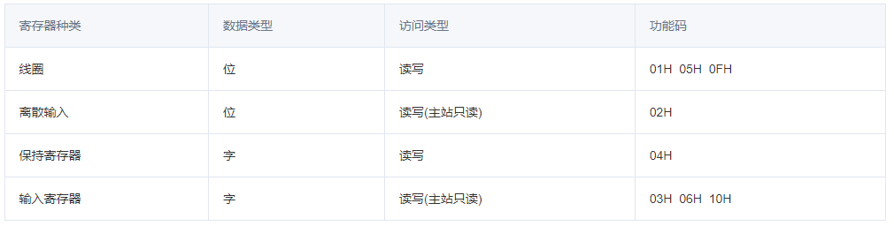

# MODBUS

## 简介

ModBus是工业领域标准通信协议，1979年由莫迪康开发的应用层报文传输协议，包括ASCII、RTU、TCP等。TCP和RTU比ASCII常见，其中TCP的使用频率更高一些。

### 范围

MODBUS 是 OSI 模型第 7 层上的应用层报文传输协议，它在连接至不同类型总线或网络的设备之间提供客户机/服务器通信。

MODBUS 是一个请求/应答协议，并且提供功能码规定的服务。MODBUS 功能码是 MODBUS 请求/应答 PDU 的元素。

互联网组织能够使 TCP/IP 栈上的保留系统端口502 访问 MODBUS。

#### 存储区(寄存器)

<!--  -->

<table><thead><tr><th style="text-align: left;">

寄存器种类

</th><th style="text-align: left;">

数据类型

</th><th style="text-align: left;">

访问类型

</th><th style="text-align: left;">

功能码

</th></tr></thead><tbody><tr><td style="text-align: left;">

线圈

</td><td style="text-align: left;">

位

</td><td style="text-align: left;">

读写

</td><td style="text-align: left;">

01H  05H  0FH

</td></tr><tr><td style="text-align: left;">

离散输入

</td><td style="text-align: left;">

位

</td><td style="text-align: left;">

读写(主站只读)

</td><td style="text-align: left;">

02H

</td></tr><tr><td style="text-align: left;">

保持寄存器

</td><td style="text-align: left;">

字

</td><td style="text-align: left;">

读写

</td><td style="text-align: left;">

04H

</td></tr><tr><td style="text-align: left;">

输入寄存器

</td><td style="text-align: left;">

字

</td><td style="text-align: left;">

读写(主站只读)

</td><td style="text-align: left;">

03H  06H  10H

</td></tr></tbody></table>

#### 功能码

