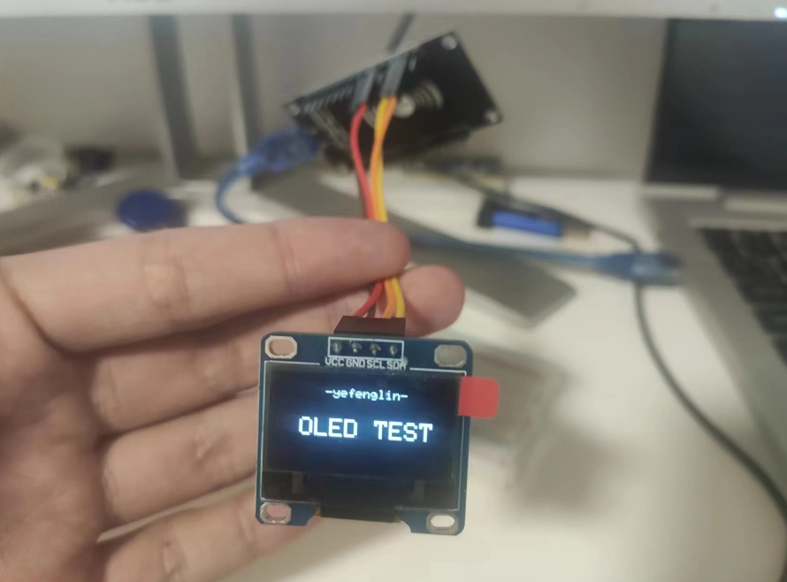

# OLED显示屏

## esp8266 驱动 OLED

<https://www.bilibili.com/video/BV1v44y1J7Cb/>

#### 产品信息

在Arduino中安装依赖的库文件，【项目】→【加载库】→【管理库】：

搜索“SSD1306”，安装“Adafruit SSD1306”这个库


#### 安装OLED驱动库

esp8266驱动库

esp8266-oled-ssd1306

#### 硬件连接

开发板引脚          OLED屏引脚

3.3V                VCC

G (GND)             GND

D1(GPIO5)           SCL

D2(GPIO4)           SDA

#### 程序代码

测试

```C
/*
 * oled
 * ESP8266驱动OLED屏
 */
#include <ESP8266WiFi.h>
#include <Wire.h>
#include <Adafruit_GFX.h>
#include <Adafruit_SSD1306.h>
Adafruit_SSD1306 oled(128, 64, &Wire, -1);

void setup()
{
  oled.begin(SSD1306_SWITCHCAPVCC,0x3C);
  oled.setTextColor(WHITE);//开像素点发光
  oled.clearDisplay();//清屏
  
  oled.setTextSize(1); //设置字体大小  
  oled.setCursor(35, 5);//设置显示位置
  oled.println("-yefenglin-");

  oled.setTextSize(2);//设置字体大小  
  oled.setCursor(15, 30);//设置显示位置
  oled.println("OLED TEST");
  
  oled.display(); // 开显示
}

void loop() {


}
```

显示



## ESP8266制作OLED网络时钟


