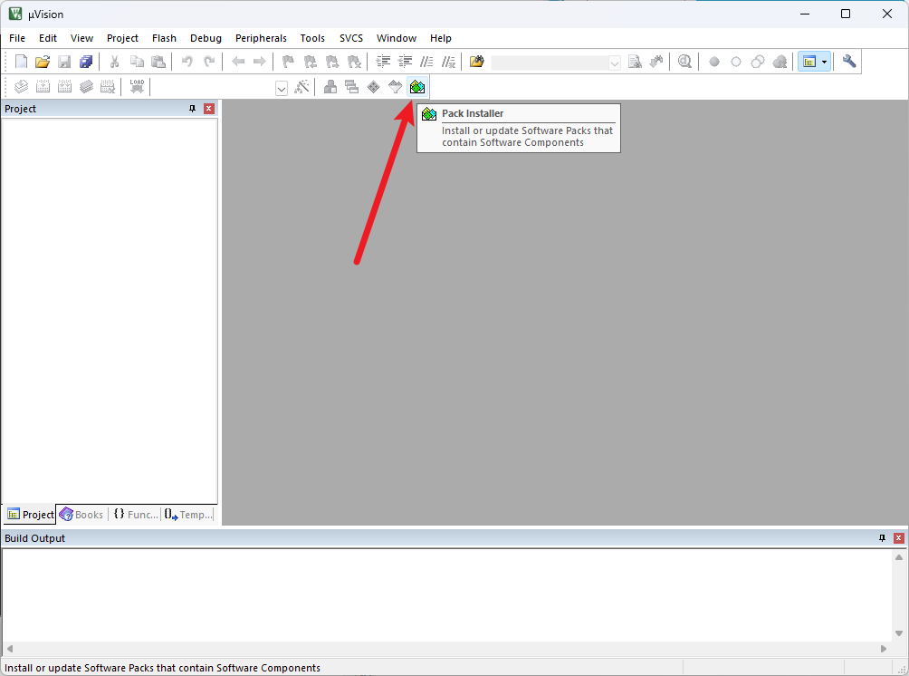

## 软件安装

教程：《江协科技-STM32入门教程-2023版》

链接：<https://www.bilibili.com/video/BV1th411z7sn>

### MDK

安装包：E:\硬件\STM32入门教程资料\Keil5 MDK

安装目录：D:\EE\keil5

### 器件支持包

#### 离线安装

支持包目录：E:\硬件\STM32入门教程资料\Keil5 MDK\支持包\Keil.STM32F1xx_DFP.2.2.0.pack

双击安装即可

#### 在线安装

右下角自动更新进度

### 安装驱动

STlink驱动：D:\EE\keil5\ARM\STLink\USBDriver\dpinst_amd64.exe

Jlink驱动：D:\EE\keil5\ARM\Segger\USBDriver\x64

ch340

## 新建STM32工程

项目目录：D:\EE\project

## 固件库
