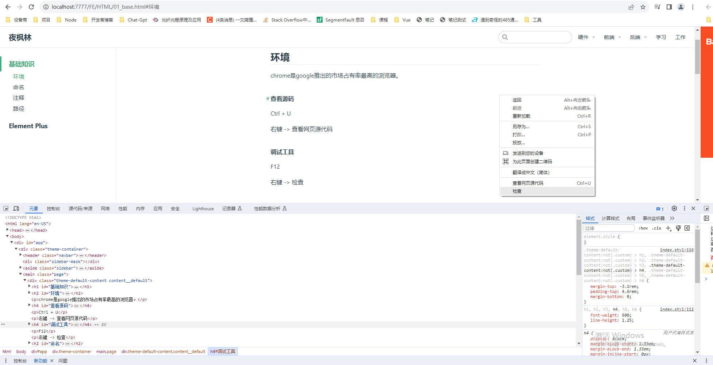

# 基础知识

## 环境

chrome是google推出的市场占有率最高的浏览器。



#### 查看源码

Ctrl + U 

右键 -> 查看网页源代码

#### 调试工具

F12 

右键 -> 检查

## 命名

- 使用小写字线命名文件，不要出现中文字符

- 扩展名标准是.html，当然也可以使用.htm

- 多个单词可以使用- 或 _ 连接，建议使用- 字符如user-create.html

## URL

统一资源定位符，用于表示资源在网络上的地址，每个部分以/进行分隔。

http 资源访问

    https://www.houdunren.com/edu/front/lesson/298.html

## 路径

#### 绝对路径

绝对路径包含主机+服务器地址+目录+文件名的完整路径

    http://yefenglin.cn/sites/10.html

#### 相对路径

相对路径是指相对当前目录的地址

```
# 当前目录的文件
2.html

# 上级目录中的文件
../3.html

# 子目录中的文件
block/user.html

# 根目录中的文件
/bootstrap.html
```

## 注释

使用注释对一段 html 代码进行说明，方便自己或同事在未来清楚的明白代码意图。

```html
<!-- 这是导航条 START -->
<header role="navigation">
  <nav>
    <ul>
      <li>
      	<a href="">夜枫林</a>
      </li>
      <li>
      	<a href="">HTML笔记</a>
      </li>
    </ul>
  </nav>
</header>
<!-- 这是导航条 END -->
```