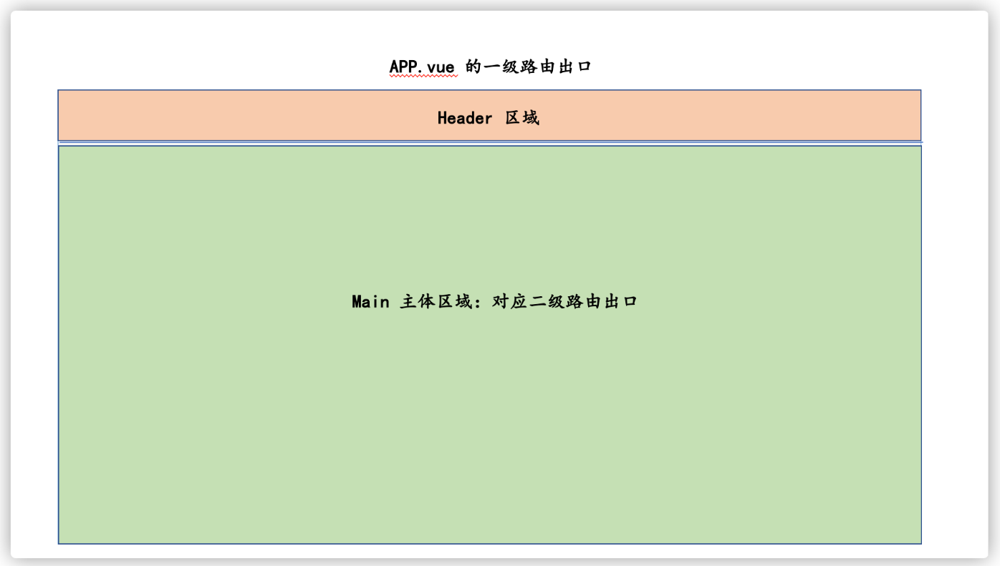
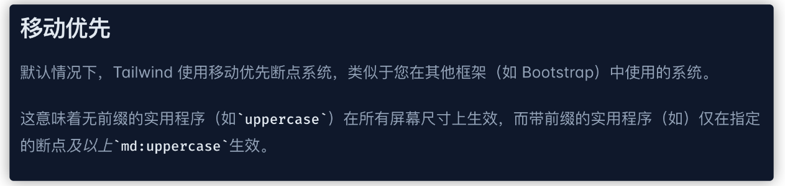

# 一、方案选型

## 初始化项目

```
npm i -g vite

npm init vite@latest
```

修改 dev 指令

```
// 显示 Network 的路径
"dev": "vite --host"

// 自动浏览器打开
"dev": "vite --open"
```

### tailwindcss

传统 css 的痛点

快速添加 tailwindcss 到项目：<https://www.tailwindcss.cn/docs/installation>

1 安装 Tailwind CSS
通过 npm 安装 tailwindcss，然后创建你自己的 create your tailwind.config.js 配置文件。

```
cnpm i -D tailwindcss postcss autoprefixer
```

2 配置模板文件

```
npx tailwindcss init -p
```

3 在 tailwind.config.js 配置文件中添加所有模板文件的路径

添加 模板路径（tailwind 的应用范围）-文件中的 content

```
/** @type {import('tailwindcss').Config} */
module.exports = {
  content: ["./src/**/*.{html,vue,js}"],
  theme: {
    extend: {},
  },
  plugins: [],
}
```

4 将加载 Tailwind 的指令添加到你的 CSS 文件中

在你的主 CSS 文件(/src/styles/index.scss)中通过 @tailwind 指令添加每一个 Tailwind 功能模块。

```
@tailwind base;
@tailwind components;
@tailwind utilities;
```

5 然后在 src/main.js 中引入该 index.scss

```js
import "./styles/index.scss";
```

6 安装 sass

```
cnpm i -D sass
```

7 此时 tailwind 已经安装到我们的项目中

8 我们可以在 src/App.vue 中为 img 标签增加一个 class="bg-red-900"

```
  
```

9 查看项目 img 标签背景变为红色，则表示成功


10 安装插件：Tailwind CSS IntelliSense

### 开发插件

Tailwind CSS IntelliSense：代码格式化工具

volar：vue 工具

### 路由分析

咱们的项目分为 移动端 和 PC 端 两种显示结果，但是这两种显示结果通过同一套代码进行实现，也就是所谓的 响应式 构建方案。那么我们在分析的时候就需要分别分析（PS：此处我们只分析大的路由方案，目的是让大家对基本的项目结构有一个初步的认识，以方便我们的项目结构处理，后续具体的细节构建方案不在这次分析行为之内）：

    移动端结构

    PC 端结构

然后把这两种的分析方案，合并到一起，组成一个最终的架构方案。

移动端结构分析

移动端的结构相对比较简单，当我们去进行路由跳转时，它是以 整个页面进行的整体路由切换 。

那么由此可知，移动端 不存在 嵌套路由的概念，只需要在 APP.vue 中保留 一个路由出口 即可。


PC 端结构分析

而 PC 端的结构相对比较复杂，如下图所示：



我们需要通过 两个路由出口 进行表示：

    1 App.vue: 一级路由出口，用作整页路由切换
    2 Main.vue：二级路由出口，用作局部路由切换

那么由此我们可知，移动端 和 PC 端 两者的路由结构是不同的，所以这就要求我们需要根据 当前用户所在设备的不同，构建不同的路由表 。

那么这一小节我们分析了 项目在不同设备中，需要具备不同的路由结构，所以我们就需要生成 多个路由表 来应对不同的情况。

### 架构搭建

项目默认没有安装 vue-router 和 vuex 。所以我们需要先安装这两个插件：

```
cnpm i vuex vue-router
```

然后我们去处理项目基本架构，最终架构如下（部分省略）：

```
├── src
│   ├── App.vue // 项目根组件，一级路由出口
│   ├── api // 接口请求
│   ├── assets // 静态资源
│   │   ├── icons // svg icon 图标
│   │   ├── images // image 图标。比如:xxx.png
│   │   └── logo.png // logo
│   ├── components // 通用的业务组件。比如：一个组件在多个页面中使用到
│   ├── constants // 常量
│   ├── directives // 自定义指令
│   ├── libs // 通用组件，可用于构建中台物料库或通用组件库
│   ├── main.js // 入口文件
│   ├── permission.js // 页面权限控制中心
│   ├── router // 路由
│   │   ├── index.js // 路由处理中心
│   │   └── modules // 路由模块
│   │       ├── mobile-routes.js // 移动端路由
│   │       └── pc-routes.js // PC 端路由
│   ├── store // 全局状态
│   │   ├── getters.js // 全局状态访问处理
│   │   ├── index.js // 全局状态中心
│   │   └── modules // 状态子模块
│   ├── styles // 全局样式
│   │   └── index.scss // 全局通用的样式处理
│   ├── utils // 工具模块
│   ├── vendor // 外部供应资源。比如：人类行为认证
│   └── views // 页面组件。与 components 的区别在于：此处组件对应路由表，以页面的形式展示
│       └── layout // 用于 PC 端，分割一级路由和二级路由
│           ├── components // 该页面组件下的业务组件
│           └── index.vue // layout 组件
├── tailwind.config.js // wailwind css 配置文件，与 src 平级
└── vite.config.js // vite 配置文件，与 src 平级

```

### vite 配置方案

    1 先明确项目的业务处理方案

    2 依据业务需要，来配置对应的 vite 内容

明确移动端和 PC 端的构建顺序

因为咱们的项目是使用的 tailwindcss 作为样式处理的核心库，所以我们的 构建顺序 需要尊重 tailwindcss 的构建顺序 的。



但是我们如何判断当前的设备是移动设备呢？

为什么达到这个目的，我们就需要先去构建出咱们的第一个工具方法：isMobileTerminal ，该方法将返回一个 boolean 形的数据，如果为 true 则表示当前所在为 移动端，如果为 false 则表示当前为 PC 端

那么根据我们之前的 构建方案 ，所以的工具方法需要被放入到 utils 中，所以下面我们首先需要在 utils 中创建一个 工具类 flexible.js ，在该方法中规定 屏幕宽度 < 1280 则为移动设备 ，并且为了保证这个方法的灵活性，我们可以让它称为一个 计算属性 ，所以我们得出如下代码：

src/utils/flexible.js

```js
import { computed } from "vue";
import { PC_DEVICE_WIDTH } from "../constants";

/**
 * 判断当前是否为移动设备，判断依据为屏幕的宽度是否大于指定值（1280）
 */
export const isMobileTerminal = computed(() => {
  return document.documentElement.clientWidth < PC_DEVICE_WIDTH;
});
```

src/constants/index.js

```js
// PC 设备指定宽度
export const PC_DEVICE_WIDTH = 1280;
```

src/App.vue

```vue
<template>
  <div>{{ isMobileTerminal }}</div>
</template>

<script setup>
import { isMobileTerminal } from "./utils/flexible";
</script>

<style lang="scss" scoped></style>
```

拓展知识：

1 在实际开发中更建议通过以下代码来进行 是否为移动端的准确判断

```js
/**
 * 判断当前是否为移动设备
 */
export const isMobileTerminal = computed(() => {
  return /Android|webOS|iPhone|iPad|iPod|BlackBerry|IEMobile|Opera Mini/i.test(
    navigator.userAgent
  );
});
```

2 document.documentElement.clientWidth 与 window.innerWidth

document.documentElement.clientWidth 是 DOM 元素 document.documentElement 的一个属性。它返回文档根元素的宽度，即 html 元素的宽度，以像素为单位。

因为该属性返回的是文档根元素的宽度，所以它不包括滚动条的宽度。如果需要考虑滚动条宽度，则需要在计算时加上滚动条的宽度，例如：

window.innerWidth 是全局属性，它返回浏览器窗口的宽度，即视口（viewport）的宽度，以像素为单位。它包括滚动条的宽度，因此通常比 document.documentElement.clientWidth 的值要大。

### 通过 vueuse 优化处理方案

对于 isMobileTerminal 方法，此时还存在一个问题，那就是当我们切换浏览器设备时，它的结果并 不是响应式 的，这种让我们的计算属性显得毫无意义了。

那么为什么会这样呢？

我们知道对于计算属性而言，它会在 依赖的响应式数据发生变化时，重新计算。但是现在我们以来的 document.documentElement.clientWidth 并非响应式数据，所以 计算属性无法发生重新计算。

那么要怎么做呢？

在这里需要给大家介绍一个新的库 vueuse， vueuse 是一个 vue 的工具类库 。它内部提供了很多的方法，可以帮助我们进行很多的便捷操作。

比如说 useWindowSize 这个方法，这个方法会给我们返回一个 响应式 的页面宽高，那么我们就可以利用这个响应式数据实现咱们的 isMobileTerminal

安装 vueuse

```
cnpm i @vueuse/core
```

在 src/utils/flexible.js 中使用 useWindowSize 方法

```js
import { useWindowSize } from "@vueuse/core";

const { width } = useWindowSize();

export const isMobileTerminal = computed(() => {
  return width.value < PC_DEVICE_WIDTH;
});
```

### 软链接

vite 默认不支持 @ 软链接。

vite 提供了 resolve.alias 功能，表示：通过别名在指向一个具体的路径

那么我们就可以通过此配置来实现 @ 软链接功能

地址：<https://cn.vitejs.dev/config/shared-options.html#resolve-alias>

在 vite.config.js 中

```js
import { join } from "path";

// https://vitejs.dev/config/
export default defineConfig({
  plugins: [vue()],
  // 软链接
  resolve: {
    alias: {
      "@": join(__dirname, "/src"),
    },
  },
});
```

### 构建移动端路由表

在 src/router/index.js 中初始化 VueRouter

```js
import { createRouter, createWebHistory } from "vue-router";
import { isMobileTerminal } from "@/utils/flexible";
import pcRoutes from "./modules/pc-routes";
import mobileRoutes from "./modules/mobile-routes";

const router = createRouter({
  history: createWebHistory(),
  routes: isMobileTerminal.value ? mobileRoutes : pcRoutes,
});

export default router;
```

2 在 src/router/modules/mobile-routes.js 构建移动端路由表

```js
export default [
  {
    path: "/",
    name: "home",
    component: () => import("@/views/main/index.vue"),
  },
];
```

3 在 src/router/modules/pc-routes.js 构建 PC 端路由表

```js
export default [];
```

4 在 src/main.js 中，注册 VueRouter

```js
import router from "./router";
createApp(App).use(router).mount("#app");
```

5 在 src/App.vue 中写入 一级路由出口

```js
<template>
  <!-- 一级路由出口 -->
  <router-view></router-view>
</template>
```

6 创建首页组件 src/views/main/index.vue ，并且写入如下内容

```vue
<template>
  <div>这是首页内容</div>
</template>

<script setup></script>
```

此时移动端初始路由表构建完成

### 划分移动端首页模块

移动端首页模块总共可分为三部分：


1 顶部的 navigationBar

2 中间的列表内容

3 底部的 tabbar

那么我们首先要开发的就是 顶部的 navigationBar 部分。

而对于该部分又可以分为三块内容：

    navigator 列表：
    右侧汉堡按钮：
    点击汉堡按钮展示的 popup 弹出层：

首先我们创建 移动端的 navigation 模块：

创建 src/views/main/components/navigation/mobile/index.vue 组件

```vue
<template>
  <div>我是移动端下的 navigation</div>
</template>
```

创建 src/views/main/components/navigation/index.vue 组件，为 控制移动端和 PC 端的 navigation 展示组件

```vue
<template>
  <mobile-navigation-vue v-if="isMobileTerminal" />
</template>

<script setup>
import { isMobileTerminal } from "@/utils/flexible";
import mobileNavigationVue from "./mobile/index.vue";
</script>
```

在 src/views/main/index.vue 中导入该组件

```vue
<template>
  <div>
    <navigation-vue></navigation-vue>
  </div>
</template>

<script setup>
import navigationVue from "./components/navigation/index.vue";
</script>
```

### 导入并配置 axios

安装 axios

```
cnpm i --save axios
```

创建 src/utils/request.js

```js
import axios from "axios";

const service = axios.create({
  baseURL: "https://api.imooc-front.lgdsunday.club/api",
  timeout: 5000,
});

export default service;
```

创建请求接口 src/api/category.js

```js
import request from "@/utils/request";

/**
 * 获取分类列表
 */
export const getCategory = () => {
  return request({
    url: "/category",
  });
};
```

在 src/views/main/components/navigation/index.vue 调用接口，尝试获取数据

```js
import { getCategory } from "@/api/category";

const getCategoryData = async () => {
  const res = await getCategory();
  console.log(res);
};
getCategoryData();
```

这样在当前架构下的一个 请求标准流程 就完成了，但是此时我们运行项目，将会得到一个错误


### vite 处理代理服务器

在 前后端分离 的项目开发中跨域的问题是非常常见的。同时对于 webpack 可以直接通过 proxy 进行处理。vite 同样提供了 proxy 的配置项。

具体使用的方式与 webpack 中的 proxy 基本没有区别，依然是通过 devServer 根据 url 进行代理处理。

地址：<https://cn.vitejs.dev/config/#server-proxy>

具体配置方式如下：

在 src/utils/request.js 中，修改 basURL 为 /api ，表示当前请求为 开发时的 api 请求

```js
const service = axios.create({
  baseURL: '/api',
  ...
})
```

在 vite.config.js 中新增 server 选项，配置代理

```js
// https://vitejs.dev/config/
export default defineConfig({
  ...
  // 代理
  server: {
    proxy: {
      // 代理所有 /api 的请求，该求情将被代理到 target 中
      '/api': {
        // 代理请求之后的请求地址
        target: 'https://api.imooc-front.lgdsunday.club/',
        // 跨域
        changeOrigin: true
      }
    }
  }
})
```

正确响应(通过 icode 获取数据)


### 获取数据

icode 获取方法

如果希望调用课程的接口数据，那么需要配置 icode 。本图文节就是告诉大家如何获取并配置 icode

获取 icode 的步骤如下：

    打开 课程列表

    在右侧可查看到 获取校验码 按钮


点击该按钮即可获取 校验码。（注意：校验码有效期为 30 天 ，过期之后需要重新获取）

配置 icode

icode 需要被配置到每次请求的 请求头 中，以 icode 为属性名。

    打开项目的 axios 配置文件（src/utils/request.js）

    为 service 添加请求拦截器，并在请求拦截器中配置 icode

```js
// 请求拦截器
service.interceptors.request.use((config) => {
  // 添加 icode
  config.headers.icode = "你的 icode ";
  // 必须返回 config
  return config;
});
```

### 处理环境变量

接口文档，那么可以发现 baseURL 分为两种：

DEV ： https://api.imooc-front.lgdsunday.club/api

PROD ： https://api.imooc-front.lgdsunday.club/prod-api

在通常咱们的企业级项目开发之中，都会区分 开发时服务 和 生产时服务。

对于开发时服务而言，它内部的数据是 假数据 ，所以我们可以随便修改。

而生产时服务，它内部数据为 真实数据，所以是不能随意修改的。

那么在我们进行项目开发时，我们需要把服务切换为 DEV 模式，而在打包项目时需要切换为 PROD 模式。

但是如果这个操作全靠人工切换，那么难免会有疏忽，一旦出现问题将会引起巨大的风险，所以我们期望可以 根据项目状态，自动切换请求的服务地址。

在 vite 中提供了 .env 文件 ，该文件为环境变量文件，默认提供了四种文件格式：

```
.env                # 所有情况下都会加载
.env.local          # 所有情况下都会加载，但会被 git 忽略
.env.[mode]         # 只在指定模式下加载
.env.[mode].local   # 只在指定模式下加载，但会被 git 忽略
```

其中 .env.[mode] 的格式可以在 不同模式下加载不同内容

新建 .env.development 文件，表示 开发时 的 .env 文件

```js
# 只在指定模式（development）下加载

# base api, 只有以 VITE_ 为前缀的变量才会暴露给经过 vite 处理
VITE_BASE_API = '/api'
```

新建 .env.production 文件，表示 生产时 的 .env 文件

```js
# 只在指定模式（production）下加载

# base api, 只有以 VITE_ 为前缀的变量才会暴露给经过 vite 处理
VITE_BASE_API = '/prod-api'
```

此时当我们执行 npm run dev 时，可以发现浏览器打印为 /api ，表示 开发时服务地址

执行 npm run build 打包项目后运行（可以通过 anywhere 运行 dist 目录），浏览器打印为 /prod-api，表示 发布时服务地址

修改 baseURL 为 import.meta.env.VITE_BASE_API 变量即可

```js
baseURL: import.meta.env.VITE_BASE_API;
```

### axios 响应拦截器

目前获取的 category 数据结构过于繁琐，如果想要获取到 categorys ，那么就必须要 res.data.data.categorys


可以利用 axios 的 响应拦截器 进行处理。

在 src/utils/request.js 中：

```js
// 响应拦截器
service.interceptors.response.use((response) => {
  const { success, message, data } = response.data;
  //   要根据success的成功与否决定下面的操作
  if (success) {
    return data;
  } else {
    // TODO：业务错误
    return Promise.reject(new Error(message));
  }
});
```

此时获取到的数据可直接拿到 categorys

### 业务组件：移动端 navigationBar

利用 category 这个数据构建 移动端 navigationBar 部分

该部分的处理将分成两部分：

    数据
    视图

在 src/views/main/components/navigation/mobile/index.vue 中定义 props 接收数据源

```vue
<script setup>
defineProps({
  data: {
    type: Array,
    required: true,
  },
});
</script>
```

在 src/views/main/components/navigation/index.vue 中传递对应数据

```vue
<template>
  <mobile-navigation-vue v-if="isMobileTerminal" :data="categoryData" />
</template>

<script setup>
import { isMobileTerminal } from "@/utils/flexible";
import mobileNavigationVue from "./mobile/index.vue";
import { getCategory } from "@/api/category";
import { ref } from "vue";

const categoryData = ref([]);
const getCategoryData = async () => {
  const { categorys } = await getCategory();
  categoryData.value = categorys;
};
getCategoryData();
</script>
```

在 src/views/main/components/navigation/mobile/index.vue 中进行视图处理

```vue
<template>
  <div class="bg-white sticky top-0 left-0 z-10">
    <ul
      class="relative flex overflow-x-auto p-1 text-xs text-zinc-600 overflow-hidden"
    >
      <!-- category item -->
      <li
        v-for="item in data"
        :key="item.id"
        class="shrink-0 px-1.5 py-0.5 z-10 duration-200"
      >
        {{ item.name }}
      </li>
    </ul>
  </div>
</template>
```


### 动态 rem 基准

rem 基准值：因为 tailwind 的尺寸单位默认为 rem ，这也是为了适配移动端下的情况。但是针对于这样的 rem 我们并没有指定其基准值，所以我们首先需要做的就是指定 rem 基准值。

对于该基准值我们期望可以 根据用户设备的不同，在一个幅度之内变化，所以我们就需要一个 动态的 rem 值

在 src/utils/flexible.js 中，新增一个方法

```js
/**
 * 初始化 rem 基准值，最大为 40px
 */
export const useREM = () => {
  // 定义最大的 fontSize
  const MAX_FONT_SIZE = 40;

  // 监听 html 文档被解析完成的事件
  document.addEventListener("DOMContentLoaded", () => {
    // 获取 html 标签
    const html = document.querySelector("html");
    // 获取根元素 fontSize 标准，屏幕宽度 / 10。（以 Iphone 为例 Iphone 6 屏幕宽度为 375，则标准 fontSize 为 37.5）
    let fontSize = window.innerWidth / 10;
    // 获取到的 fontSize 不允许超过我们定义的最大值
    fontSize = fontSize > MAX_FONT_SIZE ? MAX_FONT_SIZE : fontSize;
    // 定义根元素（html）fontSize 的大小 （rem）
    html.style.fontSize = fontSize + "px";
  });
};
```

接下来在 main.js 中调用它

```js
import { useREM } from "./utils/flexible";
useREM();
```

<https://www.tailwindcss.cn/docs/font-size>

修正 tailwind 的基准值，对 tailwind 而言它具备默认的 font-size 大小，并且这个大小也是以 rem 作为标准指定的，但是因为我们通过的修改了基准 rem 所以这个 tailwind 的 fontsize 基准值我们也需要进行改变

在 tailwind.config.js 的 theme 选项中，进行以下指定：

```js
  theme: {
    extend: {
      fontSize: {
        xs: ['0.25rem', '0.35rem'],
        sm: ['0.35rem', '0.45rem'],
        base: ['0.45rem', '0.55rem'],
        lg: ['0.55rem', '0.65rem'],
        xl: ['0.65rem', '0.75rem']
      }
    }
  }
```

### 中台组件库与通用组件

- 组件库：封装好的组件，可以直接使用

- 通用组件：封装好的组件，需要二次开发

### 通用组件：svg-icon

教程搜：vue 封装 svg

### 移动端 slider 处理
