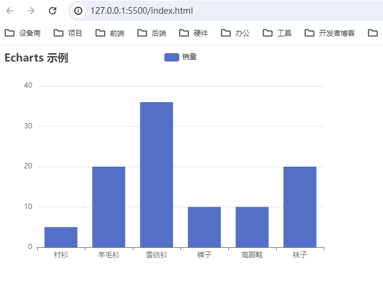
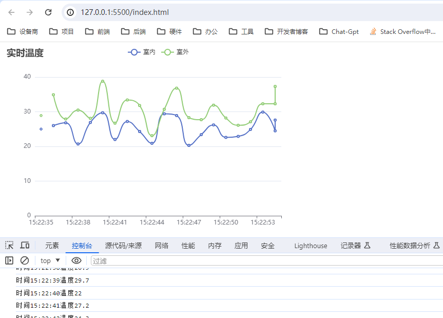

# 快速开始

官网教程：<https://echarts.apache.org/handbook/zh/get-started/>

### 基本步骤

1 引入 echarts.js

```js
<script src="https://cdnjs.cloudflare.com/ajax/libs/echarts/5.5.0/echarts.min.js"></script>
```

2 定义一个 DOM 容器

```JS
<!-- 为 ECharts 准备一个定义了宽高的 DOM -->
<div id="mainChart" style="width: 600px;height:400px;"></div>
```

3 初始化 echarts 实例

```js
<script>
    // (1)基于准备好的dom，初始化echarts实例
    var myChart = echarts.init(document.querySelector("#mainChart"));

    // (2)指定图表的配置项和数据
    var option = {
    //
    title: {
        text: "Echarts 示例",
    },
    tooltip: {},
    legend: {
        data: ["销量"],
    },
    xAxis: { data: ["衬衫", "羊毛衫", "雪纺衫", "裤子", "高跟鞋", "袜子"] },
    yAxis: {},
    series: [
        {
        name: "销量",
        type: "bar",
        data: [5, 20, 36, 10, 10, 20],
        },
    ],
    };

    // (3)使用刚指定的配置项和数据显示图表。
    myChart.setOption(option);
</script>
```



## 应用案例

### 实时温度曲线

描述：每秒生成一个随机温度，显示过去 20 秒的温度：

```js
<script>
    // (1)基于准备好的dom，初始化echarts实例
    var myChart = echarts.init(document.querySelector("#mainChart"));

    // (2)指定图表的配置项和数据
    var option = {
    //
    title: {
        text: "实时温度",
    },
    tooltip: { trigger: "axis" },
    legend: { data: ["室内", "室外"] },
    xAxis: {
        type: "category",
        data: [],
    },
    yAxis: {
        type: "value",
    },
    series: [
        { name: "室内", data: [], type: "line", smooth: true },
        { name: "室外", data: [], type: "line", smooth: true },
    ],
    };

    // (3)使用刚指定的配置项和数据显示图表。
    myChart.setOption(option);

    // 模拟实时数据
    setInterval(function () {
    var temData = 20 + Math.random().toFixed(2) * 10;
    var time = new Date();
    var timeData =
        time.getHours() + ":" + time.getMinutes() + ":" + time.getSeconds();
    console.log("时间" + timeData + "温度" + temData);

    option.xAxis.data.push(timeData);
    option.series[0].data.push(temData);
    option.series[1].data.push(temData + Math.random().toFixed(2) * 10);

    if (option.xAxis.data.length > 20) {
        option.xAxis.data.shift();
        option.series[0].data.shift();
        option.series[1].data.shift();
    }

    myChart.setOption(option);
    }, 1000);
</script>
```

)

#### 代码优化

```html
<!DOCTYPE html>
<html lang="en">
  <head>
    <meta charset="UTF-8" />
    <meta name="viewport" content="width=device-width, initial-scale=1.0" />
    <script src="https://cdnjs.cloudflare.com/ajax/libs/echarts/5.5.0/echarts.min.js"></script>
    <title>Echarts</title>
  </head>
  <body>
    <div id="mainChart" style="width: 600px; height: 400px"></div>

    <script>
      var myChart = echarts.init(document.getElementById("mainChart"));
      var option = {
        title: { text: "实时温度" },
        tooltip: { trigger: "axis" },
        legend: { data: ["室内", "室外"] },
        xAxis: { type: "category", data: [] },
        yAxis: { type: "value" },
        series: [
          { name: "室内", data: [], type: "line", smooth: true },
          { name: "室外", data: [], type: "line", smooth: true },
        ],
      };

      myChart.setOption(option);

      var xAxisData = [];
      var seriesData1 = [];
      var seriesData2 = [];

      setInterval(function () {
        var temData = 20 + Math.random().toFixed(2) * 10;
        var time = new Date();
        var timeData =
          time.getHours() + ":" + time.getMinutes() + ":" + time.getSeconds();

        xAxisData.push(timeData);
        seriesData1.push(temData);
        seriesData2.push(temData + Math.random().toFixed(2) * 10);

        if (xAxisData.length > 20) {
          xAxisData.shift();
          seriesData1.shift();
          seriesData2.shift();
        }

        myChart.setOption({
          xAxis: { data: xAxisData },
          series: [
            { name: "室内", data: seriesData1 },
            { name: "室外", data: seriesData2 },
          ],
        });
      }, 1000);
    </script>
  </body>
</html>
```
