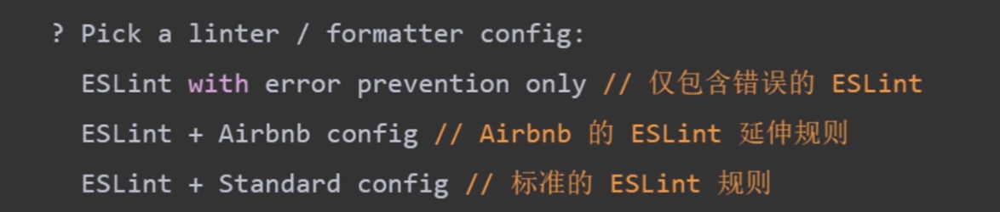

# 代码格式化

## ESLint

2013.06 插件化的 JavaScript 代码检测工具

中文文档：<https://www.eslint.com.cn/docs/user-guide/configuring>

相关插件：coc-eslint

使用 eslint 进行代码格式化与校验

## Prettier

中文文档：<https://prettier.nodejs.cn/>

## ESLint 结合 Prettier

