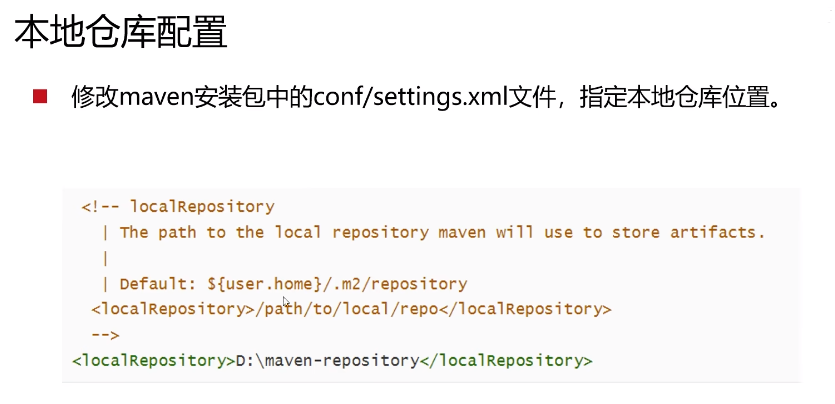

## JDK8

#### 下载

官网：<https://www.oracle.com/java/technologies/downloads/#java8-windows>

华为镜像源：<https://repo.huaweicloud.com/java/jdk/8u171-b11/>

下载：jdk-8u171-windows-x64.exe

#### 环境变量

## Maven

选择3.6以上版本

配置本地仓库、远程仓库

## IDEA

官网：<https://www.jetbrains.com/idea/download/?section=windows>
