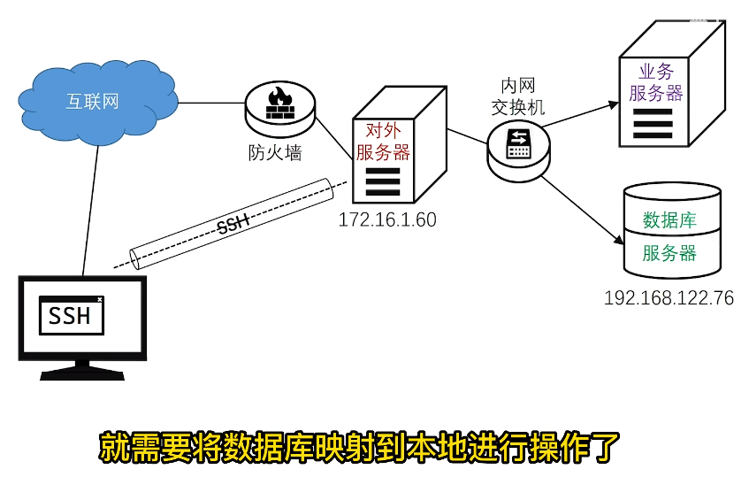

# SSH

介绍：SSH 协议：安全外壳协议，为 Secure Shell 的缩写。SSH 为建立在应用层和传输层基础上的安全协议。

## 反向代理

外网访问内网服务器：<https://www.bilibili.com/video/BV1k7411E76H/>


### 免密登录

（1）切换使用root 用户

```
su 

>>输入root密码
```
如果没有为root创建密码则先设置

```
sudo passwd root 
```

(2)生成密钥

```
ssh-keygen
```

(3)将生成的公钥拷贝到要映射的主机

```
ssh-copy-id -i ~/.ssh/id_rsa.pub root@123.206.175.1
ssh-copy-id root@123.206.175.1
```

(4)测试免密登陆

```sh
ssh root@123.206.175.1
```


### 代理设置

#### （1）内网设置

将内网服务器的22 端口代理到公网云主机（123.206.175.1）的50722端口

```sh
sudo autossh -M 50721 -fCNR '*:50722:127.0.0.1:22' root@123.206.175.1
```

-M: 指定反向代理的端口

-f: 后台运行

-C: 压缩数据传输

-N: 禁止ssh直接登录

-R: 指定反向代理的地址和端口

</br>

#### （2）本地连接


本地外网使用ssh连接云主机的50722端口，输入内网服务器的账号密码即可访问

### 应用代理

```sh
sudo autossh -M 40001 -fCNR '*:53319:127.0.0.1:53319' root@123.206.175.1
```

通过：https://123.206.175.1:53319 即可访问内网的应用服务


## 端口转发

端口转发：<https://www.bilibili.com/video/BV1C7411P7Er/>


### 本地转发


云主机：47.100.18.162

将远程服务器的13000端口代理到本地17000

```
ssh -CNR 13000:127.0.0.1:17000 tonglei@123.206.175.241 -p 50532
```

### 远程转发


### 转发 MYSQL

<https://www.bilibili.com/video/BV1tU4y1i7rR/>



```
ssh -CfNg -L 3310:127.0.0.1:3306 root@123.206.175.1
```

ssh -CfNg -L 8101:127.0.0.1:3306 root@123.206.175.241 -p 50552