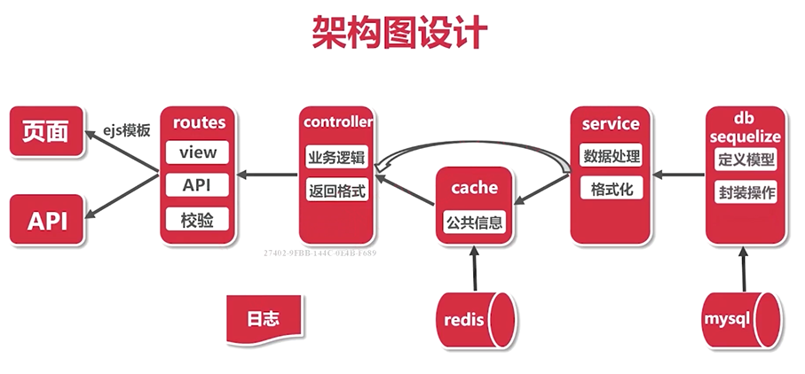

# 一、项目分析

如果去饭店吃饭，不可能找厨师点菜吧？小工负责食材存取，洗菜切肉；厨师负责烹饪；跑堂负责接待食客并与后厨沟通。这就是精典的分层体现。如果一个厨师既负责跑堂，又负责烹饪。那这个饭店的管理一定非常混乱吧。小工就是DAO，从食材库里（数据源）取出食材（原始数据），进行简单处理（数据对象化）。厨师就是Service，找到小工（DAO），获取各种半成品（对象化数据），加工成顾客需要的菜肴（最终数据）。跑堂就是Controller，负责接单（提交数据）上菜（响应数据），是顾客与后厨间的媒介（提供用户与后台程序的接口）。各司其职（高内聚），轻松协作（低耦合），就是分层思想的目标。

作者：齐天大朕
链接：https://www.zhihu.com/question/431911268/answer/1596354422
来源：知乎
著作权归作者所有。商业转载请联系作者获得授权，非商业转载请注明出处。

## 1.1 项目背景

实战：从零模拟新浪微博

Node.js-Koa2框架生态实战－从零模拟新浪微博

“双越”老师出品，纯实战的Node.js进阶课程

地址：<https://coding.imooc.com/class/388.html>

代码：<https://gitee.com/biaoquanli/koa2-weibo/tree/main>

课程涉及的知识点

## 1.1 项目架构

## 1.2 课程安排

主要包含六个方面的内容：

    技术选型

    知识点串讲

    技术方案设计

    功能开发

    线上环境

    总结最佳实践

### 1.2.1 技术选型

* 框架

* 存储和缓存

* 用户认证

### 1.2.2 知识点串讲

* koa2 和 ejs模板

* mysql 和 sequelize

* redis

* session 和 jwt

* jest 单元测试

* eslint 和 inspect debug

### 1.2.3 技术方案设计

第四章：技术方案设计

* 架构设计

* 页面（模板和路由）和 API

* 数据表和存储模型

* 其它：@ 功能和图片上传

### 1.2.4 功能开发

* 用户：登录、注册、用户设置、粉丝和关注

* 微博：发布、列表（首页、个人主页、广场页）

* @ 功能： @某人、回复、接受@我的消息

### 1.2.5 线上环境

* pm2 和多线程

* nginx 和反向代理

* 日志

### 1.2.6 总结最佳实践

* 项目结构

* 错误处理

* 代码风格

* 质量保证

* 安全

* 线上环境

