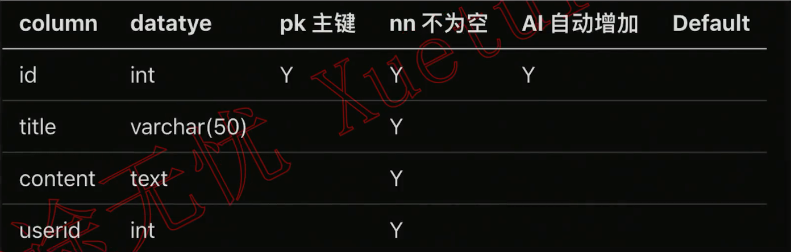
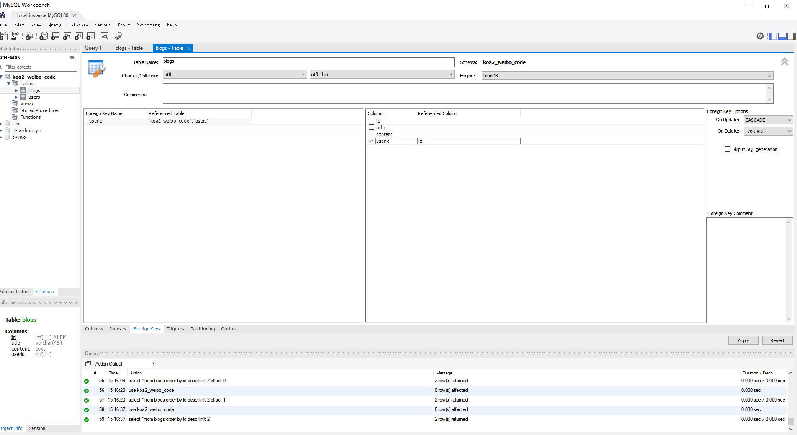
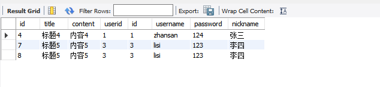
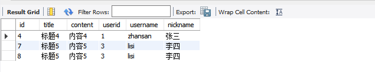
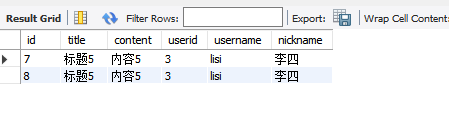
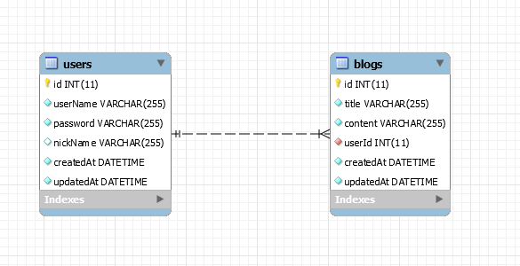
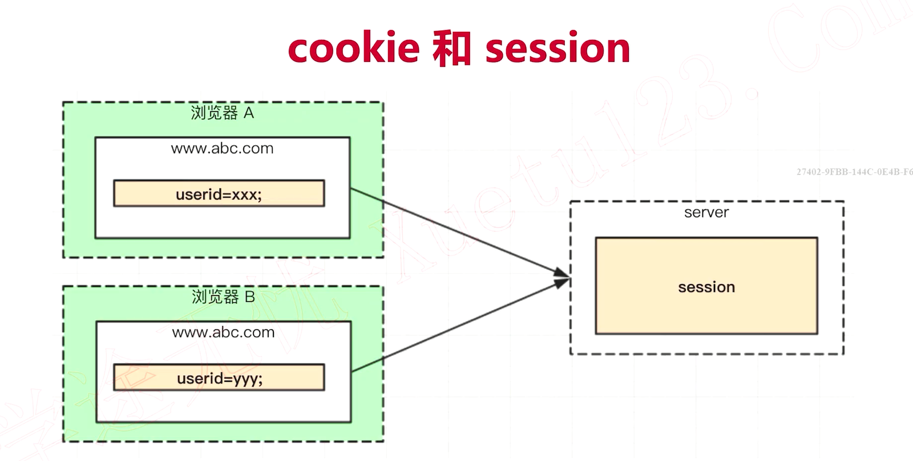
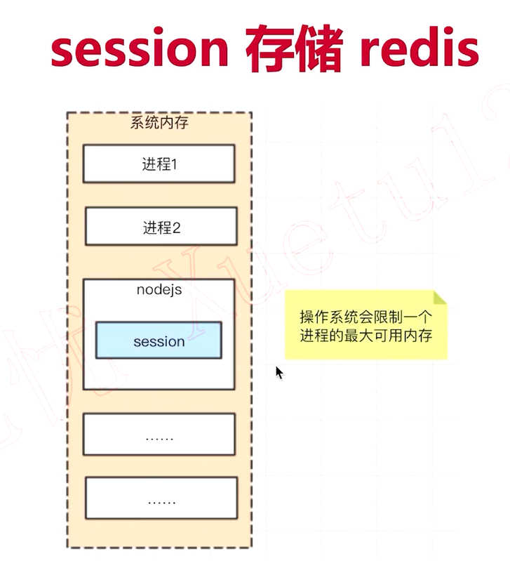
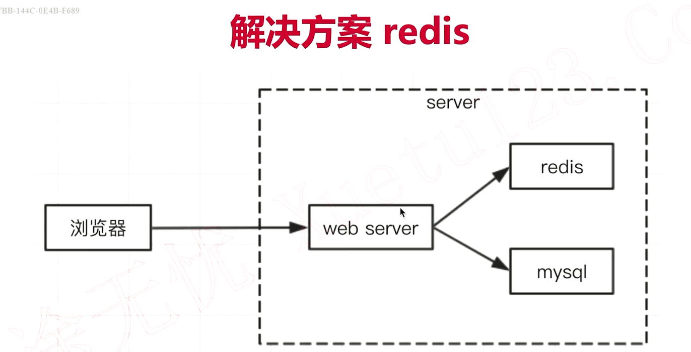

# 二、技术选型和知识点介绍

    本章内容:

    * 技术选型概述

    * 知识点介绍

    * 产出：koa2开发环境

## 2.1 技术选型概述

#### 框架选型

koa2 VS express VS egg

异步编程：排除express

学习范围：egg太顶层，不利于理解


#### 数据库选型

mysql VS mongodb

mysql应用广泛，成本低

#### 登录技术

session VS jwt

#### 前端页面

ejs后端模板引擎  VS vue/react前端框架

前端框架复杂程度高，本课程核心关注后端

#### 缓存数据库

redis

#### 单元测试

jest


## 2.2 KOA2

### 2.2.1 项目创建

（1）koa-generator

包地址：<https://www.npmjs.com/package/koa-generator>

（2）快速创建 
```
# 1. 全局安装：
cnpm i -g koa-generato

# 2. 创建项目
koa2 -e koa2-weibo-code

# 3. 启动项目
cd koa2-weibo-code
cnpm install

# 4. 启动项目
npm run dev

# 5. 访问网址

http://localhost:3000/

```

（3）启动报错

问题：通过npm run dev报错

解决办法：<https://www.jianshu.com/p/815f3f8c635a>

package.json

```js
  "scripts": {
    ...
    "dev": ".\\node_modules\\.bin\\nodemon bin\\www"
  }
```

（4）修改端口

/bin/www
```js
var port = normalizePort(process.env.PORT || '3000');
```

（5）添加gitignore，远程到git仓库

（6）设置环境变量

插件安装
```
cnpm i cross-env -D
```

修改package.json
```js
  "scripts": {
    "start": "node bin/www",
    "dev": "cross-env NODE_ENV=dev .\\node_modules\\.bin\\nodemon bin\\www",
    "prd": "cross-env NODE_ENV=production pm2 start bin/www",
    "test": "echo \"Error: no test specified\" && exit 1"
  },
```
### 2.2.2 代码结构

目录结构
```
.
+-- bin
|   +-- www               // 项目启动必备文件,配置端口等服务信息
+-- node_modules          // 项目依赖，安装的所有模块都会在这个文件夹下
+-- public                // 存放静态文件，如样式、图片等
|   +-- images            // 图片
|   +-- javascript        // js文件
|   +-- stylesheets       // 样式文件
+-- routers               // 存放路由文件，如果前后端分离的话只用来书写api接口使用
|   +-- index.js
|   +-- user.js
+-- views                 // 存放存放模板文件，就是前端页面，如果后台只是提供api的话，这个就是备用
|   +-- error.pug
|   +-- index.pug
|   +-- layout.pug
+-- app.js                // 主入口文件
+-- package.json          // 存储项目名、描述、作者、依赖等等信息
+-- package-lock.json     // 存储项目依赖的版本信息，确保项目内的每个人安装的版本一致
```

新建src目录，将public routers views app.js放入src目录中，并修改www.js，使其能够正确引用src目录中的代码。
```
var app = require('../src/app');
```

github提交：refactor 调整目录结构

### 2.2.3 开发路由

（1）GET 方法获取动态参数

```js
router.get('/profile/:userName', async (ctx, next) => {
  const { userName } = ctx.params;
  ctx.body = {
    title: 'this is profile page',
    userName
  }
})
```

  http://localhost:3000/profile/lisi

  {
    "title": "this is profile page",
    "userName": "lisi"
  }

```js
router.get('/loadMore/:userName/:pageIndex', async (ctx, next) => {
  const { userName, pageIndex } = ctx.params;
  ctx.body = {
    title: 'this is loadMore page',
    userName,
    pageIndex
  }
})
```

  http://localhost:3000/loadMore/zhangsan/3

  {
    "title": "this is loadMore page",
    "userName": "zhangsan",
    "pageIndex": "3"
  }


（2）Post 方法获取动态参数
```js
router.post('/login', async (ctx, next) => {
  const { userName, password } = ctx.request.body
  ctx.body = {
    tag: 100,
    userName,
    password
  }
})
```

测试（postman）：http://localhost:3000/users/login

{
    "userName": "zhangsan",
    "password": "Aa112211"
}

结果:
{
    "tag": 100,
    "userName": "zhangsan",
    "password": "Aa112211"
}

github提交；feat：路由的演示
 
## 2.3 EJS

#### 变量

<%= title %>


#### 条件

```ejs
<% if (isMe){ %>
  <a href="#">@ 提到我的(3)</a>
<% } %>
```


#### 组件

  <%- include('widgets/user-info',{ isMe }) %>


#### 循环
```
blogList: [
  {
    id: 1,
    title: 'hello'
  }, {
    id: 2,
    title: "hi"
  }
]
```

<%- include('widgets/blog-list', {blogList}) %>
```
<ul>
    <% blogList.forEach(blog=> { %>
        <li data-id="<%=blog.id %>">
            <%= blog.title %>
        </li>
        <% }) %>
</ul>
```

## 2.4 Mysql

users 表：


blogs 表：




#### 基本sql语句

use koa2_weibo_code;

select * from users;

select * from blogs;

#### 增删改查

增加：

insert into users(username, `password`, nickname) values('zhansan', '124', '张三');

删除：

delete from blogs where id='3'; 

更新：

update blogs set content='内容1内容1' where id='1';

查询：

select * from users order by id desc;

select username, nickname from users where username='zhangsan'and`password`='124';

  

#### 查询总数，分页

查询总数：

select count(id) as sum from blogs;

分页：

select * from blogs order by id desc limit 2 offset 0;

#### 外键

创建




更新限制 & 删除级联

insert into blogs(title, content, userid) values('标题7','内容7', 4);

插入不存在的id，会报错

delete from users where id=2; 
 
删除id=2的user，会删除关联的blog


联表查询

select * from blogs inner join users on users.id = blogs.userid;




select blogs.* ,users.username, users.nickname from blogs inner join users on users.id = blogs.userid;



select blogs.* ,users.username, users.nickname from blogs inner join users on users.id = blogs.userid where users.username = 'lisi'




## 2.5 Sequelize

官网：<https://www.sequelize.cn/>

* 数据表，用js中的模型（class或对象）代替

* 数据记录，用js中的对象或数组代替

* sql语句，用对象方法代替

cnpm i mysql2 sequelize

测试
```js
const Sequelize = require('sequelize');

const conf = {
    host: 'localhost',
    dialect: 'mysql',
}
const seq = new Sequelize('koa2_weibo_code', 'root', '', conf)

// 测试连接

seq.authenticate().then(() => {
    console.log('ok');
}).catch(() => {
    console.log('error');
})
```

连接池代码：
```js
const mysql = require('mysql2');
const Sequelize = require('sequelize');

// 创建数据库连接池
const pool = mysql.createPool({
    host: 'localhost',
    user: 'root',
    password: '',
    database: 'koa2_weibo_code',
});

// 封装数据库连接函数
function connectToDatabase() {
    return new Promise((resolve, reject) => {
        pool.getConnection((err, connection) => { // 从连接池获取连接
            if (err) reject(err);
            else resolve(connection);  // 将连接对象传递给回调函数
            console.log('成功连接到 MySQL');
        });
    });
}

connectToDatabase()
```

### 2.5.1 建模 & 同步数据

创建模型
```js
const Sequelize = require('sequelize');
const seq = require('./seq');

// 创建 User 模型，表名会是users
const User = seq.define('user', {
    // id会自动创建，并设为主键自增
    userName: {
        type: Sequelize.STRING, // varchar(255)
        allowNull: false // 是否允许为空
    },
    password: {
        type: Sequelize.STRING, // varchar(255)
        allowNull: false // 是否允许为空
    },
    nickName: {
        type: Sequelize.STRING, // varchar(255)
        comment: '昵称'
    }
})
module.exports = {
    User
}
```



### 2.5.2 基本操作

写入数据
```js
const { Blog, User } = require('./model');

!(async function () {
    // 创建用户
    const zhangsan = await User.create({
        userName: 'zhangsan',
        password: '123456',
        nickName: "张三"
    })

    console.log('zhangsan: ', zhangsan.dataValues);
})()
```
```
zhangsan:  {
  id: 2,
  userName: 'zhangsan',
  password: '123456',
  nickName: '张三',
  updatedAt: 2024-01-29T09:34:22.758Z,
  createdAt: 2024-01-29T09:34:22.758Z
}
```

查询数据

```js
const { Blog, User } = require('./model');

!(async function () {
    const zhangsan = await User.findOne({
        where: {
            userName: 'zhangsan'
        }
    })

    console.log(zhangsan.dataValues);

        // 查询特定的列
    const zhangsan2 = await User.findOne({
        attributes: ['userName', 'nickName'], // 指定要查询的列名数组，不指定则查询所有列
        where: {
            userName: 'zhangsan'
        }
    })
    console.log(zhangsan2.dataValues);
})()
```
```
{
  id: 1,
  userName: 'zhangsan',
  password: '123456',
  nickName: '张三',
  createdAt: 2024-01-29T09:44:09.000Z,
  updatedAt: 2024-01-29T09:44:09.000Z
}


{ userName: 'zhangsan', nickName: '张三' }

```

```js
// 查询一个列表
const zhangsanBlogList = await Blog.findAll({
    where: {
        userId: zhangsan.dataValues.id
    },
    order: [
        ['id', 'desc']
    ]
})
console.log(zhangsanBlogList.map(blog => blog.dataValues));
```
```
[
  {
    id: 2,
    title: '标题2',
    content: '内容2',
    userId: 1,
    createdAt: 2024-01-29T09:44:09.000Z,
    updatedAt: 2024-01-29T09:44:09.000Z
  },
  {
    id: 1,
    title: '标题A',
    content: '内容A',
    userId: 1,
    createdAt: 2024-01-29T09:44:09.000Z,
    updatedAt: 2024-01-29T09:44:09.000Z
  }
]

```

分页
```js
//分页
const blogPageList = await Blog.findAll({
    limit: 3,
    offset: 0
})
console.log(blogPageList.map(blog => blog.dataValues));
```

总数
```js
// 查询总数
const blogLsitAndCount = await Blog.findAndCountAll({
    limit: 2,
    offset: 0,
    order: [
        ['id', 'desc']
    ]
})
console.log(blogLsitAndCount.count, blogLsitAndCount.rows.map(blog => blog.dataValues));
```
```
20 [
  {
    id: 20,
    title: '标题4',
    content: '内容4',
    userId: 10,
    createdAt: 2024-01-29T09:55:55.000Z,
    updatedAt: 2024-01-29T09:55:55.000Z
  },
  {
    id: 19,
    title: '标题3',
    content: '内容3',
    userId: 10,
    createdAt: 2024-01-29T09:55:55.000Z,
    updatedAt: 2024-01-29T09:55:55.000Z
  }
]
```

## 2.6 Redis

【GeekHour】一小时Redis教程:

<https://www.bilibili.com/video/BV1Jj411D7oG/>

课程：第3章 技术选型和知识点介绍[下]

redis：内存数据库（缓存）

mysql：磁盘数据库

适用：公共数据，秒杀，热点数据，读多写少，微博广场页，数据一致，session

### 2.6.1 下载安装

windows：<https://github.com/tporadowski/redis/releases>

默认端口：6379

启动：redis-cli

值类型：string

设置值：set key value

获取值：get key

所有值：keys *

删除值：del key

### 2.6.2 nodejs操作redis

/src/conf/db.js

代码文件注释(js doc)
```js
/**
 * @description 存储配置
 * @author 夜枫林
 */
```


/src/cache/_redis.js
```js
/**
 * @description 连接 redis 的方法 get set
 * @author 夜枫林
 */
```


## 2.7 Cookie和Session





session数据隔离

解决方案



* 将 web server 和 redis 拆分为两个单独的服务

* 双方都是独立的，都是可扩展的(例如都扩展成集群)

* (包括 mysql，也是一个单独的服务，也可扩展)

为何 session 适合用 redis ?

* session 访问频繁，对性能要求极高

* session 可不考虑断电丢失数据的问题(内存的硬伤)

* session 数据量不会太大(相比于 mysql中存储的数据)


为何网站数据不适合用 redis ?

操作频率不是太高(相比于 session 操作)

断电不能丢失，必须保留

数据量太大，内存成本太高


### 2.7.1 session存储redis


### 2.7.2 koa2中使用


## 2.8 Jest


