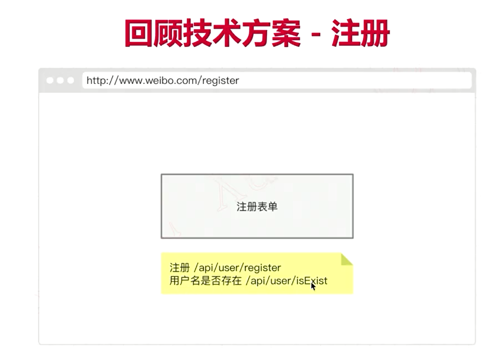

# 三、功能开发

    用户管理（注册和登录）

    用户设置（修改基本信息，修改密码，退出登录）

    创建微博，暂时不考虑显示微博列表

    个人主页，显示个人微博和个人信息，暂时不做关注功能

    广场页（使用缓存）

    关注和取消关注，显示粉丝和关注人

    首页

    @和回复

    @提到我的


## 3.1 用户管理

    页面：模板和路由

    数据建模

    开发注册功能

    开发登录功能

    抽离login Check中间件

    单元测试

### 创建页面




### 数据建模

Users


用户模型 /db/model/User.js
```js
/**
 * @description 用户数据模型
 * @author 夜枫林
 */

const seq = require('../seq')
const { STRING, DECIMAL } = require('../types')
// users
const User = seq.define('user', {
    userName: {
        type: STRING,
        allowNull: false,
        unique: true, 
        comment: '用户名，唯一'
    },
    password: {
        type: STRING,
        allowNull: false,
        comment: '密码'
    },
    nickName: {
        type: STRING,
        allowNull: false,
        comment: '昵称，默认用户名'
    },
    gender: {
        type: DECIMAL,
        allowNull: false,
        defaultValue: 3,
        comment: '性别，1男性，2女性 3保密',
    },
    picture: {
        type: STRING,
        defaultValue: '/images/default.png',
        comment: '用户头像，图片url',
    },
    city: {
        type: STRING,
        comment: '用户所在城市',
    }
})

module.exports = User
```

数据类型 /src/db/types.js
```js
const Sequelize = require('sequelize')

module.exports = {
    STRING: Sequelize.STRING,
    DECIMAL: Sequelize.DECIMAL,
    TEXT: Sequelize.TEXT,
    INTEGER: Sequelize.INTEGER,
    BOOLEAN: Sequelize.BOOLEAN,
}
```

数据模型入口文件 /src/db/model/index.js
```js
const User = require('./User')

module.exports = { User }
```

将模型添加到同步文件 /src/db/sync.js
```js
require('./model/index')
```

### 开发注册功能

（1）开发注册接口

 API /src/routes/api/user.js

```js
const router = require('koa-router')()

router.prefix('/user')

// 注册路由
router.post('/register', async (ctx, next) => {

})

// 用户名是否存在
router.post('/isExist', async (ctx, next) => {
    const { userName } = ctx.request.body
    // controller
    // ctx.body = await xxx()
})

module.exports = router
```

注册 /src/app.js
```js
const userApiRouter = require('./routes/api/user')

app.use(userApiRouter.routes(), userApiRouter.allowedMethods())
```

/isExist 接口
```js
router.post('/isExist', async (ctx, next) => {
    const { userName } = ctx.request.body
    // controller
    // ctx.body = await xxx()
})

```

创建controller： /src/controller/user.js
```js
/**
 * 用户名是否存在
 * @param {string} userName 用户名
 */
async function isExist(userName) {
    // 业务逻辑处理

    // 调用 services 获取数据

    // 统一返回格式
}

module.exports = {
    isExist
}
```

sevices层：/src/services/user.js

getUserInfo：用户名判断（注册）、登录查询
```js
/**
 * 获取用户信息
 * @param {string} userName 用户名
 * @param {string} password 密码
 */
async function getUserInfo(userName, password) {
    // 查询条件
    const whereOpt = {
        userName
    }
    if (password) {
        Object.assign(whereOpt, { password })
    }

    // 查询
    const result = await User.findOne({
        attributes: ['id', 'userName', 'nickName', 'picture', 'city'],
        where: whereOpt
    })

    // 未找到
    if (result == null) {
        return result
    }

    // 格式化


    // 返回查到的数据
    return result.dataValues
}
```

格式化头像：/src/services/_format.js
```js
const { DEFALULT_PICTURE } = require('../config/constant')

/**
 * 用户默认头像
 * @param {object} obj 用户对象
 * @returns 
 */
function _formatUserPicture(obj) {
    if (obj.picture === null) {
        obj.picture = DEFALULT_PICTURE
    }
    return obj
}

/**
 * 格式化用户信息
 * @param {Array|Object} list 用户列表或者单个用户对象
 */
function formatUser(list) {
    if (list == null) {
        return list
    }

    // 数组 - 用户列表
    if (list instanceof Array) {
        return list.map(_formatUserPicture)
    }

    // 单个对象
    return _formatUserPicture(list)
}
```

图片地址抽离：/src/conf/constant.js
```JS
DEFAULT_PICTRUE: 'https://dwz.cn/rnTnftZs',
```

sevices层：/src/services/user.js

getUserInfo
```js
    // 格式化
    const formatRes = formatUser(result.dataValues)

    // 返回查到的数据
    return formatRes
```

controller： /src/controller/user.js


业务模型：/src/model/ResModel.js


（2）密码加密和用户信息验证


### 开发登录功能


### 抽离login Check中间件


### 单元测试

