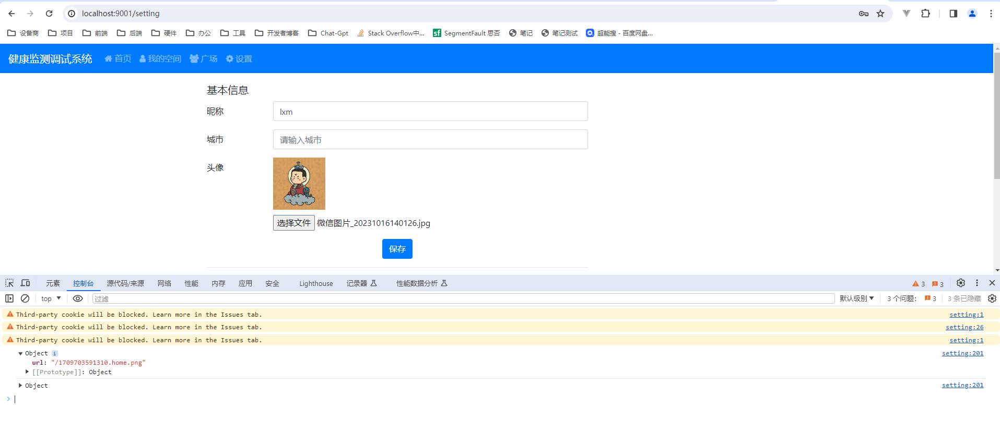

# 四、用户设置


## 4.1 设置页面

### view

D:\project\koa2-weibo-code\src\views\setting.ejs


### router

D:\project\koa2-weibo-code\src\routes\view\user.js

```js
const { loginRedirect } = require("../../middlewares/loginChecks");

router.get("/setting", loginRedirect, async (ctx, next) => {
  await ctx.render("setting", ctx.session.userInfo);
});
```

## 4.2 图片上传

插件：formidable-upload-koa

<https://www.npmjs.com/package/formidable-upload-koa>

插件：fs-extra

<https://www.npmjs.com/package/fs-extra>

安装

```
$ cnpm i formidable-upload-koa fs-extra --save
```

### router

D:\project\koa2-weibo-code\src\routes\api\utils.js

```js
const router = require("koa-router")();
const { loginCheck } = require("../../middlewares/loginChecks");
const koaForm = require("formidable-upload-koa");
const { saveFile } = require("../../controller/utils");

router.prefix("/api/utils");

// 上传图片
router.post("/upload", loginCheck, koaForm(), async (ctx, next) => {
  // 调用上传图片的函数
  const file = ctx.req.files["file"];
  // 保存文件
  const { size, path, name, type } = file;
  // controller
  ctx.body = await saveFile({
    name,
    type,
    size,
    filePath: path,
  });
});

module.exports = router;
```

### controller

D:\project\koa2-weibo-code\src\controller\utils.js

```js
const fse = require("fs-extra");
const { ErrorModel, SuccessModel } = require("../model/ResModel");
const { uploadFileSizeFailInfo } = require("../model/ErrorInfo");
const path = require("path");

// 存储目录 -src同级别
const DIST_FOLDER_PATH = path.join(__dirname, "..", "..", "uploadFiles");
// 文件最大体积 1M
const MIX_SIZE = 1024 * 1024 * 1024;

// 是否需要创建目录
fse.pathExists(DIST_FOLDER_PATH).then((exist) => {
  if (!exist) {
    fse.ensureDir(DIST_FOLDER_PATH);
  }
});

/**
 * 保存文件
 * @param {string} name 文件名
 * @param {string} type 文件类型
 * @param {number} size 文件大小
 */
async function saveFile({ name, type, size, filePath }) {
  console.log("saveFile", name, type, size, filePath);
  // 文件过大
  if (size > MIX_SIZE) {
    // 删除文件
    await fse.remove(filePath);
    // 返回提示信息
    return new ErrorModel(uploadFileSizeFailInfo);
  }

  // 保存：移动文件
  const fileName = Date.now() + "." + name; // 文件名(防止重名)
  const distFilePath = path.join(DIST_FOLDER_PATH, fileName); // 目的地
  await fse.move(filePath, distFilePath); // 移动

  //返回信息 /study.png
  return new SuccessModel({
    url: "/" + fileName,
  });
}

module.exports = {
  saveFile,
};
```



统一文件服务


## 4.3 修改信息

### router

D:\project\koa2-weibo-code\src\routes\api\user.js

```js
router.patch("/changeInfo", loginCheck, async (ctx, next) => {
  // 获取参数
  const { nickName, city, picture } = ctx.request.body;
  // controller
  ctx.body = await changeInfo(ctx, { nickName, city, picture });
});
```

### controller

D:\project\koa2-weibo-code\src\controller\user.js

```js
async function changeInfo(ctx, { nickName, city, picture }) {
  // 获取用户信息
  const { userName } = ctx.session.userInfo;
  if (!nickName) {
    nickName = userName;
  }
  // service
  const result = await updateUser(
    {
      newNickName: nickName,
      newCity: city,
      newPicture: picture,
    },
    { userName }
  );

  if (result) {
    // 执行成功
    Object.assign(ctx.session.userInfo, {
      nickName,
      city,
      picture,
    });
    return new SuccessModel();
  }
  // 失败
  return new ErrorModel(changeInfoFailInfo);
}
```

### service

D:\project\koa2-weibo-code\src\services\user.js

```js
async function updateUser(
  { newPassword, newNickName, newPicture, newCity },
  { userName, password }
) {
  // 拼接修改内容
  const updateData = {};
  if (newPassword) {
    updateData.password = newPassword;
  }
  if (newNickName) {
    updateData.nickName = newNickName;
  }
  if (newPicture) {
    updateData.picture = newPicture;
  }
  if (newCity) {
    updateData.city = newCity;
  }

  // 拼接查询条件
  const whereData = {
    userName,
  };
  if (password) {
    whereData.password = password;
  }

  // 执行修改
  const result = await User.update(updateData, { where: whereData });
  return result[0] > 0; // 行数，修改成功返回1，失败返回0
}
```

## 4.4 修改密码

### router

D:\project\koa2-weibo-code\src\routes\api\user.js

```js
router.patch("/changePassword", loginCheck, async (ctx, next) => {
  // 获取参数
  const { password, newPassword } = ctx.request.body;
  const { userName } = ctx.session.userInfo;
  // controller
  ctx.body = await changePassword(userName, password, newPassword);
});
```

### controller

D:\project\koa2-weibo-code\src\controller\user.js

```
async function changePassword(userName, password, newPassword) {
    const result = await updateUser(
        { newPassword },
        { userName, password }
    )
    // 成功
    if (result) {
        return new SuccessModel()
    }
    //失败
    return new ErrorModel(changePasswordFailInfo)
}
```


## 4.5 退出登录

### 分析

方法：删除用户 session.userInfo

### router

D:\project\koa2-weibo-code\src\routes\api\user.js

```js
router.post("/logout", loginCheck, async (ctx, next) => {
  // controller
  logout(ctx);
});
```

### controller

D:\project\koa2-weibo-code\src\controller\user.js

```js
async function logout(ctx) {
  delete ctx.session.userInfo;
  return new SuccessModel();
}
```

## 4.6 单元测试
