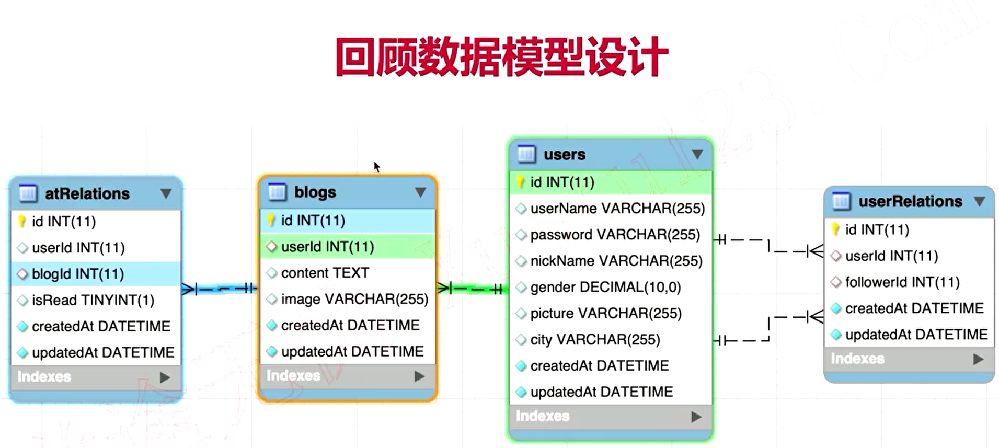
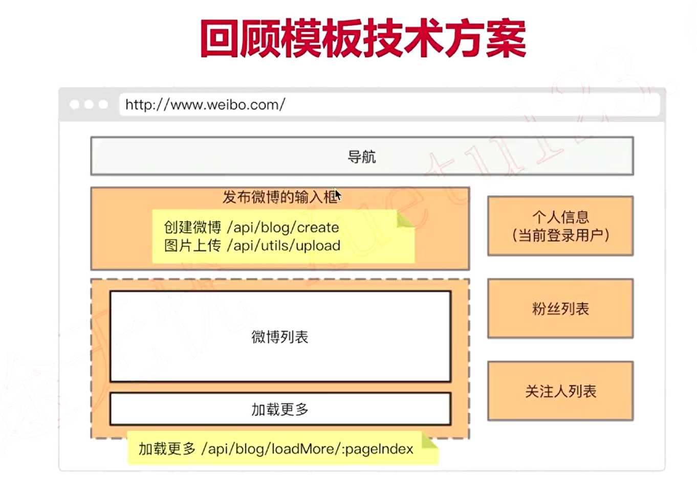

# 五、创建微博

## 创建数据模型



### 模型

创建模型：/src/db/model/Blog.js

```js
/**
 * @description 博客模型
 * @author 夜枫林
 */

const seq = require("../seq");
const { STRING, DECIMAL, INTEGER, TEXT } = require("../types");
// users
const Blog = seq.define("blog", {
  userId: {
    type: INTEGER,
    allowNull: false,
    comment: "用户ID",
  },
  content: {
    type: TEXT,
    allowNull: false,
    comment: "博客内容",
  },
  image: {
    type: STRING,
    comment: "图片地址，多个以逗号隔开",
  },
});

module.exports = User;
```

### 导出

### 外键关联

### 同步

## 模板和路由



## 接口

## 单元测试
