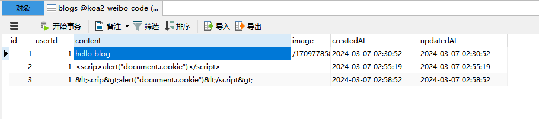

# 五、创建微博

## 5.1 数据模型


### 模型

创建模型：/src/db/model/Blog.js

```js
const seq = require("../seq");
const { STRING, DECIMAL, INTEGER, TEXT } = require("../types");
// users
const Blog = seq.define("blog", {
  userId: {
    type: INTEGER,
    allowNull: false,
    comment: "用户ID",
  },
  content: {
    type: TEXT,
    allowNull: false,
    comment: "博客内容",
  },
  image: {
    type: STRING,
    comment: "图片地址，多个以逗号隔开",
  },
});

module.exports = User;
```

### 外键关联

### 同步

## 5.2 模板和路由


### router

D:\project\koa2-weibo-code\src\routes\view\blog.js

```js
const router = require("koa-router")();
const { loginRedirect } = require("../middlewares/loginChecks");
// 首页
router.get("/", loginRedirect, async (ctx) => {
  await ctx.render("index2", {});
});

module.exports = router;
```

## 5.3 创建微博

### router

D:\project\koa2-weibo-code\src\routes\api\blog-home.js

```js
const router = require("koa-router")();
const { create } = require("../../controller/blog-home");

router.prefix("/api/blog");

// 创建微博
router.post("/create", async (ctx, next) => {
  const { content, image } = ctx.request.body;
  const { id: userId } = ctx.session.userInfo;
  // controller
  ctx.body = await create({ userId, content, image });
});

module.exports = router;
```

### controller

D:\project\koa2-weibo-code\src\controller\blog-home.js

```js
async function create({ userId, content, image }) {
  // service
  try {
    // 创建微博
    const blog = await createBlog({ userId, content, image });
    return new SuccessModel({ blog });
  } catch (ex) {
    console.error(ex.message, ex.stack);
    return new ErrorModel(createBlogFailInfo);
  }
}
```

### service

D:\project\koa2-weibo-code\src\services\blog.js

```js
const { Blog } = require("../db/model/index");

async function createBlog({ userId, content, image }) {
  const result = await Blog.create({
    userId,
    content,
    image,
  });
  return result.dataValues;
}
```

## 5.4 xss 过滤

npm 地址：<https://www.npmjs.com/package/xss>

```
cnpm i xss
```

过滤：D:\project\koa2-weibo-code\src\controller\blog-home.js

```js
/**
 * @description 首页 controller
 * @author 夜枫林
 */

const xss = require("xss");
const { createBlog } = require("../services/blog");
const { SuccessModel, ErrorModel } = require("../model/ResModel");
const { createBlogFailInfo } = require("../model/ErrorInfo");
/**
 * 创建微博
 * @param {Object} param0 创建微博所需的数据{userId, content, image}
 */
async function create({ userId, content, image }) {
  // service
  try {
    // 创建微博
    const blog = await createBlog({
      userId,
      content: xss(content),
      image,
    });
    return new SuccessModel({ blog });
  } catch (ex) {
    console.error(ex.message, ex.stack);
    return new ErrorModel(createBlogFailInfo);
  }
}

module.exports = {
  create,
};
```



## 5.5 格式校验

## 5.6 单元测试
