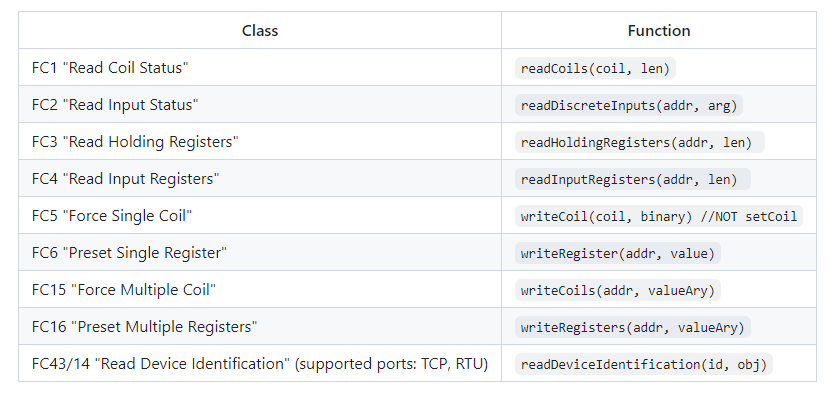

# modbus-serial

npm：<https://www.npmjs.com/package/modbus-serial>

"modbus-serial" 是一个 Node.js 模块，用于在串行通信中实现 Modbus 协议。它可以帮助你通过串行端口与 Modbus 设备进行通信，执行读取和写入操作，并解析 Modbus 协议的数据。

一个纯 JavaScript 实现的 MODBUS-RTU(串行和 TCP)的 NodeJS 库。

## 类图



- FC1 "Read Coil Status" - 读取线圈状态 - 对应操作为 readCoils(coil, len)

- FC2 "Read Input Status" - 读取输入状态 - 对应操作为 readDiscreteInputs(addr, arg)

- FC3 "Read Holding Registers" - 读取保持寄存器 - 对应操作为 readHoldingRegisters(addr, len)

- FC4 "Read Input Registers" - 读取输入寄存器 - 对应操作为 readInputRegisters(addr, len)

- FC5 "Force Single Coil" - 强制单个线圈 - 对应操作为 writeCoil(coil, binary)

- FC6 "Preset Single Register" - 预置单个寄存器 - 对应操作为 writeRegister(addr, value)

- FC15 "Force Multiple Coil" - 强制多个线圈 - 对应操作为 writeCoils(addr, valueAry)

- FC16 "Preset Multiple Registers" - 预置多个寄存器 - 对应操作为 writeRegisters(addr, valueAry)

- FC43/14 "Read Device Identification" - 读取设备识别信息 - 对应操作为 readDeviceIdentification(id, obj)，在支持的端口（TCP, RTU）上执行该操作

## 案例

### 读写

```js
// create an empty modbus client
const ModbusRTU = require("modbus-serial");
const client = new ModbusRTU();

// open connection to a serial port
client.connectRTUBuffered("/dev/ttyUSB0", { baudRate: 9600 }, write);

function write() {
  client.setID(1);

  // write the values 0, 0xffff to registers starting at address 5
  // on device number 1.
  client.writeRegisters(5, [0, 0xffff]).then(read);
}

function read() {
  // read the 2 registers starting at address 5
  // on device number 1.
  client.readHoldingRegisters(5, 2).then(console.log);
}
```

读取返回：

```
{ data: [ 65535, 65535 ], buffer: <Buffer ff ff ff ff> }
```

### 多个从属服务器上读取

```js
const ModbusRTU = require("modbus-serial");
// create an empty modbus client
const client = new ModbusRTU();
// open connection to a serial port
client.connectRTUBuffered("/dev/ttyS0", { baudRate: 9600 });
// set timeout, if slave did not reply back
client.setTimeout(500);

// list of meter's id
const metersIdList = [10, 11, 12, 13, 14];

const getMetersValue = async (meters) => {
  try {
    // get value of all meters
    for (let meter of meters) {
      // output value to console
      console.log(await getMeterValue(meter));
      // wait 100ms before get another device
      await sleep(100);
    }
  } catch (e) {
    // if error, handle them here (it should not)
    console.log(e);
  } finally {
    // after get all data from slave, repeat it again
    setImmediate(() => {
      getMetersValue(metersIdList);
    });
  }
};

const getMeterValue = async (id) => {
  try {
    // set ID of slave
    await client.setID(id);
    // read the 1 registers starting at address 0 (first register)
    let val = await client.readInputRegisters(0, 1);
    // return the value
    return val.data[0];
  } catch (e) {
    // if error return -1
    return -1;
  }
};

const sleep = (ms) => new Promise((resolve) => setTimeout(resolve, ms));

// start get value
getMetersValue(metersIdList);
```

这段代码是使用 Node.js 中的 modbus-serial 模块来实现 Modbus RTU 通讯的示例代码。下面是对代码的简要分析：

导入模块：首先导入了 modbus-serial 模块，该模块用于实现 Modbus RTU 通讯。

创建 Modbus 客户端：通过 new ModbusRTU() 创建了一个 ModbusRTU 客户端实例。

连接到串行端口：使用 client.connectRTUBuffered("/dev/ttyS0", { baudRate: 9600 }) 方法连接到串行端口 "/dev/ttyS0"，指定波特率为 9600。

设置超时时间：通过 client.setTimeout(500) 设置了超时时间为 500 毫秒，如果从设备没有回复，则超时。

定义需要读取的仪表 ID 列表：metersIdList 中包含了需要读取数值的仪表的 ID。

定义异步函数 getMetersValue：该函数用于循环读取各个仪表的数值，并在控制台输出结果。每次读取完一个仪表的数值后，通过 await sleep(100) 等待 100 毫秒再读取下一个仪表的数值。

定义异步函数 getMeterValue：该函数根据传入的仪表 ID，设置 Modbus 客户端的 ID，然后通过 client.readInputRegisters(0, 1) 读取仪表的第一个保持寄存器的值，并将其返回。

定义 sleep 函数：用于实现延迟功能。

调用 getMetersValue 函数：最后调用 getMetersValue 函数开始获取各个仪表的数值，并通过循环读取实现周期性获取。

总体来说，该代码实现了通过 Modbus RTU 协议读取多个仪表的数值，并实现了循环读取和输出的功能。在发生错误时，会返回 -1 并记录错误信息。

### 串行通讯

```js
// create an empty modbus client
const ModbusRTU = require("modbus-serial");
const client = new ModbusRTU();

// open connection to a serial port
client.connectRTUBuffered("/dev/ttyUSB0", { baudRate: 9600 });
client.setID(1);

// read the values of 10 registers starting at address 0
// on device number 1. and log the values to the console.
setInterval(function () {
  client.readHoldingRegisters(0, 10, function (err, data) {
    console.log(data.data);
  });
}, 1000);
```

### TCP 通讯

```js
// create an empty modbus client
const ModbusRTU = require("modbus-serial");
const client = new ModbusRTU();

// open connection to a tcp line
client.connectTCP("127.0.0.1", { port: 8502 });
client.setID(1);

// read the values of 10 registers starting at address 0
// on device number 1. and log the values to the console.
setInterval(function () {
  client.readHoldingRegisters(0, 10, function (err, data) {
    console.log(data.data);
  });
}, 1000);
```

### UDP 通讯

```js
// create an empty modbus client
const ModbusRTU = require("modbus-serial");
const client = new ModbusRTU();

// open connection to a udp line
client.connectUDP("127.0.0.1", { port: 8502 });
client.setID(1);

// read the values of 10 registers starting at address 0
// on device number 1. and log the values to the console.
setInterval(function () {
  client.readHoldingRegisters(0, 10, function (err, data) {
    console.log(data.data);
  });
}, 1000);
```

### ModbusTCP 服务器

```js
// create an empty modbus client
const ModbusRTU = require("modbus-serial");
const vector = {
  getInputRegister: function (addr, unitID) {
    // Synchronous handling
    return addr;
  },
  getHoldingRegister: function (addr, unitID, callback) {
    // Asynchronous handling (with callback)
    setTimeout(function () {
      // callback = function(err, value)
      callback(null, addr + 8000);
    }, 10);
  },
  getCoil: function (addr, unitID) {
    // Asynchronous handling (with Promises, async/await supported)
    return new Promise(function (resolve) {
      setTimeout(function () {
        resolve(addr % 2 === 0);
      }, 10);
    });
  },
  setRegister: function (addr, value, unitID) {
    // Asynchronous handling supported also here
    console.log("set register", addr, value, unitID);
    return;
  },
  setCoil: function (addr, value, unitID) {
    // Asynchronous handling supported also here
    console.log("set coil", addr, value, unitID);
    return;
  },
  readDeviceIdentification: function (addr) {
    return {
      0x00: "MyVendorName",
      0x01: "MyProductCode",
      0x02: "MyMajorMinorRevision",
      0x05: "MyModelName",
      0x97: "MyExtendedObject1",
      0xab: "MyExtendedObject2",
    };
  },
};

// set the server to answer for modbus requests
console.log("ModbusTCP listening on modbus://0.0.0.0:8502");
const serverTCP = new ModbusRTU.ServerTCP(vector, {
  host: "0.0.0.0",
  port: 8502,
  debug: true,
  unitID: 1,
});

serverTCP.on("socketError", function (err) {
  // Handle socket error if needed, can be ignored
  console.error(err);
});
```

```
这段代码是使用 Node.js 中的 modbus-serial 模块创建了一个模拟 Modbus 服务器，可以处理 Modbus 请求。以下是对代码的分析：

引入模块和定义 vector 对象：

使用 require("modbus-serial") 引入 modbus-serial 模块。
定义了一个名为 vector 的对象，其中包含了用于处理不同类型 Modbus 寄存器和线圈的函数。
vector 对象中包含的函数：

getInputRegister(addr, unitID)：同步处理函数，返回传入的地址值 addr。
getHoldingRegister(addr, unitID, callback)：异步处理函数，通过 setTimeout 模拟延迟，然后通过回调函数返回 addr + 8000。
getCoil(addr, unitID)：异步处理函数，返回一个 Promise，在延迟后根据地址是否为偶数 resolve 布尔值。
setRegister(addr, value, unitID)：支持异步处理，简单地打印设置的寄存器地址、数值和单元 ID。
setCoil(addr, value, unitID)：支持异步处理，简单地打印设置的线圈地址、数值和单元 ID。
readDeviceIdentification(addr)：返回一个包含设备识别信息的对象。
创建 Modbus TCP 服务器：

使用 ModbusRTU.ServerTCP 创建一个 Modbus TCP 服务器，并传入 vector 对象作为处理程序。
指定服务器的主机地址为 "0.0.0.0"，端口为 8502，设置调试模式为 true，单元 ID 为 1。
监听 socketError 事件：

当出现 socket 错误时，会触发该事件，并输出错误信息到控制台。
总体来说，这段代码实现了一个简单的 Modbus TCP 服务器，可以模拟处理不同类型的 Modbus 请求，并提供一些模拟数据以供测试和开发目的使用。

```

### 读写 Modbus ASCII

```js
// create an empty modbus client
const Modbus = require("modbus-serial");
const client = new Modbus();

// open connection to a serial port
client.connectAsciiSerial(
  "/dev/ttyUSB0",
  {
    baudRate: 9600,
    startOfSlaveFrameChar: 0x3a, // optional: slave frame delimiter
  },
  write
);

function write() {
  client.setID(1);

  // write the values 0, 0xffff to registers starting at address 5
  // on device number 1.
  client.writeRegisters(5, [0, 0xffff]).then(read);
}

function read() {
  // read the 2 registers starting at address 5
  // on device number 1.
  client.readHoldingRegisters(5, 2).then(console.log);
}
```

### modbusdb

“modbusdb”是 Modbus 协议的优雅包装。查看 modbusdb github repo 在https://github.com/yarosdev/modbusdb获取更多信息，欢迎反馈!

下面是一个在 modbus-serial 上使用 modbusdb 包装器的例子:

```js
import Modbus from "modbus-serial";
import {
  Modbusdb,
  ModbusSerialDriver,
  Datamap,
  createRegisterKey,
  TypeEnum,
  ScopeEnum,
} from "modbusdb";

// create an empty modbus client
const client = new Modbus();

client.connectTcpRTUBuffered("127.0.0.1", { port: 8502 }, app); // or use any other available connection methods

function app() {
  // First you need to define a schema for a database:
  // createRegisterKey(UNIT_ADDRESS, MODBUS_TABLE, REGISTER_ADDRESS, BIT_INDEX)
  const schema = [
    {
      key: createRegisterKey(1, ScopeEnum.InternalRegister, 10),
      type: TypeEnum.Int16,
    },
    {
      key: createRegisterKey(1, ScopeEnum.InternalRegister, 11),
      type: TypeEnum.Int32,
    },
    {
      key: createRegisterKey(1, ScopeEnum.PhysicalRegister, 99),
      type: TypeEnum.UInt16,
    },
    {
      key: createRegisterKey(1, ScopeEnum.InternalRegister, 15, 2),
      type: TypeEnum.Bit,
    },
  ];

  // Define unit-scoped config if needed:
  const units = [
    {
      address: 1, // This is unit address
      forceWriteMany: true, // Use 15(0x0f) and 16(0x10) functions for single register, default: false
      bigEndian: true, // You can use BigEndian for byte order, default: false
      swapWords: false, // This is applicable only for multi-registers types such as int32, float etc, default: false
      requestWithGaps: true, // If you are requesting addresses 10 and 13, allow to send one request to the device, default: true
      maxRequestSize: 32, // How many registers to be requested in one round-trip with device, default: 1
    },
  ];

  // Let`s create an instance of a database:
  const db = new Modbusdb({
    driver: new ModbusSerialDriver(client),
    datamap: new Datamap(schema, units),
  });

  // Now we can request three registers:
  // NOTICE: Modbusdb under the hood will make all needed requests for you in using an optimal plan
  //         If registers can be requested using a single request, be sure it will
  db.mget([
    createRegisterKey(1, ScopeEnum.InternalRegister, 10),
    createRegisterKey(1, ScopeEnum.InternalRegister, 11),
    createRegisterKey(1, ScopeEnum.PhysicalRegister, 99),
  ]).then((result) => {
    console.log("mget", result);
  });

  // You can store register`s key to be used later:
  const speedSetPoint = createRegisterKey(1, ScopeEnum.InternalRegister, 10);
  const workingMode = createRegisterKey(1, ScopeEnum.InternalRegister, 11);

  // Write values directly into modbus device as easy as possible:
  // NOTICE: Modbusdb under the hood will make all needed requests for you
  //         Write operations have higher priority over the read operations
  db.mset([
    [speedSetPoint, 60],
    [workingMode, 10],
  ]).then((result) => {
    console.log("mset", result);
  });
}
```

## Enums:枚举

```js
ScopeEnum: (Modbus Table)
  1 = PhysicalState = Discrete Input
  2 = InternalState = Coil Status
  3 = PhysicalRegister = Input Register
  4 = InternalRegister = Holding Register

TypeEnum: (Available Data Types)
  1 = Bit,
  4 = Int16,
  5 = UInt16,
  6 = Int32,
  7 = UInt32,
  8 = Float
```
