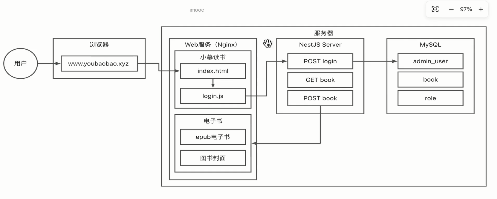

# 一、项目分析

## 1.1 需求分析

后台管理系统

    用户管理
        - 登录注册

    权限管理
        - 管理菜单
        - 管理用户
        - 管理角色
        - 管理权限

    图书管理
        - 图书列表查询
        - 图书上传
        - 图书阅读

## 1.2 技术架构

### 建站

#### 域名

#### 服务器

#### web 服务

### 开发

#### 前端

框架：vue-vben-admin(SPA)

核心库：vue3 全家桶（vue3 vue-router4 pinia2）、vite4、ant-design-vue、windicss

#### 后端

框架：Node.js + NestJS

    - 依赖注入

    - Restful API

    - jwt 鉴权

    - cors 跨域

    - orm 模型

    - 数据库：mysql

## 1.3 项目阶段

### 1.3.1 框架搭建

### 1.3.2 登录模块

### 1.3.3 前端控制权限开发

### 1.3.4 图书模块开发

### 1.3.5 后端控制权限模块开发

### 1.3.6 无界微前端架构升级
