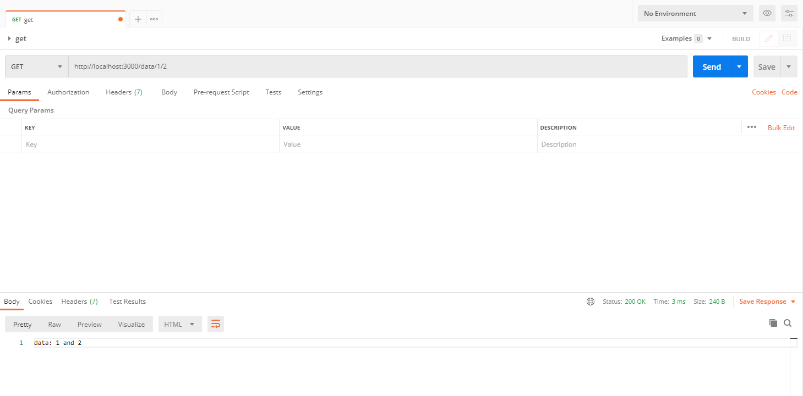

# 二、项目搭建

## 前端项目

github：<https://github.com/vbenjs/vue-vben-admin>

文档：<https://doc.vvbin.cn/>

演示：<https://vben.vvbin.cn/#/login?redirect=/dashboard>

### 下载主题

版本：vue-vben-admin-2.10.0


环境要求：

    "node": ">=16.15.1"
    "pnpm": ">=8.1.0"

依赖安装

```
lxm18@lxm_hp MINGW64 /e/zhenPath/vue-vben-admin-2.10.0
$ pnpm i
```

启动

```
lxm18@lxm_hp MINGW64 /e/zhenPath/vue-vben-admin-2.10.0
$ npm run dev

> vben-admin@2.10.0 dev
> pnpm vite
```


```js
<script type="module" src="/src/main.ts"></script>
```

### vben

三种运行方式：

(1) vite

    "dev": "pnpm vite"
    "serve": "npm run dev"

指令

```
npm run dev
npm run server
```

特点：打包快，访问满

(2) preview

本地加载

    "preview": "npm run build && vite preview"

```
npm run preview
```

特点：打包慢，访问超快

(3) build

    "build": "cross-env NODE_ENV=production pnpm vite build",
    "build:analyze": "pnpm vite build --mode analyze",

```
npm run build
npm run build:analyze
```

analyze：打包分析


地址: E:\zhenPath\vue-vben-admin-2.10.0\node_modules\.cache\visualizer\stats.html

### 项目发布

npm run build 会将项目直接打包到根目录，不推荐这种做法

#### vite 配置

    "@vben/vite-config": "workspace:*",

workspace 意义：本地

### es module 特性

页面响应：

```js
<script type="module" src="/src/main.ts"></script>
```

### vue 插件原理


```
1. 读取配置文件阶段：vue plugin
2. 运行时：编译
```

```js
"@vitejs/plugin-vue": "^4.1.0",
```

D:\project\zhenpath\vue-vben-admin\node_modules\@vitejs\plugin-vue\dist\index.cjs

### mock 原理

## 后端框架

```
$ npm i -g @nestjs/cli
$ nest new project-name

? Which package manager would you ❤️  to use? npm
CREATE nest-admin/.eslintrc.js (688 bytes)
CREATE nest-admin/.prettierrc (54 bytes)
CREATE nest-admin/nest-cli.json (179 bytes)
CREATE nest-admin/package.json (2018 bytes)
CREATE nest-admin/README.md (3413 bytes)
CREATE nest-admin/tsconfig.build.json (101 bytes)
CREATE nest-admin/tsconfig.json (567 bytes)
CREATE nest-admin/src/app.controller.ts (286 bytes)
CREATE nest-admin/src/app.module.ts (259 bytes)
CREATE nest-admin/src/app.service.ts (150 bytes)
CREATE nest-admin/src/main.ts (216 bytes)
CREATE nest-admin/src/app.controller.spec.ts (639 bytes)
CREATE nest-admin/test/jest-e2e.json (192 bytes)
CREATE nest-admin/test/app.e2e-spec.ts (654 bytes)

```

入口文件：src/main.ts

```
import { NestFactory } from '@nestjs/core';
import { AppModule } from './app.module';

async function bootstrap() {
  const app = await NestFactory.create(AppModule);
  await app.listen(3000);
}
bootstrap();
```

启动项目

```
$ npm i

$ npm run start:dev
```

网址：<http://localhost:3000/>

### controller

控制器负责处理传入请求并向客户端返回响应。

为了创建基本控制器，我们使用类和装饰器( @Controller() )。

提示: 要使用 CLI 创建控制器，只需执行 $ nest g controller [name] 命令即可。

#### 路由

#### 请求对象

### Restful API

get : 获取数据

post : 新增数据

put: 更新数据

delete: 删除数据

### 参数传递

三种参数形式：

    param —— restful api

    query —— url（get）

    body  —— post

#### param

(1) 常规：@Get('/data/:id')

http://localhost:3000/data/1


（2）级联：

http://localhost:3000/data/1/2

http://localhost:3000/data/1/get/2

@Get('/data/:id/:subId')



#### body

```js
@Post('/data')
    postData(@Body() body): string {
    console.log(body);
    return 'post data: ' + JSON.stringify(body);
}
```


#### query

```js
@Post('/data')
    postData(@Body() body, @Query() query): string {
    console.log(body, query);
    return 'post data: ' + JSON.stringify(body) + ' and id = ' + query.id;
}
```


### provider

provider（提供者） —— service（服务层）

#### 流程

定义 --> 注入 -- > 调用 --> 注册

```js
import { Module } from "@nestjs/common";
import { AppController } from "./app.controller";
import { AppService } from "./app.service";

@Module({
  imports: [],
  controllers: [AppController],
  providers: [AppService],
})
export class AppModule {}
```

@Injectable(): 注入

```js
import { HttpException, HttpStatus, Injectable } from "@nestjs/common";

@Injectable()
export class AppService {
  getHello(): string {
    return "Hello World!";
  }

  getDataS(params): string {
    if (!params.id) {
      throw new HttpException("BAD_REQUEST", HttpStatus.BAD_REQUEST);
    }
    return "getData service";
  }
}
```

提示: 要使用 CLI 创建服务，只需执行 $ nest g service cats 命令即可。

### 异常处理

#### 标准异常

Nest 提供了一个内置的 HttpException 类，从 @nestjs/common 包中暴露出来。对于典型的基于 HTTP REST/GraphQL API 的应用，最佳做法是在发生某些错误情况时发送标准 HTTP 响应对象。

```js
cats.controller.ts

@Get()
async findAll() {
  throw new HttpException('Forbidden', HttpStatus.FORBIDDEN);
}
```

当客户端调用此端点时，响应如下所示：

英 When the client calls this endpoint, the response looks like this:

```js
{
  "statusCode": 403,
  "message": "Forbidden"
}
```


#### 自定义异常

自定义异常基类：HttpException

内置异常：

```
BadRequestException

UnauthorizedException

NotFoundException

ForbiddenException
....
```

异常过滤器： ExceptionFilter

#### 绑定过滤器

使用 @UseFilters() 装饰器

```js
  @Get('/data/:subid')
  @UseFilters(new HttpExceptionFilter())
  getDataById(@Param() params): string {
    console.log(params);
    return this.appService.getDataS(params);
```


## 数据库

### 模块划分

模块：<https://nest.nodejs.cn/modules>


### 模块

#### 快速创建

nest g module user

nest g controller user

#### 类型转换

```js
@Controller("cats")
export class CatsController {
  @Get("/:id")
  getCar(@Param("id", ParseIntPipe) id: number) {
    console.log(typeof id);
    return "get car: " + id;
  }
}
```

将 string 类型转换为 number 类型

### 数据库连接

官网文档：<https://nest.nodejs.cn/techniques/database>

安装

```js
npm install --save @nestjs/typeorm typeorm mysql2
```

#### 连接数据库

/src/main.ts

```js
import { Module } from "@nestjs/common";
import { TypeOrmModule } from "@nestjs/typeorm";
import { AppController } from "./app.controller";
import { AppService } from "./app.service";
import { AuthModule } from "./modules/auth/auth.module";
import { BookModule } from "./modules/book/book.module";
import { UserModule } from "./modules/user/user.module";

@Module({
  imports: [
    TypeOrmModule.forRoot({
      type: "mysql",
      host: "localhost",
      port: 3306,
      username: "root",
      password: "",
      database: "book-admin",
      entities: [__dirname + "/**/*.entity{.ts,.js}"],
      // synchronize: true,
    }),
    AuthModule,
    BookModule,
    UserModule,
  ],
  controllers: [AppController],
  providers: [AppService],
})
export class AppModule {}
```

#### 创建模型

/src/modules/user/user.entity.ts

```js
import { Entity, Column, Unique, PrimaryGeneratedColumn } from "typeorm";

@Entity("admin_user")
export class User {
  @PrimaryGeneratedColumn() // 主键 自增
  id: number;

  @Column() // 关联表名
  @Unique(["username"]) // 唯一
  username: string;

  @Column()
  password: string;

  @Column()
  avatar: string;

  @Column()
  role: string;

  @Column()
  nickname: string;

  @Column()
  active: number;
}
```

#### 建立连接

建立连接：/src/modules/user/user.module.ts

```js
import { Module } from "@nestjs/common";
import { UserController } from "./user.controller";
import { TypeOrmModule } from "@nestjs/typeorm";
import { User } from "./user.entity";
import { UserService } from "./user.service";

@Module({
  imports: [TypeOrmModule.forFeature([User])], //  引入实体
  controllers: [UserController],
  providers: [UserService],
})
export class UserModule {}
```

#### 创建实体

使用模型：/src/modules/user/user.service.ts

```js
import { Injectable } from '@nestjs/common';
import { InjectRepository } from '@nestjs/typeorm';
import { Repository } from 'typeorm';
import { User } from './user.entity';

@Injectable()
export class UserService {
  constructor(
    @InjectRepository(User) // 注解
    private readonly usersRepository: Repository<User>, // 得到实例
  ) {}

  findOne(id: number): Promise<User | undefined> {
    return this.usersRepository.findOneBy({ id }); // 返回实例内容
  }
}

```

#### 测试


### 创建用户

方法：Post

路径：/user

参数：body

#### create-user.dto

类型约束

```js
export class CreateUserDto {
  username: string;
  password: string;
  role: string;
  nickname: string;
  avatar: string;
  active: number;
}
```

#### service

```js
  create(createUserDto: CreateUserDto): Promise<User> {
    const user = new User();
    user.username = createUserDto.username;
    user.password = createUserDto.password;
    user.role = createUserDto.role;
    user.avatar = createUserDto.avatar;
    user.nickname = createUserDto.nickname;
    user.active = 1;

    return this.usersRepository.save(user);
  }
```

#### controller

```js
  @Post()
  createUser(@Body() body) {
    return this.userService.create(body);
  }
```

#### 测试


### 删除用户

## 环境准备

### nginx 服务器

- windows 通过下载官网安装包，下载地址：<http://nginx.org/en/download.html>

- mac 通过 brew 安装，参考：<https://www.jianshu.com/p/c3294887c6b6>

#### 安装过程

参考链接：<https://blog.csdn.net/a910247/article/details/130180241>

1. 官网下载 nginx 安装包


2. 解压到指定目录（D 盘）


3. 启动 ngnix

```
start nginx

tasklist /fi "imagename eq nginx.exe"
```


4. 访问 ngnix 服务器

默认地址：<http://127.0.0.1:80>


#### 配置

文件位置：D:\nginx-1.24.0\conf\nginx.conf

### epub 电子书

- 电子书格式

META-INF: 元数据

content.opf: 内容文件(基本信息)

toc.ncx: 目录文件
