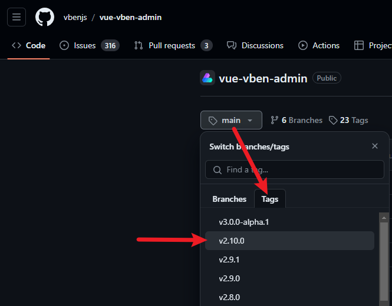

# 二、前端框架搭建

github：<https://github.com/vbenjs/vue-vben-admin>

文档：<https://doc.vvbin.cn/>

演示：<https://vben.vvbin.cn/#/login?redirect=/dashboard>

## 下载主题

版本：vue-vben-admin-2.10.0



环境要求：

    "node": ">=16.15.1"
    "pnpm": ">=8.1.0"

依赖安装

```
lxm18@lxm_hp MINGW64 /e/zhenPath/vue-vben-admin-2.10.0
$ pnpm i
```

启动

```
lxm18@lxm_hp MINGW64 /e/zhenPath/vue-vben-admin-2.10.0
$ npm run dev

> vben-admin@2.10.0 dev
> pnpm vite
```


```js
<script type="module" src="/src/main.ts"></script>
```

## vben

三种运行方式：

(1) vite

    "dev": "pnpm vite"
    "serve": "npm run dev"

指令

```
npm run dev
npm run server
```

特点：打包快，访问满

(2) preview

本地加载

    "preview": "npm run build && vite preview"

```
npm run preview
```

特点：打包慢，访问超快

(3) build

    "build": "cross-env NODE_ENV=production pnpm vite build",
    "build:analyze": "pnpm vite build --mode analyze",

```
npm run build
npm run build:analyze
```

analyze：打包分析


地址: E:\zhenPath\vue-vben-admin-2.10.0\node_modules\.cache\visualizer\stats.html

## 项目发布

npm run build 会将项目直接打包到根目录，不推荐这种做法

### vite 配置

    "@vben/vite-config": "workspace:*",

workspace 意义：本地
