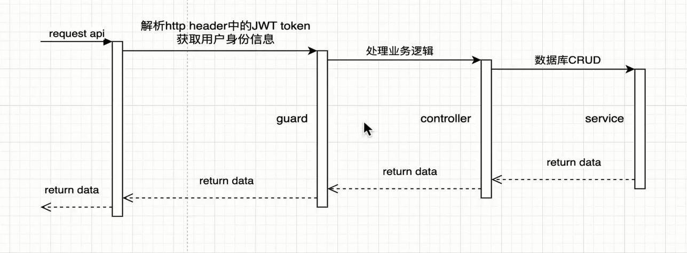
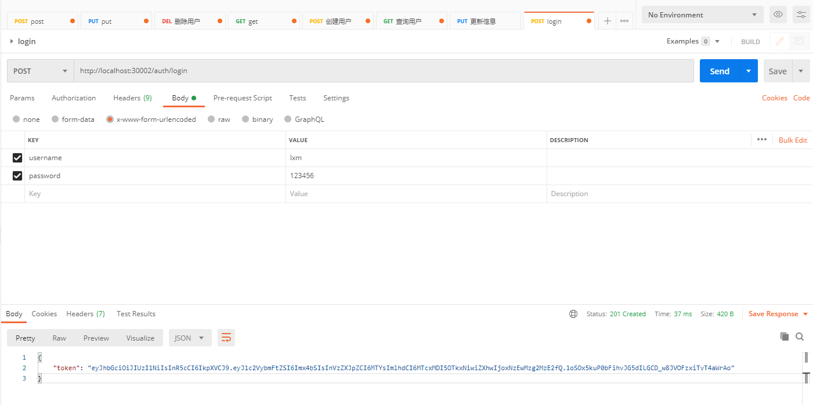

# 三、登录模块

## 前端开发

### 源码分析

### 路由配置

### 路由守卫

#### 全局守卫

befareEach

afterEach

加载状态

中断请求

#### 组件内守卫

### 表单校验

## 后端开发

### 时序图



### 请求守卫

```js
canActivate:  ExecutionContextHost {
  args: [
    IncomingMessage {
      _events: [Object],
      _readableState: [ReadableState],
      _maxListeners: undefined,
      socket: [Socket],
      httpVersionMajor: 1,
      httpVersionMinor: 1,
      httpVersion: '1.1',
      complete: false,
      rawHeaders: [Array],
      rawTrailers: [],
      joinDuplicateHeaders: null,
      aborted: false,
      upgrade: false,
      url: '/user',
      method: 'GET',
      statusCode: null,
      statusMessage: null,
      client: [Socket],
      _consuming: false,
      _dumped: false,
      next: [Function: next],
      baseUrl: '',
      originalUrl: '/user',
      _parsedUrl: [Url],
      params: {},
      query: {},
      res: [ServerResponse],
      body: {},
      route: [Route],
      [Symbol(shapeMode)]: true,
      [Symbol(kCapture)]: false,
      [Symbol(kHeaders)]: [Object],
      [Symbol(kHeadersCount)]: 34,
      [Symbol(kTrailers)]: null,
      [Symbol(kTrailersCount)]: 0
    },
    ServerResponse {
      _events: [Object: null prototype],
      _eventsCount: 1,
      _maxListeners: undefined,
      outputData: [],
      outputSize: 0,
      writable: true,
      destroyed: false,
      _last: false,
      chunkedEncoding: false,
      shouldKeepAlive: true,
      maxRequestsOnConnectionReached: false,
      _defaultKeepAlive: true,
      useChunkedEncodingByDefault: true,
      sendDate: true,
      _removedConnection: false,
      _removedContLen: false,
      _removedTE: false,
      strictContentLength: false,
      _contentLength: null,
      _hasBody: true,
      _trailer: '',
      finished: false,
      _headerSent: false,
      _closed: false,
      socket: [Socket],
      _header: null,
      _keepAliveTimeout: 5000,
      _onPendingData: [Function: bound updateOutgoingData],
      req: [IncomingMessage],
      _sent100: false,
      _expect_continue: false,
      _maxRequestsPerSocket: 0,
      locals: [Object: null prototype] {},
      [Symbol(shapeMode)]: false,
      [Symbol(kCapture)]: false,
      [Symbol(kBytesWritten)]: 0,
      [Symbol(kNeedDrain)]: false,
      [Symbol(corked)]: 0,
      [Symbol(kOutHeaders)]: [Object: null prototype],
      [Symbol(errored)]: null,
      [Symbol(kHighWaterMark)]: 16384,
      [Symbol(kRejectNonStandardBodyWrites)]: false,
      [Symbol(kUniqueHeaders)]: null
    },
    [Function: next]
  ],
  constructorRef: [class UserController],
  handler: [Function: getAllUser],
  contextType: 'http'
}
```

### 鉴权接口

#### 调用链路

（1）在 auth 模块中引入 user 模块

（2）exports user 模块的 UserService

（3）在 auth.services 中引入 user 模块的 UserService

（4）根据 username 查询用户信息

### 校验逻辑

### JWT

#### 生成 token



#### 统一格式

## 前后端联调
