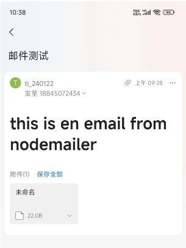

# nodemailer

参考视频：<https://www.bilibili.com/video/BV18p4y1Q7KJ/>

Nodemailer是一个用于Node.js应用程序的模块，可以轻松发送电子邮件。该项目始于2010年，当时没有合理的选项来发送电子邮件消息，如今它是大多数Node.js用户默认选择的解决方案。

#### 一、环境配置

安装模块：nodemailer
```
npm i nodemailer --save
```

#### 二、创建对象

```js
var nodemailer = require('nodemailer');
// 创建一个SMTP传输对象
var transporter = nodemailer.createTransport({
    host: 'smtp.163.com', // 设置SMTP服务器的主机名
    port: 465, // 设置SMTP服务使用的端口
    secureConnection: true, // 启用安全连接
    auth: {
        user: 'tl_240122@163.com', // 你的邮箱账号
        pass: 'BKZEJEUUWRPJSRGA' // 你的邮箱授权码
    }
})
```
#### 三、邮件配置

```js
const mailOptions = {
    from: 'tl_240122@163.com', // 你的邮箱
    to: '18845072434@163.com', // 接收者,可以同时发送多个,以逗号隔开
    // cc: 'xx@example.com',
    subject: '邮件测试',
    text: '这是一封来自 Node.js 的邮件测试。', // 邮件文本
    html: `<h1>this is en email from nodemailer</h1>`, // 邮件支持 html，但是和 text 冲突，后者会覆盖掉前者，只能选其一
    // Apple Watch specific HTML body 苹果手表指定HTML格式
    watchHtml: '<b>Hello</b> to myself',

    // attachments: [ // 上传附件的格式，path 为相对路径
    //     {   // utf-8 string as an attachment
    //         filename: 'text1.txt',
    //         content: 'hello world!'
    //     },
    //     {   // binary buffer as an attachment
    //         filename: 'text2.txt',
    //         content: new Buffer('hello world!', 'utf-8')
    //     },
    //     {   // file on disk as an attachment
    //         filename: 'text3.txt',
    //         path: '/path/to/file.txt' // stream this file
    //     },
    //     {   // filename and content type is derived from path
    //         path: '/path/to/file.txt'
    //     },
    //     {   // stream as an attachment
    //         filename: 'text4.txt',
    //         content: fs.createReadStream('file.txt')
    //     },
    //     {   // define custom content type for the attachment
    //         filename: 'text.bin',
    //         content: 'hello world!',
    //         contentType: 'text/plain'
    //     },
    //     {   // use URL as an attachment
    //         filename: 'license.txt',
    //         path: 'https://raw.github.com/nodemailer/nodemailer/master/LICENSE'
    //     },
    //     {   // encoded string as an attachment
    //         filename: 'text1.txt',
    //         content: 'aGVsbG8gd29ybGQh',
    //         encoding: 'base64'
    //     },
    //     {   // data uri as an attachment
    //         path: 'data:text/plain;base64,aGVsbG8gd29ybGQ='
    //     },
    //     {
    //         // use pregenerated MIME node
    //         raw: 'Content-Type: text/plain\r\n' +
    //             'Content-Disposition: attachment;\r\n' +
    //             '\r\n' +
    //             'Hello world!'
    //     }
    // ],
};

```

#### 四、发送邮件

```js
// 发送邮件，打印信息
transporter.sendMail(mailOptions, function (error, info) {
    if (error) {
        console.log(error);
    } else {
        console.log('Email sent');
    }
    transporter.close();
});
```

#### 五、发送结果


