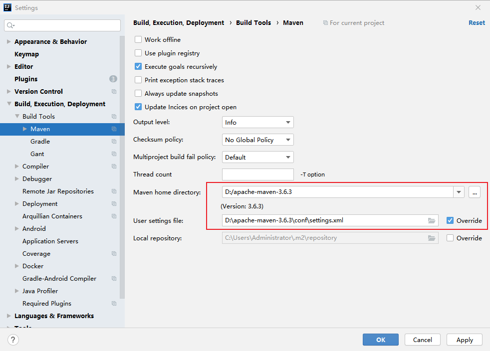

# 快速上手

#### SpringBoot特点

约定优于配置

内嵌Tomcat（web服务器）

定制化启动器Starters，简化maven配置

提供生产级服务监控方案

## 创建项目

#### 新建工程

file - new - project

项目类型选择 Maven 或者（Spring Initializr）

选择SDK - Next

创建项目名称、选择项目路径  - Finish

#### SpringBoot项目

Initialization failed for https://start.spring.io Please check URL, network and proxy settings解决办法

<https://developer.aliyun.com/article/1168541>

#### 配置 Maven

file - settings - Build - build-tools - maven

## 热部署

## 系统配置