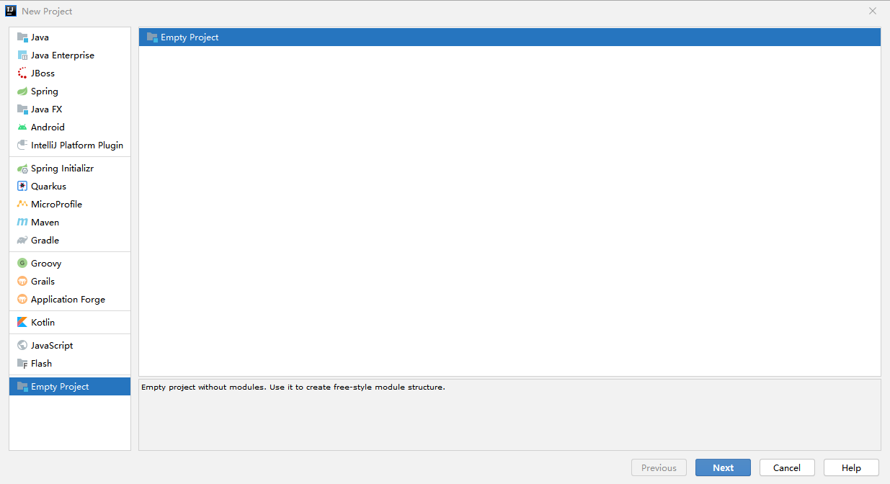
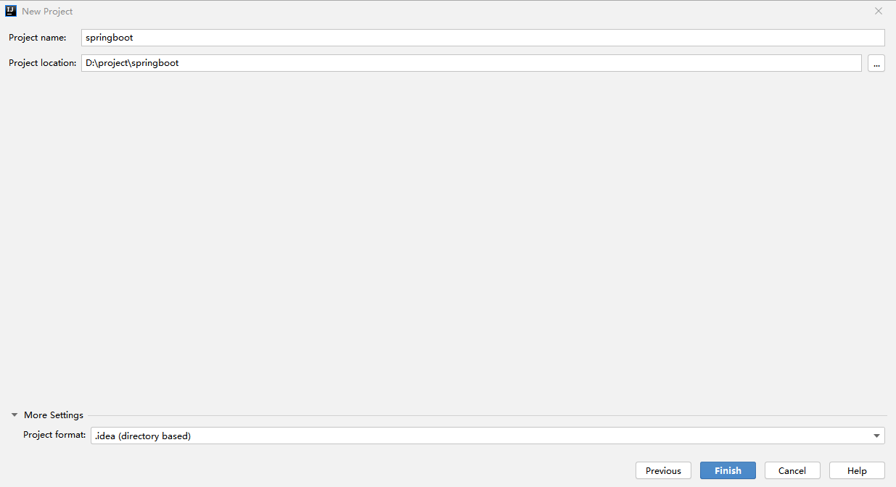
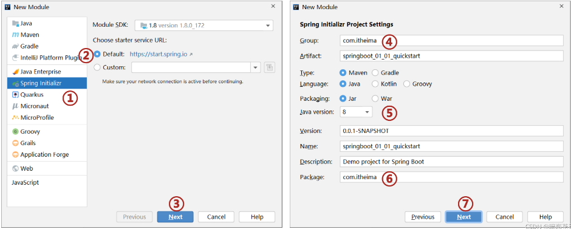
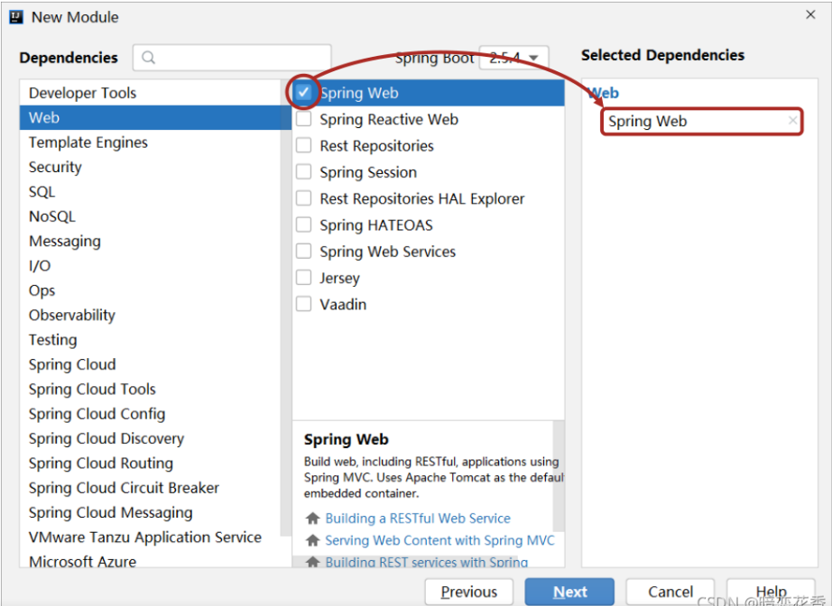
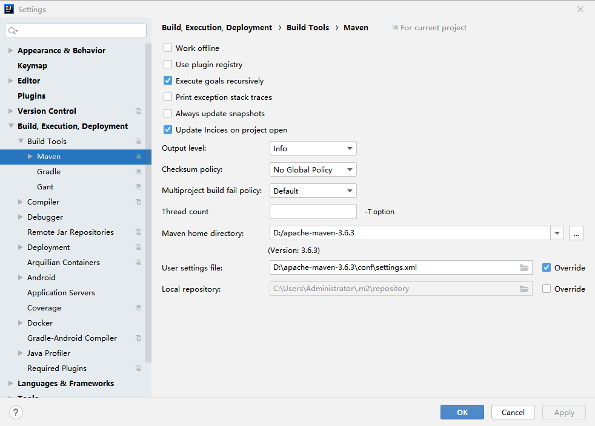

# 一、基础篇

SpringBoot是由Pivotal团队提供的全新框架，其设计目的是用来简化Spring应用的初始搭建以及开发过程。该框架使用了特定的方式来进行配置，从而使开发人员不再需要定义样板化的配置。

## 1.1 前置知识

    Java基础语法

Spring与SpringMVC

	知道Spring是用来管理bean，能够基于Restful实现页面请求交互功能

Mybatis与Mybatis-Plus

	基于Mybatis和MybatisPlus能够开发出包含基础CRUD功能的标准Dao模块

数据库MySQL

	能够读懂基础CRUD功能的SQL语句

服务器

	知道服务器与web工程的关系，熟悉web服务器的基础配置

maven

	知道maven的依赖关系，知道什么是依赖范围，依赖传递，排除依赖，可选依赖，继承

web技术（含vue，ElementUI)

	知道vue如何发送ajax请求，如何获取响应数据，如何进行数据模型双向绑定


## 1.2 入门案例

环境要求

Java8及以上

Maven 3.5及以上：https://docs.spring.io/spring-boot/docs/current/reference/html/getting-started.html#getting-started-system-requirements

    公司电脑版本：D:\apache-maven-3.6.3

### 1.2.1 IDEA联网版

新建项目





新建模块



选择技术



遇到问题及解决

（1）未配置好maven



(2) spring版本过高 3.5.2 —— pom.xml

```
<parent>
    <groupId>org.springframework.boot</groupId>
    <artifactId>spring-boot-starter-parent</artifactId>
    <version>2.3.5.RELEASE</version>
    <relativePath/> <!-- lookup parent from repository -->
</parent>
```

(3) 无效的发行版本 13


开发控制器类 —— controller.BookController

``` java
package com.itheima.controller;

import org.springframework.web.bind.annotation.GetMapping;
import org.springframework.web.bind.annotation.RequestMapping;
import org.springframework.web.bind.annotation.RestController;

//Rest 模式
@RestController
@RequestMapping("/books")
public class BookController {
    @GetMapping
    public String getById() {
        System.out.println("springboot is running...");
        return "springboot is running...";
    }
}

```


### 1.2.2 官网创建


### 1.2.3 阿里云版


### 1.2.4 手工制作