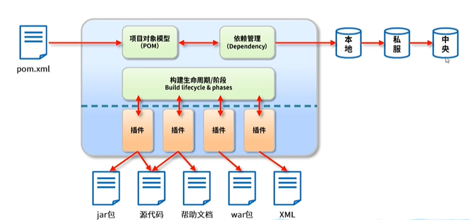

# P1 环境准备

## 内容介绍

* java EE 企业级框架：spring boot + MybatisPlus

* 前端框架：Vue 3 + ElementUi

* 部署打包

## 课程内容

## 概念介绍

### Web技术基础

目前市面上的软件主要可分为两种:

BS:(Browser/Server浏览器/服务器架构模式)

CS:(Client/Server客户端/服务器架构模式)。

### 架构对比

* C/S架构主要特点是交互性强，具有安全访问模式，网络流量低，响应速度快因为客户端负责大多数业务逻辑和UI演示，所以也被称为胖客户端，C/S结构的软件需要针对不同的操作系统开发不同版本的软件。

* 随着互联网的兴起，CS架构不适合Web，最大的原因是Web应用程序的修改和升级非常迅速，而CS架构需要每个客户端逐个升级桌面App，因此，Browser/Server模式开始流行，简称BS架构。

* B/S架构的主要特点是分散性高、维护方便、开发简单、共享性高、总拥有成本低

### BS架构原理
在BS架构下，客户端只需要浏览器，应用程序的逻辑和数据都存储在服务器端浏览器只需要请求服务器，获取Web页面，并把Web页面展示给用户即可。

## 开发配置

java环境配置：1.8

开发工具：IDEA

项目管理工具：Maven

自动化构建和依赖管理

