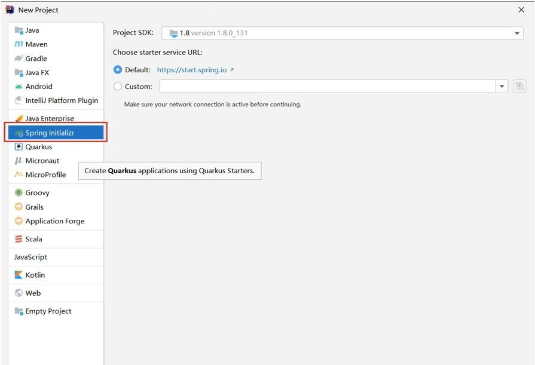
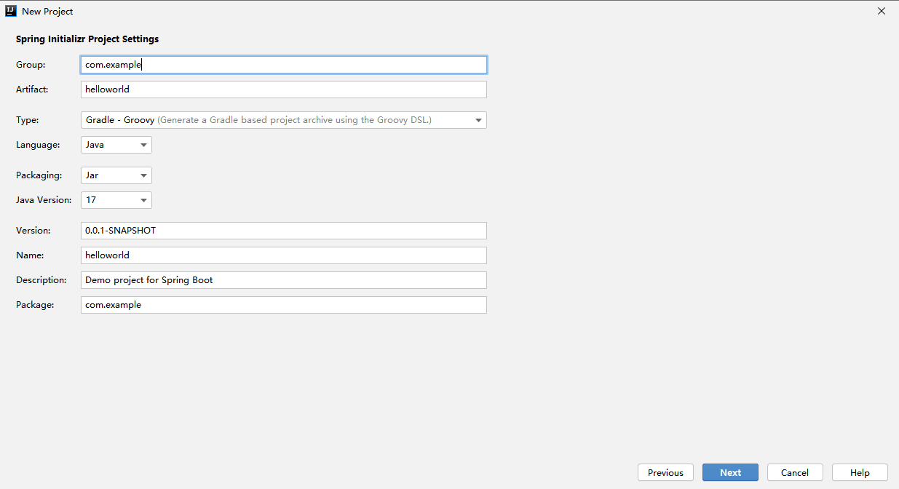
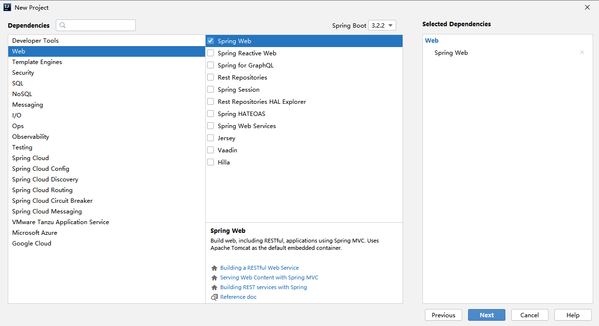

# P2 快速上手

## springboot 介绍

Spring Boot是由Pivotal团队提供的基于Spring的全新框架，旨在简化Spring应用的初始搭建和开发过程。

Spring Boot是所有基于Spring开发项目的起点

Spring Boot就是尽可能地简化应用开发的门槛，让应用开发、测试、部署变得更加简单。

### SpringBoot特点

* 遵循“约定优于配置”的原则，只需要很少的配置或使用默认的配置

* 能够使用内嵌的Tomcat、Jetty服务器，不需要部署war文件

* 提供定制化的启动器Starters，简化Maven配置，开箱即用

* 纯Java配置，没有代码生成，也不需要XML配置

* 提供了生产级的服务监控方案，如安全监控、应用监控、健康检测等

## 创建应用

Group: 一般输入公司域名

Artifact: 一般输入项目名

Version: 一般输入版本号

## 开发环境热部署

## 系统配置

