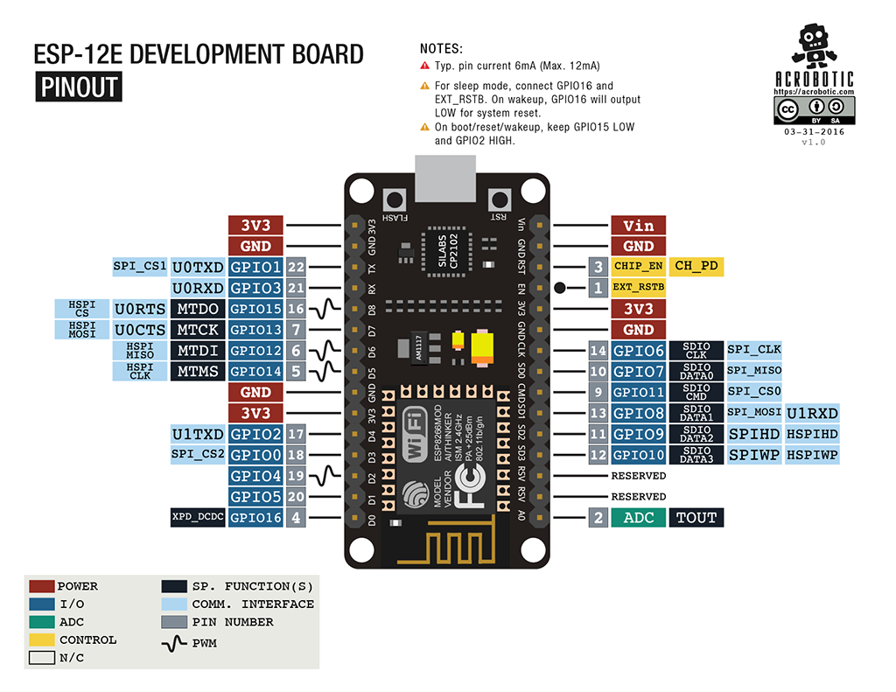

# 软硬结合-从零打造物联网

## 一、项目介绍

搭建云服务器，把整个从硬件、到云服务器，最终界面呈现踏踏实实地走一回，打通起来


### 1.1 参考教程

软硬结合-从零打造物联网

项目地址：<https://www.bilibili.com/video/BV16L411n7Pi>

教程网址：<https://www.scaugreen.cn/posts/44755/>

GitHub：<https://github.com/alwxkxk/soft-and-hard>

### 1.2 项目导读

#### 技术栈

前端：

后端：nodeJS

交互：ajax


#### 新增内容

    对参考教程进行完善，并添加部分功能

        1 dht11 采集温湿度数据

        2 stm32f103 控制

        3 led 实时显示数据

        4 jquery 界面交互

### 1.3 项目日志

#### 2021-01-13

#### 2023-11-28
    完成demo0.1

#### 2023-11-29

    完善开发流程：0.md-庖丁解牛

    添加技术方案

## 二、硬件知识

### 2.1 NodeMCU

esp8266




### 2.2 开发环境

Arduino

官网下载地址: <https://www.arduino.cc/en/software>

驱动安装：ch340

扩展开发板网址: <http://arduino.esp8266.com/stable/package_esp8266com_index.json>

安装：文件-首选项


需求安装梯子访问，国内网络安装不了，解决办法：<https://www.scaugreen.cn/posts/10960>


### 2.3 数据采集

使用esp8266 获取dht11 数据


#### 参考视频：<https://www.bilibili.com/video/BV15A4y1D7Bh>

#### 安装库文件


#### 代码：
```c
#include <DHT.h>      // 1.调用dht11驱动库
#define DHTPIN D4     // 2.定义D4（GPIO2）口
//#define DHTPIN 2
#define DHTTYPE DHT11 // 3.说明模块类型dht11

DHT dht(DHTPIN, DHTTYPE);


void setup() {
  // put your setup code here, to run once:
  dht.begin();  // 开始测量
  Serial.begin(9600);   // 打开串口，设置波特率
}

void loop() {
  // put your main code here, to run repeatedly:
  delay(200); 
  float h = dht.readHumidity();
  float t = dht.readTemperature();

  Serial.print("当前温度：");
  Serial.print(t);
  Serial.println("℃");
  Serial.print("当前湿度：");
  Serial.print(h);
  Serial.println("%");

  delay(2000);
}
```

#### 输出


### 2.4 STM32


### 2.5 数据显示


### 2.6 调试助手

开一个cmd窗口，输入：telnet 127.0.0.1 4567，连接服务器


## 三、软件开发

### 3.1 jquery

### 3.2 Ajax

#### Axios

### 3.3 Express

Express中文网：<https://www.expressjs.com.cn/starter/installing.html>

npm 将 Express 应用程序生成器安装到全局环境中并使用

```
npm install -g express-generator
```

-h 参数可以列出所有可用的命令行参数：

```sh
$ express -h

  Usage: express [options] [dir]

  Options:

    -h, --help          输出使用方法
        --version       输出版本号
    -e, --ejs           添加对 ejs 模板引擎的支持
        --hbs           添加对 handlebars 模板引擎的支持
        --pug           添加对 pug 模板引擎的支持
    -H, --hogan         添加对 hogan.js 模板引擎的支持
        --no-view       创建不带视图引擎的项目
    -v, --view <engine> 添加对视图引擎（view） <engine> 的支持 (ejs|hbs|hjs|jade|pug|twig|vash) （默认是 jade 模板引擎）
    -c, --css <engine>  添加样式表引擎 <engine> 的支持 (less|stylus|compass|sass) （默认是普通的 css 文件）
        --git           添加 .gitignore
    -f, --force         强制在非空目录下创建
```

创建一个名称为 myapp 的 Express 应用
```
$ express --view=pug myapp

   create : myapp
   create : myapp/package.json
   create : myapp/app.js
   create : myapp/public
   create : myapp/public/javascripts
   create : myapp/public/images
   create : myapp/routes
   create : myapp/routes/index.js
   create : myapp/routes/users.js
   create : myapp/public/stylesheets
   create : myapp/public/stylesheets/style.css
   create : myapp/views
   create : myapp/views/index.pug
   create : myapp/views/layout.pug
   create : myapp/views/error.pug
   create : myapp/bin
   create : myapp/bin/www
```

然后安装所有依赖包：
```
$ cd myapp

$ npm install

$ npm start
```

浏览器中打开 http://localhost:3000/

#### 目录结构：

```
.
├── app.js
├── bin
│   └── www
├── package.json
├── public
│   ├── images
│   ├── javascripts
│   └── stylesheets
│       └── style.css
├── routes
│   ├── index.js
│   └── users.js
└── views
    ├── error.pug
    ├── index.pug
    └── layout.pug

7 directories, 9 files
```

### 3.4 Bootstrap

中文文档（V3）：<https://v3.bootcss.com/components/#btn-groups>

（1）将Bootstrap的css和js文件添加到 /public/stylesheets 和 /public/javascripts 目录下

（2）修改express路由 /routes/index.js

```js
var express = require('express');
var router = express.Router();
var path = require('path');

/* GET home page. */
router.get('/', function (req, res, next) {
  res.sendFile('index.html', { root: path.join(__dirname, '../views') })
});

module.exports = router;
```

（3）Bootstrap 引入  /views/index.html

```html
<link href="/stylesheets/bootstrap.min.css" rel="stylesheet">
<script src="/javascripts/jquery.min.js"></script>
<script src="/javascripts/bootstrap.min.js"></script>
```


### 3.5 Echarts

### 3.6 Websocket

### 3.7 Mysql


#### Sequlize


## 四、案例实现 1

流程


1.使用网络调试助手来替代服务器端程序，让NodeMCU与网络调试助手通信，网络调试助手接收来自于NodeMCU的数据以及向NodeMCU发送控制命令控制开关灯。

2.使用NodeMCU与服务器端程序通信，服务器端程序接收来自于NodeMCU的数据以及向NodeMCU发送控制

3.使用前端界面进行通信

### 3.1 硬件程序

#### 设计思路

让NodeMCU与服务器端程序通信，服务器端程序接收来自于NodeMCU的数据以及向NodeMCU发送控制命令控制开关灯。在编写服务器程序前，我们使用网络调试助手来 等效替换 我的服务器端程序，进行前期的想法验证，探索验证通过网络通信确实能控制NodeMCU。

ESP8266之WiFiClient库学习：<https://blog.csdn.net/qq_41477556/article/details/112366202>

#### 程序代码

```c
//如果是nodemcu V3版，需要另外定义LED引脚
#define LED_BUILTIN 2 
#include <ESP8266WiFi.h>
//必须修改：填写你的WIFI帐号密码
const char* ssid = "ziroom601";
const char* password = "ziroomer002";

const char* host = "192.168.0.108";
const int port = 15002;//tcp使用端口

const char* id = "1234abcd";
int tick = 1000;

WiFiClient client;  //建立WiFi客户端对象

void setup() {
  // put your setup code here, to run once:
  Serial.begin(115200);
  pinMode(LED_BUILTIN, OUTPUT);
  //连接WIFI
  WiFi.begin(ssid, password);
  //设置读取socket数据时等待时间为100ms（默认值为1000ms，会显得硬件响应很慢）
  client.setTimeout(100);

  //等待WIFI连接成功
  while (WiFi.status() != WL_CONNECTED) {
    Serial.println("WiFi connecting...");
    delay(500);
  }
  Serial.println("WiFi connected!.");
}

void loop() {
  // put your main code here, to run repeatedly:
  if (client.connect(host, port))
  {
    // TCP连接成功
    Serial.println("host connected!");
    client.println("TCP client connected!");
  }
  else
  {
    // TCP连接异常
    Serial.println("host connecting...");
    delay(500);
  }

  while (client.connected()) {
    //      接收到TCP数据
    if (client.available())
    {
      String line = client.readStringUntil('\n');
      if (line == "1") {
        // 如果接收到1，就代表开灯
        Serial.println("command:open led.");
        // 设置该引脚为低电平
        digitalWrite(LED_BUILTIN, LOW);
      }
      else if (line == "0") {
        // 如果接收到0，就代表关灯
        Serial.println("command:close led.");
        // 设置该引脚为高电平
        digitalWrite(LED_BUILTIN, HIGH);
      }else{
        Serial.print("receive:"); 
        Serial.println(line); 
      }
    }
  }
}

```

### 3.2 前端页面

#### 3.2.1 页面结构

页面结构主要分成两个部分：

- 1 设备信息

  - 地址

  - 状态（0/1）

- 2 控制按钮

    - 开灯

    - 关灯


```html
<!DOCTYPE html>
<html lang="en">
<head>
    <meta charset="UTF-8">
    <meta name="viewport" content="width=device-width, initial-scale=1.0">
    <meta http-equiv="X-UA-Compatible" content="ie=edge">
    <title>案例实现1：网页控制小灯</title>
</head>
<body>
    <h1>网页点亮小灯</h1>
    <div class="info">
        <div>设备地址：<span id="equipment-addr"></span></div>
        <div>设备状态：<span id="equipment-status"></span></div>
    </div>
    <div class="control-btn">
        <button id="open-btn">开灯</button>
        <button id="close-btn">关灯</button>
    </div>
</body>
</html>
```

#### 3.2.2 逻辑处理

控制按钮：定义开/关灯函数，将其绑定到按钮上，点击后发送ajax请求

设备信息：HTTP 轮询：每一秒发起次请求，获取设备地址和esp8266的返回状态码（0/1），并将其显示在页面上

```js
<script>
    // 开灯
    function open() {
        let XHR = new XMLHttpRequest()
        XHR.open('GET', '/open')
        XHR.send()
    }

    // 关灯
    function close() {
        let XHR = new XMLHttpRequest()
        XHR.open('GET', '/close')
        XHR.send()
    }

    // 绑定按钮事件
    document.getElementById('open-btn').onclick = open
    document.getElementById('close-btn').onclick = close

    // 获取数据
    function genData() {
        console.log("hello");
        let XHR = new XMLHttpRequest()
        XHR.open('GET', '/data')
        XHR.onload = function () {
            let result = XHR.response
            let msg = JSON.parse(result)
            console.log(msg)
            document.getElementById('equipment-addr').innerHTML = msg.addr
            document.getElementById('equipment-status').innerHTML = msg.status
        }
        XHR.send()
    }

    setInterval(genData, 1000)
</script>
```


### 3.3 后端服务

#### 3.3.1 tcp服务

建立tcp服务器，获取-回送数据到esp8266

```js
const net = require('net')
const HTTP_HOST = '0.0.0.0'
const TCP_PORT = 15002

let tcpClient = null

// 创建TCP服务
var tcpServer = net.createServer((socket) => {
    //connect
    var addr = socket.remoteAddress + ':' + socket.remotePort
    console.log(addr, " connect.")
    socket.addr = addr
    tcpClient = socket

    // data
    socket.on('data', (data) => {
        // 获取客户端发送的数据
        tcpClient.lastData = data.toString()
        console.log('客户端发来数据：', tcpClient.lastData)
        // 向客户端发送数据
        socket.write('recieved: ' + tcpClient.lastData)
    })

    // close
    socket.on('close', () => {
        console.log('客户端断开连接')
    })

})

tcpServer.on('error', (err) => {
    console.log('tcpServer error', err)
})

tcpServer.listen(TCP_PORT, () => {
    console.log('tcpServer 监听端口：', TCP_PORT)
})
```


#### 3.3.2 http服务

根据不同请求，响应不同内容到页面

```js
const http = require('http')
const fs = require('fs')

const HTTP_PORT = 15001

// 创建HTTP服务
const httpServer = http.createServer((req, res) => {
    console.log(req.method, req.url);
    switch (req.url) {
        case '/':
            res.end(fs.readFileSync('./index.html'))
            break
        case '/data':
            var addr = "无连接";
            if (tcpClient && tcpClient.addr) {
                addr = tcpClient.addr
            }
            var status = genData() || "无数据";
            var result = JSON.stringify({ addr: addr, status: status })
            res.end(result)
            break
        case '/open':
            openLed()
            res.end("opend")
            break
        case '/close':
            closeLed()
            res.end("closed")
            break
        default:
            res.writeHead(400);
            res.end();
            break;
    }
})

httpServer.listen(HTTP_PORT, HTTP_HOST, () => {
    console.log('httpServer 监听端口：', HTTP_PORT)
})
```

#### 3.3.2 处理函数

```js
// 处理函数
function openLed() {
    if (tcpClient) {
        tcpClient.write('1')
    }
}

function closeLed() {
    if (tcpClient) {
        tcpClient.write('0')
    }
}

function genData() {
    if (tcpClient) {
        console.log("gendata");
        return tcpClient.lastData
    }
}

```


## 五、案例实现 2

### 项目介绍

案例实现1的缺点：

    1. 界面不美观 ---- 使用Bootstrap美化

    2. 代码的逻辑是只能针对一个设备（为了让代码尽量简单），不能同时连接多台设备。

    3. API设计不合理，GET /open 其实是不符合规范约定，GET方法往往代表着获取数据，而非执行动作。
    
       所以案例实现2 里，使用是的POST方法。

本次案例基于（三）案例实现1，使用4.1-Express、4.2-Bootstrap和4.3-jquery对其进行深化

代码流程：


（1）首先由Express手脚架（generator）生成http服务器。服务器端跑起来后，可以访问网页界面，**显示已连接的硬件设备及其状态** 和点击网页界面的 **按钮控制**。

（2）然后构建tcp服务器，用于 **连接NodeMCU** 和 **收发控制指令**，进而转发到对应的硬件里，硬件接收到就执行开关灯。

（3）NodeMCU通电跑程序时，首先连接WIFI，连接WIFI成功后会连接TCP服务器，成功后会不断地发送tick数值，我用这个当作心跳（在之前的课程里：亲手实现demo0.1 里有讨论过为什么要引入心跳机制），然后一直等待接收控制指令，执行开关灯。
 

设备地址：IP + 端口

设备 ID：esp8266连接网络后，会自动获取到IP地址，同时会获取一个mac地址，这个mac地址就是设备ID。原项目demo1中，定义接收的第一条数据为设备id。
        
设备状态：0 - 关闭，    1 - 开启

设备指令：0 - 关闭，    1 - 开启

### 服务器端

#### tcp服务

```js
const net = require('net');
const PORT = 15002;
const HOST = '0.0.0.0';

const server = net.createServer(function (socket) {
	// connect
	let addr = socket.remoteAddress + ':' + socket.remotePort;
	console.log(addr + ' connected');

	// receive data 
	socket.on('data', function (data) {
		let str = data.toString();
		console.log(addr + ' sent: ' + str);
	})

	// close 
	socket.on('close', function () {
		console.log(addr + ' closed');
	})
})

server.on("error", function (err) {
	console.log(err);
})

server.listen(PORT, HOST, function () {
	console.log('demo1 TCP服务器 启动：', server.address())
})
```

输出
```
demo1 TCP服务器 启动： { address: '0.0.0.0', family: 'IPv4', port: 15002 }
127.0.0.1:1453 connected
127.0.0.1:1453 sent: lxm
127.0.0.1:1453 closed
```


#### 页面交互

（1）数据获取

可以使用 XMLHttpRequest 对象来实现 AJAX 异步通信。

首先创建一个 XMLHttpRequest 对象，然后使用该对象的 onreadystatechange 事件监听器来处理异步请求的状态变化。当 readyState 的值为 4 时，说明异步请求已经完成。

在异步请求完成后，该函数会解析响应内容（JSON 格式），然后使用 DOM 操作删除页面上旧的 select 和 table 元素，并根据响应内容添加新的 select 和 table 元素，以更新页面显示的数据。

```js
function genData() {
  var httpRequest =  new XMLHttpRequest();

  httpRequest.onreadystatechange = ()=>{
    if( httpRequest.readyState === 4){
      // 删除select里的旧数据（根据类名来找到那些元素）
      var selectItems = document.getElementsByClassName('equipment-select-item')
      Array.from(selectItems).forEach(item=>{
        item.remove()
      })

      // 删除table里的旧数据（根据类名来找到那些元素）
      var tableItems = document.getElementsByClassName('equipment-table-item')
      Array.from(tableItems).forEach(item=>{
        item.remove()
      })

      var responseData = JSON.parse(httpRequest.responseText)
      responseData.forEach(equipment=>{
        // 给select 添加新数据
        addSelectorData(equipment)
        // 给table 添加新数据
        addTableData(equipment)
      })

    }
  };
  httpRequest.open('GET', '/equipmentArray');
  httpRequest.send();
}
```

httpRequest.readyState 的状态码
```
      // 0	UNSENT	代理被创建，但尚未调用 open() 方法。    
      // 1	OPENED	open() 方法已经被调用。
      // 2	HEADERS_RECEIVED	send() 方法已经被调用，并且头部和状态已经可获得。
      // 3	LOADING	下载中； responseText 属性已经包含部分数据。
      // 4	DONE	下载操作已完成。
```


（2）点击按钮


#### 请求分析

#### 首页路由

GET /  ----> /routes/index.js

```js
var path = require ('path');

/* GET home page. */
router.get('/', function(req, res, next) {
  // 默认是使用pug模板的，为了减少不必要的学习与降低入门门槛，改使用html。
  res.sendFile('index.html',{root:path.join(__dirname , '../views')});
});

```

#### 获取数据

GET /equipmentArray  ----> /routes/index.js

```js
// 因为不使用模板，数据不能渲染到页面中显示，只能通过请求获取数据，再显示到页面中。
// 获取已经接入的设备列表
router.get('/equipmentArray',function(req, res, next) {
  let result = []
  tcpServer.equipmentArray.forEach((equipment)=>{
    result.push({
      addr:equipment.addr,
      id:equipment.id,
      lastValue:equipment.lastValue
    })
  })
  res.json(result)
});
```

#### 按钮控制

POST /  ----> /routes/index.js

```js
// POST / 控制设备开关灯
router.post('/',function(req, res, next) {
  let addr = req.body.addr
  let id = req.body.id
  let action = req.body.action
  if(action === 'open' || action === 'close'){
    tcpServer.sentCommand(id,addr,action)
  }
  res.json(req.body);
})
```


### 页面结构


页面结构主要分成两个部分：

- 1 设备控制

  - 下拉框：选择设备

  - 开关按钮：控制设备

- 2 设备列表

    - 列表编号

    - IP地址

    - 设备ID

    - 最新数据

代码位置：/myapp/views/index.html

```html
<body>
    <h1>案例实现2：Express + Bootsrap优化</h1>
    <div class="row">
        <h2>设备控制</h2>
        <div class="row">
            <div class="col-md-4 col-sm-6 col-xs-12">
                <select id="dev-selector"></select>
            </div>
            <button class="col btn btn-success" id="open" type="button">开灯</button>
            <button class="col btn btn-warning" id="close" type="button">关灯</button>
        </div>
    </div>

    <div class="row">
        <h2>设备列表</h2>
        <!-- 通过 .table-striped 类可以给 <tbody> 之内的每一行增加斑马条纹样式。 -->
        <table id="dev-show" class="table table-striped">
            <tbody>
                <tr>
                    <th>#</th>
                    <th>ip地址</th>
                    <th>设备ID</th>
                    <th>最后上传的数据</th>
                </tr>
            </tbody>
        </table>
    </div>
</body>
```


## 六、案例实现 3

## 七、项目部署