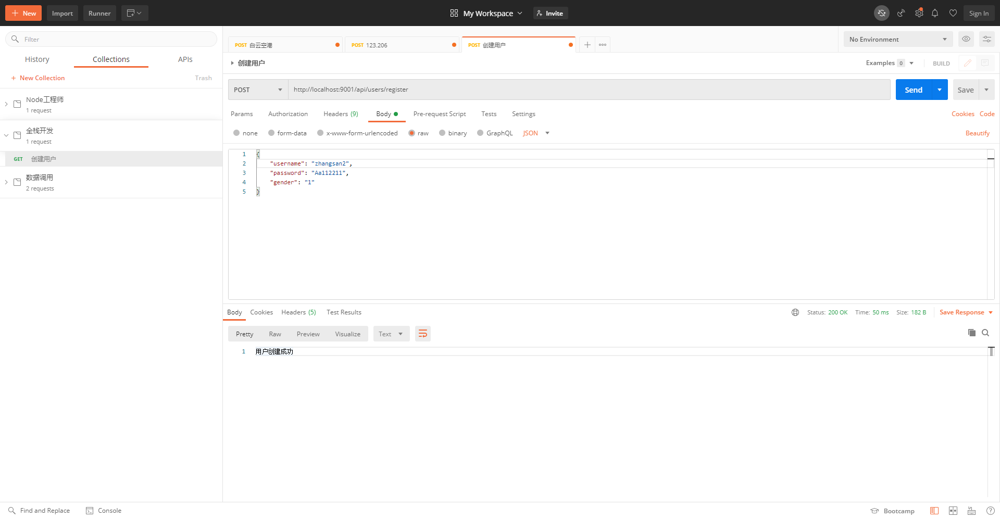
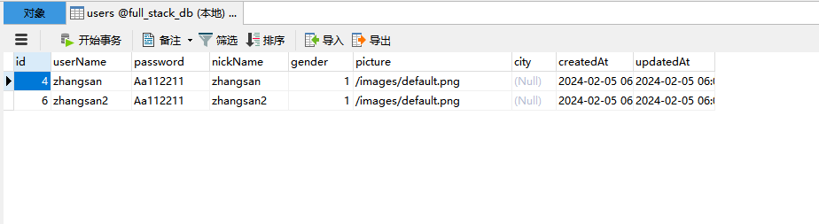
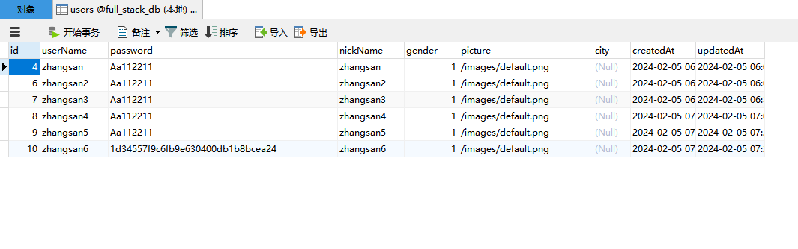
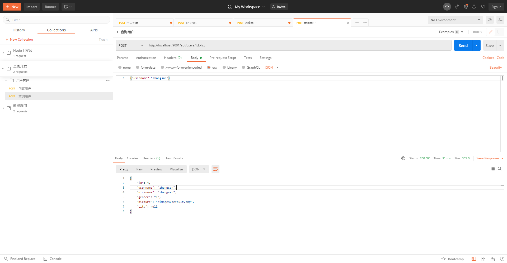

# 全栈开发-koa2

后端：Node.js-Koa2框架生态实战－从零模拟新浪微博

链接：<https://coding.imooc.com/class/388.html>

笔记：<http://localhost:7777/RD/node/koa/koa2-sina-01.html>

代码：<https://github.com/chike95/sm-demo/tree/main/fullstack/koa2-project>

## 开发规范

阿里巴巴_java开发规范手册详解

<https://blog.csdn.net/chuige2013/article/details/127193250>

## 架构层级

1. 模型层（Model）—— db

模型层直接与数据库交互，负责数据的定义、数据业务逻辑处理等。在使用Sequelize时，模型层主要包括：

模型定义：定义应用中的数据模型，每个模型对应数据库中的一个表。在Sequelize中，这通常通过定义模型的schema来实现。

迁移文件：如果使用Sequelize的迁移工具，还会有数据库迁移文件，用于定义数据库结构的变更。

2. 控制器层（Controller）—— controller

控制器层位于模型层和视图/客户端之间，负责处理进来的请求，执行相应的业务逻辑，并返回响应。在Koa2应用中，控制器层通常包括：

路由处理：定义URL路由和对应的处理函数。Koa2使用中间件机制处理HTTP请求，因此每个路由处理函数实际上是一个或多个中间件函数。

业务逻辑：在处理请求的过程中，控制器会调用模型层的接口进行数据操作，并根据操作结果返回相应的视图或数据。

3. 视图层（View）—— vite（vue）

视图层负责向用户展示信息和接收用户的输入。在前后端分离的应用中，视图层通常由前端框架（如React、Vue等）负责，后端仅提供API接口返回数据。在传统的Web应用中，视图层可能包括：

模板渲染：使用模板引擎（如EJS、Pug等）渲染HTML页面。

4. 服务层（Service）—— service

虽然MVC是一个经典的设计模式，但在复杂应用中，仅仅依靠模型层和控制器层可能不足以处理所有的业务逻辑。这时可以引入服务层：

业务逻辑处理：服务层是介于控制器层和模型层之间的一个逻辑层，专门用于处理复杂的业务逻辑。这样可以保持控制器的简洁，同时使得业务逻辑更容易被复用和测试。

5. 配置层（Config）—— conf

配置层用于存放应用的配置信息，例如数据库配置、中间件配置等。这些配置可以根据不同的环境（开发环境、生产环境等）进行调整。

6. 工具层（Utils）—— utils

工具层提供了一些共用的工具函数，比如加密工具、日期处理工具等，供整个应用使用。

## 路由设计
```
用户管理
    POST /api/users/register：用户注册
    POST /api/users/login：用户登录
    GET /api/users/profile/:userId：获取用户资料
    PUT /api/users/profile/:userId：更新用户资料
帖子管理
    POST /api/posts：创建帖子
    GET /api/posts：获取帖子列表
    GET /api/posts/:postId：获取帖子详情
    PUT /api/posts/:postId：编辑帖子
    DELETE /api/posts/:postId：删除帖子
评论管理
    POST /api/comments：发表评论
    GET /api/comments/:postId：获取某帖子的评论列表
    DELETE /api/comments/:commentId：删除评论
分类管理
    POST /api/categories：创建分类
    GET /api/categories：获取所有分类
    PUT /api/categories/:categoryId：编辑分类
    DELETE /api/categories/:categoryId：删除分类
```
## KOA2

### 项目创建 

（1）koa-generator

包地址：<https://www.npmjs.com/package/koa-generator>

（2）快速创建 
```
# 1. 全局安装：
cnpm i -g koa-generate

# 2. 创建项目
koa2 -e koa2-project

# 3. 启动项目
cd koa2-project
cnpm install

# 4. 启动项目
npm run dev

# 5. 访问网址

http://localhost:3000/

```

（3）启动报错

问题：通过npm run dev报错

解决办法：<https://www.jianshu.com/p/815f3f8c635a>

package.json

```js
  "scripts": {
    ...
    "dev": ".\\node_modules\\.bin\\nodemon bin\\www"
  }
```

（4）修改端口

/bin/www
```js
var port = normalizePort(process.env.PORT || '9001');
```

（5）添加gitignore，远程到git仓库

（6）设置环境变量

插件安装
```
cnpm i cross-env -D
```

修改package.json
```js
  "scripts": {
    "start": "node bin/www",
    "dev": "cross-env NODE_ENV=dev .\\node_modules\\.bin\\nodemon bin\\www",
    "prd": "cross-env NODE_ENV=production pm2 start bin/www",
    "test": "echo \"Error: no test specified\" && exit 1"
  },
```

### 环境配置 

/src/conf/db.js
```js
const ENV = process.env.NODE_ENV

module.exports = {
    isDEV: ENV === 'dev',
    notDev: ENV !== 'dev',
    isProduct: ENV === 'production',
    notProduct: ENV !== 'production',
    isTest: ENV === 'test',
    notTest: ENV !== 'test'
}
```

## 代码结构

目录结构
```
.
+-- bin
|   +-- www               // 项目启动必备文件,配置端口等服务信息
+-- node_modules          // 项目依赖，安装的所有模块都会在这个文件夹下
+-- public                // 存放静态文件，如样式、图片等
|   +-- images            // 图片
|   +-- javascript        // js文件
|   +-- stylesheets       // 样式文件
+-- routers               // 存放路由文件，如果前后端分离的话只用来书写api接口使用
|   +-- index.js
|   +-- user.js
+-- views                 // 存放存放模板文件，就是前端页面，如果后台只是提供api的话，这个就是备用
|   +-- error.pug
|   +-- index.pug
|   +-- layout.pug
+-- app.js                // 主入口文件
+-- package.json          // 存储项目名、描述、作者、依赖等等信息
+-- package-lock.json     // 存储项目依赖的版本信息，确保项目内的每个人安装的版本一致
```

新建src目录，将public routers views app.js放入src目录中，并修改www.js，使其能够正确引用src目录中的代码。
```
var app = require('../src/app');
```


## sequelize 配置

安装插件
```
cnpm i mysql2 sequelize
```

创建实例 /src/db/seq.js
```js
const Sequelize = require('sequelize')
const { MYSQL_CONF } = require('../conf/db')
const { host, user, password, database } = MYSQL_CONF

const conf = {
    host,
    dialect: 'mysql'
}

const seq = new Sequelize(database, user, password, conf)

module.exports = seq
```

配置参数 /src/conf/db.js
```js
const { isPro } = require('../utils/env')

// 本地 mysql 配置
let MYSQL_CONF = {
    host: 'localhost',
    user: 'root',
    password: '',
    port: '3306',
    database: 'full_stack_db'
}

if (isPro) {
    // 线上 mysql 配置
    MYSQL_CONF = {

    }
}

module.exports = {
    MYSQL_CONF
}
```


## 登录注册

接口
    api/users/register  注册用户
    api/users/isExsit   用户是否存在
    api/users/login     登录用户


### 用户注册

创建用户模型 /src/db/modules/User.js
```js
const seq = require('../seq')
const { STRING, DECIMAL } = require('../types')

const User = seq.define('user', {
    username: {
        type: STRING,
        allowNull: false,
        unique: true,
        comment: '用户名，唯一'
    }
})

module.exports = User
```

将模型导入到 ./index.js中统一管理

创建service层：/src/service/user
```js
const { User } = require('../db/models/index')

/**
 * 
 * @param {string} userName 用户名
 * @param {string} password 密码
 * @param {number} gender 性别
 */
async function createUser({ username, password, gender = 3, nickname }) {
    // 创建用户
    const result = await User.create({
        username,
        password,
        gender,
        nickname: nickname ? nickname : username
    })
    console.log("createUser");
    return result.dataValues
}
```

创建controller：/src/controller/userController
```js
const { createUser } = require('../service/user')

async function register({ username, password, gender }) {
    let result = await createUser({ username, password, gender })
    return ("用户创建成功")
}

module.exports = {
    register
}
```

编写路由 /routers/api/users.js
```js
const router = require('koa-router')()
const { register } = require('../../controller/userController')

router.prefix('/api/users')

// 注册路由
router.post('/register', async (ctx, next) => {
    // 获取前端参数
    console.log(ctx.request.body);
    const { username, password, gender } = ctx.request.body
    // 调用 controller，返回
    ctx.body = await register({ username, password, gender })
})

module.exports = router
```

引入路由 /src/app.js
```js
const usersApiRouter = require('../src/routes/api/users')

app.use(usersApiRouter.routes(), usersApiRouter.allowedMethods())
```

测试：





问题：

（1）用户名重复时，注册会报错 —— 先查询，后注册

（2）密码未加密，有安全风险 —— md5加密

#### 密码加密

crypto模块加密 /src/utils/cryp.js
```js
const crypto = require('crypto')
const { CRYPTO_SECRET_KEY } = require('../conf/secretKeys')

/**
 * md5 加密
 * @param {string} content 明文
 */
function _md5(content) {
    const md5 = crypto.createHash('md5')
    return md5.update(content).digest('hex')
}

function md5Pwd(pwd) {
    const str = `password=${pwd}&key=${CRYPTO_SECRET_KEY}`
    return _md5(str)
}

module.exports = md5Pwd
```

密码加密
```js
async function register({ username, password, gender }) {
    const userInfo = await getUserInfo(username)
    if (userInfo) {
        return ("用户已存在")
    } else {
        let result = await createUser(
            {
                username,
                password: md5Pwd(password),  // 密码加密
                gender
            })
        return ("用户创建成功")
    }
}

```




### 用户查询

创建service层：/src/service/user
```js
/**
 * 获取用户信息
 * @param {string} username 用户名
 * @param {string} password 密码
 */
async function getUserInfo(username, password) {
    // 查询条件
    let whereOpt = {
        username
    }
    if (password) {
        Object.assign(whereOpt, { password })
    }
    // 查询用户信息
    const result = await User.findOne({
        attributes: ['id', 'username', 'nickname', 'gender', 'picture', 'city'],
        where: whereOpt
    })

    // 未找到
    if (result == null) {
        return result
    }

    return result.dataValues
}
```

创建controller：/src/controller/userController
```js
async function isExist(username, password) {
    const userInfo = await getUserInfo(username)
    if (userInfo) {
        console.log("用户已存在");
    } else {
        console.log("用户不存在");
    }

    return ("isExist")
}
```

编写路由 /routers/api/users.js
```js
router.post('/isExist', async function (ctx, next) {
    const { username } = ctx.request.body
    // 返回数据
    ctx.body = await isExist(username)
})
```

测试：



完善注册代码/src/controller/userController
```js
async function register({ username, password, gender }) {
    const userInfo = await getUserInfo(username)
    if (userInfo) {
        return ("用户已存在")
    } else {
        let result = await createUser({ username, password, gender })
        return ("用户创建成功")
    }
}
```

注意事项

错误处理：代码中没有显示错误处理逻辑。在实际应用中，对于数据库操作可能出现的错误（如违反唯一性约束），应该进行捕获并适当处理。

数据验证：虽然Sequelize支持模型级别的验证，但在此代码中未展示任何关于验证用户名、密码等字段的逻辑。在实际应用中，应在插入或更新数据前进行充分的数据验证。

这段代码为构建用户相关的后端服务提供了一个基础框架，但在部署到生产环境前还需要增加安全性和健壮性方面的考虑。

