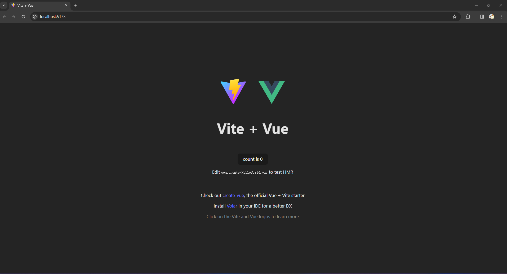
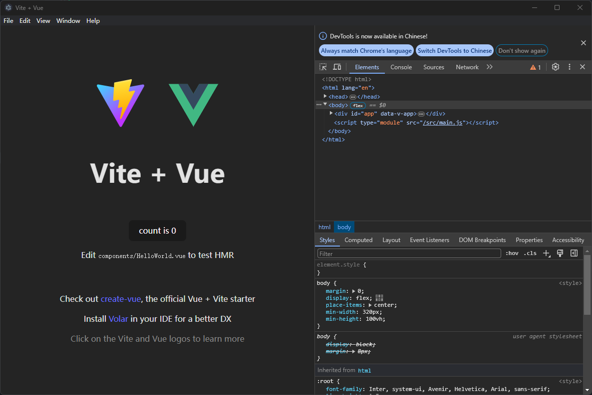

# 调试系统

## 初始化项目

### vite

```
$ npx cnpm init vite iotDebug

Need to install the following packages:
create-vite@5.2.1
Ok to proceed? (y) y
√ Package name: ... iotdebug
√ Select a framework: » Vue
√ Select a variant: » JavaScript
```

进入目录，安装插件，然后启动项目

```
$ cd iotdebug

$ cnpm i

$ npm run dev
```



### electron

vite+ vue3 项目添加 electron，并 electron 打包教程，以及 electron 代码热重载页面

链接：<https://blog.csdn.net/L_15737525552/article/details/131884028>

#### 安装插件

```
cnpm i electron -D
```

因为 src 下面存放的是我们的 vite 项目，为了避免后续文件多了以后混淆起来，在根目录下创建一个 electron 文件夹，，现在创建 main.js 作为 electron 的入口文件。

```js
// 控制应用生命周期和创建原生浏览器窗口的模组
const { app, BrowserWindow, Menu } = require("electron");
const path = require("path");
// process.env['ELECTRON_DISABLE_SECURITY_WARNINGS'] = true // 关闭控制台的警告

function createWindow() {
  // 创建浏览器窗口
  const mainWindow = new BrowserWindow({
    width: 1200,
    height: 800,
    webPreferences: {
      // 书写渲染进程中的配置
      nodeIntegration: true, //开启true这一步很重要,目的是为了vue文件中可以引入node和electron相关的API
      contextIsolation: false, // 可以使用require方法
      enableRemoteModule: true, // 可以使用remote方法
    },
  });

  // 监听html
  mainWindow.loadFile(path.resolve(__dirname, "../dist/index.html"));
}
// 这段程序将会在 Electron 结束初始化
// 和创建浏览器窗口的时候调用
// 部分 API 在 ready 事件触发后才能使用。
app.whenReady().then(() => {
  createWindow();

  app.on("activate", function () {
    // 通常在 macOS 上，当点击 dock 中的应用程序图标时，如果没有其他
    // 打开的窗口，那么程序会重新创建一个窗口。
    if (BrowserWindow.getAllWindows().length === 0) createWindow();
  });
});

// 除了 macOS 外，当所有窗口都被关闭的时候退出程序。 因此，通常对程序和它们在
// 任务栏上的图标来说，应当保持活跃状态，直到用户使用 Cmd + Q 退出。
app.on("window-all-closed", function () {
  if (process.platform !== "darwin") app.quit();
});
```

接着修改 package.json 文件

    1 配置入口文件
    2 添加启动命令

```JSON
{
  "name": "iotdebug",
  "private": true,
  "version": "0.0.0",
  "main": "electron/main.js",   // electron 入口
  "scripts": {
    "dev": "vite --open",
    "build": "vite build",
    "preview": "vite preview",
    "electron:dev": "electron .",   // electron 启动
  },
  ...
}

```

配置完成以后启动, 出现以下窗口表示搭建成功了。

```
$ npm run electron:dev
```



#### 配置加载代码热更新

```
cnpm i electron-reload
```
