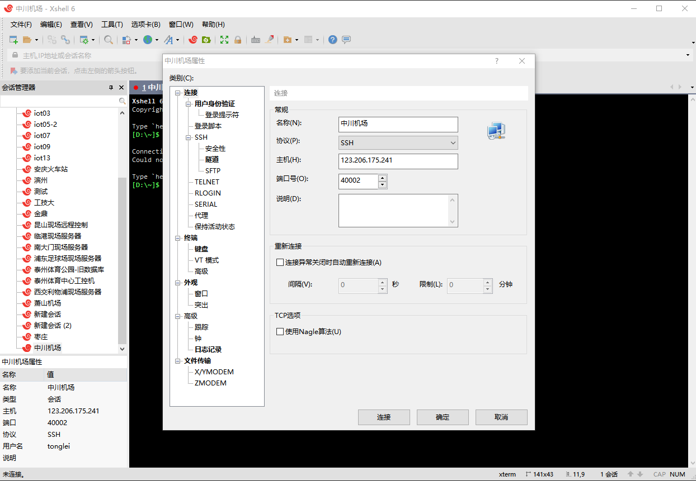
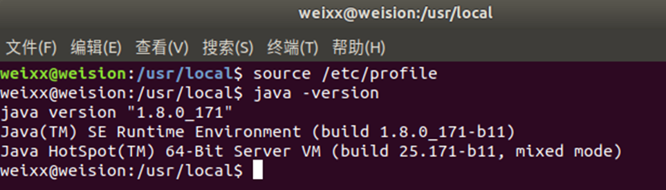
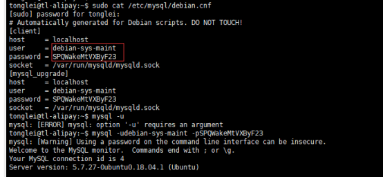

# 二、环境搭建

## 2.1 远程连接

### 2.1.1 安装ssh openssh

```sh
sudo apt-get install openssh
sudo apt-get install openssh-server
sudo apt-get install openssh-client
sudo systemctl start ssh-agent.service # 启动ssh服务
```
### 2.1.2 免密登录

（1）切换使用root 用户
```
su 
>>输入root密码
```

（2）如果没有为root创建密码则先设置
```
sudo passwd root 
```

（3）生成密钥
```
ssh-keygen
```

（4）将生成的公钥拷贝到要映射的主机
```
ssh-copy-id -i ~/.ssh/id_rsa.pub root@123.206.175.241
ssh-copy-id root@123.206.175.241
```

（5）测试免密登陆
```
ssh root@123.206.175.241
```

### 2.1.3 反向代理
```
sudo autossh -M 40001 -fCNR '*:40002:127.0.0.1:22' root@123.206.175.241
```

说明：第一个端口是autossh的监视端口 ，将本地（127.0.0.1）的22端口映射到远程（123.206.175.241）的40002端口

查看端口情况(123.206.175.241)：
```
# 查看所有端口
netstat -an

# 查看指定端口
netstat -anp | grep 40002
```

远程连接现场服务器：123.206.175.241:40002




如需关闭反向代理
```
pkill -3 autossh
```

参考链接：

<https://zhuanlan.zhihu.com/p/112227542>

<https://blog.csdn.net/BBQ__ZXB/article/details/112670401>


## 2.2 JAVA 环境

安装 jdk1.8

教程：<https://developer.aliyun.com/article/704959>

### 2.2.1 apt 安装

（1）更新apt
```sh
sudo apt update
```

附：更换镜像源
<https://blog.csdn.net/qq_43445867/article/details/123707266>


(2) 查找合适的openjdk版本
```sh
apt-cache search openjdk
```

（3）安装
```sh
sudo apt-get install openjdk-8-jdk
```

(4) 配置环境变量
```sh
vim ~/.bashrc
```

如何编辑？【i:进入编辑模式 esc:退出编辑 :wq保存】

在最后一行加上:
```sh
export JAVA_HOME=/usr/lib/jvm/java-8-openjdk-amd64
export PATH=$JAVA_HOME/bin:$PATH
export CLASSPATH=.:$JAVA_HOME/lib/dt.jar:$JAVA_HOME/lib/tools.jar
```

(5) 执行 java -version 查看java 版本




### 2.2.2 压缩包安装

华为云镜像源：<https://repo.huaweicloud.com/java/jdk/>

(1) 下载：jdk-8u171-linux-x64.tar.gz

(2) 解压：
```sh
tar -zxvf jdk-8u171-linux-x64.tar.gz
```

(3) 移动
```sh
sudo mv jdk1.8.0_171 /usr/local/jdk1.8
```

(4) 配置环境变量

这里我们修改全局配置文件，作用于所有用户：vim /etc/profile  在最后一行添加：

```sh
export JAVA_HOME=/usr/local/jdk1.8
export JRE_HOME=${JAVA_HOME}/jre
export CLASSPATH=.:${JAVA_HOME}/lib:${JRE_HOME}/lib
export PATH=.:${JAVA_HOME}/bin:$PATH
```


(5) 使配置生效
```sh
source /etc/profile
```

(6) 检查是否安装成功：java -version


## 2.3 数据库

### 2.3.1 安装 mysql

(1) 安装

```sh
# 安装mysql服务
sudo apt-get install mysql-server
# 安装客户端
sudo apt install mysql-client
# 安装依赖
sudo apt install libmysqlclient-dev
# 检查状态
sudo netstat -tap | grep mysql
```

(2) 查看已有账号
```sh
sudo cat /etc/mysql/debian.cnf
```



(3) 登录
```sh   
mysql -udebian-sys-maint -pSPQWakeMtVXByF23
```

(4) 查看数据库
```sh
show databases;
```

(5) 使用 ‘mysql’这个库
```sh
use mysql;
update user set authentication_string=PASSWORD("自定义密码") where user='root';
update user set plugin="mysql_native_password";
flush privileges;
quit;
```

(6) 重启
```sh
/etc/init.d/mysql restart
```

### 2.3.2 更改mysql数据目录

系统环境：Ubuntu 12.04（其他版本其实也类似），使用apt-get install mysql-server。

默认情况下，mysql的数据目录是/var/lib/mysql，因为如果你的数据库以后会越来越大，那么你就得考虑用一个空间足够大的分区来存放数据库文件，所以还是选择把它修改到其他位置，比如/usr/data/mysql_data。这个目录可以直接挂载一个大硬盘。

具体修改方式如下（为了方便起见，你可以先用su命令将系统当前用户转到root，否则以下命令可能都需要加上sudo 前缀）：
```sh

# 1 停止mysql服务
/etc/init.d/mysql stop

# 2 备份原来的数据目录
chown mysql:mysql /usr/data/mysql_data

# 修改存储路径
vim /etc/mysql/my.cnf
# 找到datadir=/var/lib/mysql
# 将它改为datadir=/usr/data/mysql_data

# 拷贝原来的数据文件
cp -a /var/lib/mysql/* /usr/data/mysql_data

# 启动mysql服务
vim /etc/apparmor.d/usr.sbin.mysqld

#我们会看到此文件中有2行：
 /var/lib/mysql/ r,
 /var/lib/mysql/** rwk,

# 以上是针对默认数据目录的权限配置，所以据此我们增加两行，指向新目录，设置同样的权限：
 /newdir/mysql/ r,
 /newdir/mysql/** rwk,

# 实测：（2023-10-28）ubuntu18.04.03 server下，添加以下内容，存储位置：/srv/SqlData/
 /srv/SqlData/ r,
 /srv/SqlData/** rwk,

/etc/init.d/apparmor restart

/etc/init.d/mysql start

```

OK，到此就已经成功转移了mysql数据目录。

