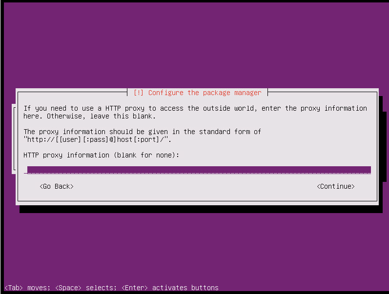

# Ubuntu服务器

## 一、系统安装

阿里源：<https://blog.csdn.net/lx7820336/article/details/124703404>

### 1.1 Ubuntu Server

1. 选择系统语言-English


2. 选择操作-Install Ubuntu Server


3. 选择安装过程和系统的默认语言-English


4.选择区域-other


5. 选择亚洲-Asia


6. 选择国家-China


7. 选择字符集编码-United States


8. 是否检测键盘布局，选择No


9. 选择键盘类型-English (US)


10.选择键盘布局-English (US)


11. 配置网络，选择Continue


12. 选择手动配置网络-configure network manually


13. 设置主机ip: 192.168.30.100


14. 设置主机子网掩码: 255.255.255.0


15. 设置主机网关: 192.168.30.1


16. 设置主机dns: 192.168.30.1


17. 设置主机名(项目名称-taizhou)


18. 设置域名-可以选择不填，直接Continue


19. 设置用户名（tonglei）-Continue


20. 设置登陆账号（tonglei）-Continue


21. 设置登录密码（空格选择“Show Password in Clear”可以显示密码）-Continue


22. 重复上一步设置的登录密码-Continue

23. 是否使用弱密码，选择是-Yes


24. 是否加密home文件夹，选择否-No


25. 确认时区是否正确(这里是“Asia/Shanghai”或者“Asia/Shanghai”都可以)，选择是-Yes


26. 选择分区方式(分区向导-使用整个磁盘和设置逻辑分区LVM)-“Guided-use entire disks and set up LVM”

也可以不分区：“Guided-use entire disk”


27. 选择要分区的磁盘(这里只有一块)-“SCSI3 （0,0,0）(sda) -53.7GB VMware Virtual disk”


28. 是否将变更写入磁盘，选择是-Yes


29. 用于指导分区的卷组数量,默认即可，选择-Continue


30. 是否写入变更的磁盘，选择是-Yes


31. 设置HTTP代理，无需填写直接下一步-Continue



32. 设置系统升级方式，选择没有自动更新-No automatic updates


33. 选择要安装的软件，选择：lamp server 和 OpenSSH Server，然后下一步-Continue


34. 是否安装GRUB引导程序，选择是-Yes


35.完成安装，选择下一步-Continue


36.系统安装完会自动启动主机


37.输入设置好的登录账户和密码就可以开始使用了


## 二、环境搭建

### 2.1 jdk1.8

教程：<https://developer.aliyun.com/article/704959>

#### 2.1.1 apt 安装

（1）更新apt
```sh
sudo apt update
```

附：更换镜像源
<https://blog.csdn.net/qq_43445867/article/details/123707266>


(2) 查找合适的openjdk版本
```sh
apt-cache search openjdk
```

（3）安装
```sh
sudo apt-get install openjdk-8-jdk
```

(4) 配置环境变量
```sh
vim ~/.bashrc
```

如何编辑？【i:进入编辑模式 esc:退出编辑 :wq保存】

在最后一行加上:
```sh
export JAVA_HOME=/usr/lib/jvm/java-8-openjdk-amd64
export PATH=$JAVA_HOME/bin:$PATH
export CLASSPATH=.:$JAVA_HOME/lib/dt.jar:$JAVA_HOME/lib/tools.jar
```

(5) 执行 java -version 查看java 版本


#### 2.1.2 压缩包安装

华为云镜像源：<https://repo.huaweicloud.com/java/jdk/>

(1) 下载：jdk-8u171-linux-x64.tar.gz

(2) 解压：
```sh
tar -zxvf jdk-8u171-linux-x64.tar.gz
```

(3) 移动
```sh
sudo mv jdk1.8.0_171 /usr/local/jdk1.8
```

(4) 配置环境变量

这里我们修改全局配置文件，作用于所有用户：vim /etc/profile  在最后一行添加：

```sh
export JAVA_HOME=/usr/local/jdk1.8
export JRE_HOME=${JAVA_HOME}/jre
export CLASSPATH=.:${JAVA_HOME}/lib:${JRE_HOME}/lib
export PATH=.:${JAVA_HOME}/bin:$PATH
```


(5) 使配置生效
```sh
source /etc/profile
```

(6) 检查是否安装成功：java -version


### 2.2 mysql

#### 2.2.1 安装

(1) 安装

```sh
# 安装mysql服务
sudo apt-get install mysql-server
# 安装客户端
sudo apt install mysql-client
# 安装依赖
sudo apt install libmysqlclient-dev
# 检查状态
sudo netstat -tap | grep mysql
```

(2) 查看已有账号
```sh
sudo cat /etc/mysql/debian.cnf
```


(3) 登录
```sh   
mysql -udebian-sys-maint -pSPQWakeMtVXByF23
```

(4) 查看数据库
```sh
show databases;
```

(5) 使用 ‘mysql’这个库
```sh
use mysql;
update user set authentication_string=PASSWORD("自定义密码") where user='root';
update user set plugin="mysql_native_password";
flush privileges;
quit;
```

(6) 重启
```sh
/etc/init.d/mysql restart
```

#### 2.2.2 ubuntu系统下更改mysql数据目录的方法
系统环境：Ubuntu 12.04（其他版本其实也类似），使用apt-get install mysql-server。
默认情况下，mysql的数据目录是/var/lib/mysql，因为如果你的数据库以后会越来越大，那么你就得考虑用一个空间足够大的分区来存放数据库文件，所以还是选择把它修改到其他位置，比如/usr/data/mysql_data。这个目录可以直接挂载一个大硬盘。

具体修改方式如下（为了方便起见，你可以先用su命令将系统当前用户转到root，否则以下命令可能都需要加上sudo 前缀）：
```sh
# 1 停止mysql服务
/etc/init.d/mysql stop

# 2 备份原来的数据目录
chown mysql:mysql /usr/data/mysql_data

# 修改存储路径
vim /etc/mysql/my.cnf
# 找到datadir=/var/lib/mysql
# 将它改为datadir=/usr/data/mysql_data

# 拷贝原来的数据文件
cp -a /var/lib/mysql/* /usr/data/mysql_data

# 启动mysql服务
vim /etc/apparmor.d/usr.sbin.mysqld

#我们会看到此文件中有2行：
 /var/lib/mysql/ r,
 /var/lib/mysql/** rwk,

# 以上是针对默认数据目录的权限配置，所以据此我们增加两行，指向新目录，设置同样的权限：
 /newdir/mysql/ r,
 /newdir/mysql/** rwk,

# 实测：（2023-10-28）ubuntu18.04.03 server下，添加以下内容，存储位置：/srv/SqlData/
 /srv/SqlData/ r,
 /srv/SqlData/** rwk,

/etc/init.d/apparmor restart

/etc/init.d/mysql start

```


OK，到此就已经成功转移了mysql数据目录。


## 设置IP


## 反向代理