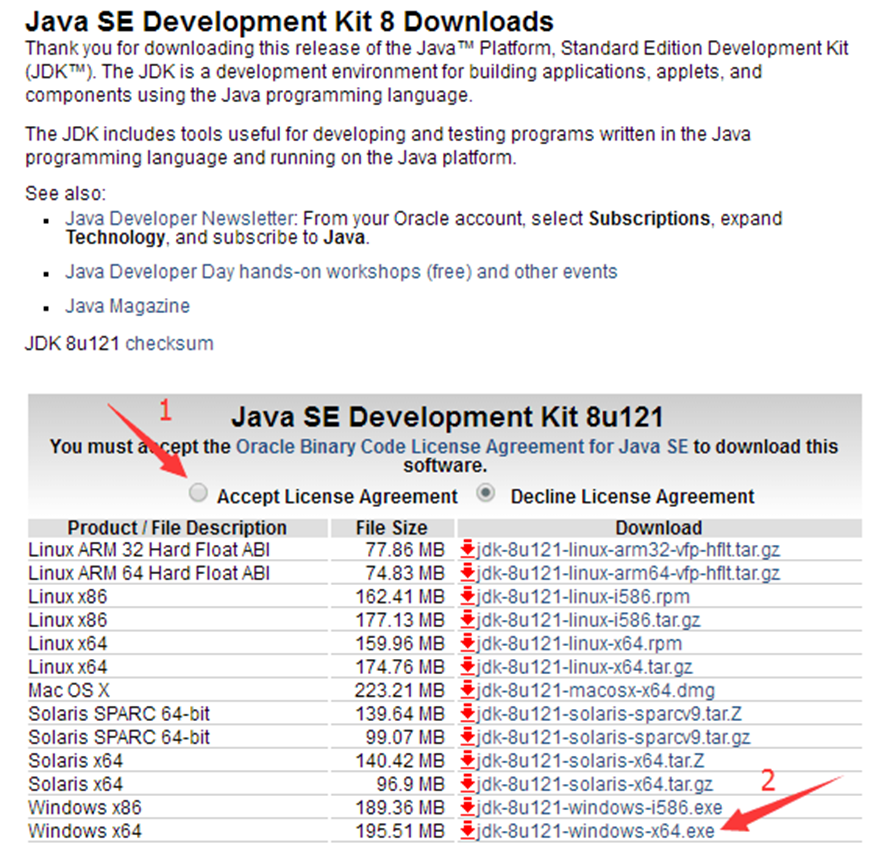
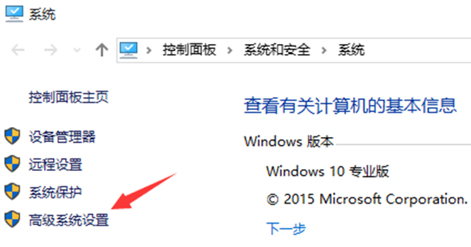

# windows部署

## 环境搭建

### JDK1.8

镜像源：<https://blog.csdn.net/lx7820336/article/details/124703404>

官网：<https://www.oracle.com/technetwork/java/javase/downloads/jdk8-downloads-2133151.html>

#### 配置环境变量

首先，找到 JDK 的安装目录，以图示为例，进入这一层 C:\Program Files\Java\jdk1.8.0_121目录，复制以备后用。然后，通过“控制面板”进入“系统”属性，实际上直接选择“此电脑”点击右键选择“属性”即可：

