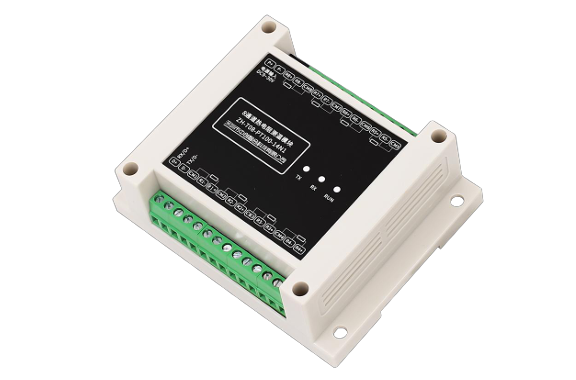
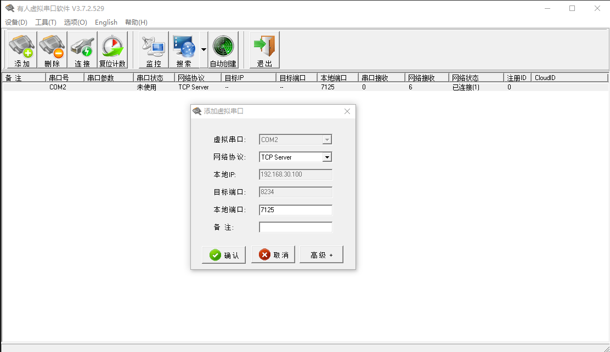

# 8 通道电阻测量模块

## 产品介绍



型号：ZH-T08R-14N1

中创智合官网：<https://www.szzczh.cn/>

说明书下载地址：<https://www.szzczh.cn/d.aspx?type=1&tid=9&tn=%E6%B8%A9%E5%BA%A6%E4%B8%8E%E7%94%B5%E9%98%BB%E9%87%87%E9%9B%86%E6%A8%A1%E5%9D%97>

## 软件设计

### MODBUS

#### 步骤

1. usr-vcom 开启虚拟串口程序



2. 安装 modbus-serial

```
npm install modbus-serial
```

3. node 启动程序

```
node index.js
```

4. 读取参数

```js
return client.readHoldingRegisters(0x0050, 1);
```

5. 写入参数

```js
return client.writeRegister(0x0050, 44); // 写入数据
```

6. 确认写入

```js
client.setID(44);

return client.readHoldingRegisters(0x0050, 1);
```

#### 程序代码 - 修改编号

```js
const ModbusRTU = require("modbus-serial");
const client = new ModbusRTU();

client.connectRTUBuffered("COM2", { baudRate: 9600 }, read);
// client.connectRTUBuffered("COM2", { baudRate: 9600 }, () => write(1, 22));

function write(addr, newAddr) {
  client.setID(addr);

  // on device number 1.
  client.writeRegister(0x0050, newAddr).then(console.log).then(read);
}

function read() {
  for (let i = 0; i < 255; i++) {
    client.setID(i);
  }
  client.readHoldingRegisters(0x0050, 1).then(console.log);
}
```

#### 数据返回：

{ address: 80, value: 1 }

{ data: [ 1 ], buffer: <Buffer 00 01> }

#### 存在的问题：

write 函数中的 client.writeRegister().then(console.log).then(read)可能会导致不可预测的行为，因为 read 函数会在写入操作之前就被调用。

其次，在 read 函数中，通过循环设置设备 ID 并读取保持寄存器的值是不合适的，这将导致对多个设备进行读取操作而不是特定的设备。

## 工作记录

2024-02-26：modbus 测试

2024-02-27：编写 modbus 测试程序

2024-03-25：组装采集箱
