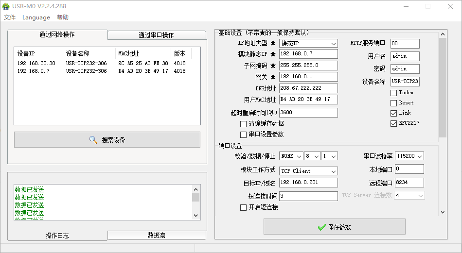
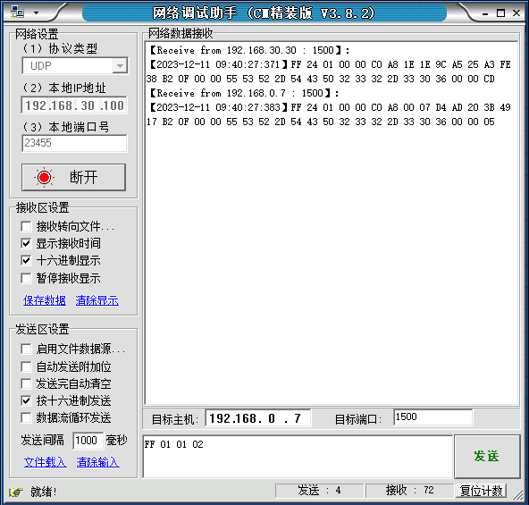
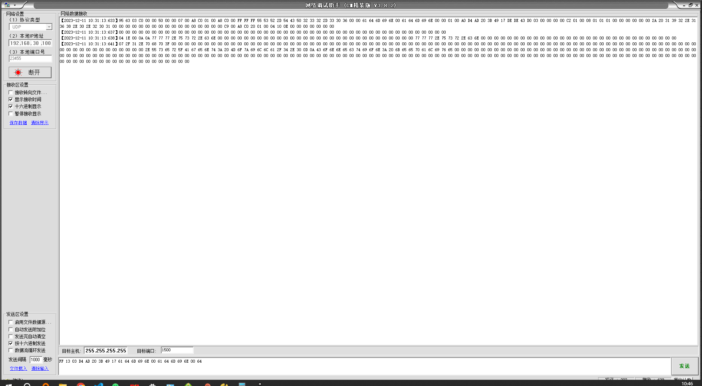

# 485

## 连接状态

Ubuntu下执行netstat命令可以查看端口使用情况（但是无法查看进程ID，需要使用lsof命令）

```sh
netstat -anp | grep 12000
```

需求：

思路：在Node.js中，可以使用child_process模块来执行系统命令并获取其输出结果，然后将结果封装进一个json对象。

```js
const { exec } = require('child_process');

function getCommandOutput(command) {
  return new Promise((resolve, reject) => {
    exec(command, (error, stdout, stderr) => {
      if (error) {
        reject(error);
        return;
      }
      resolve(stdout);
    });
  });
}

// 将命令输出结果转换为JSON对象的函数
function parseNetstatOutput(output) {
  const lines = output.trim().split('\n');
  const result = [];

  for (let i = 0; i < lines.length; i++) {
    const parts = lines[i].split(/\s+/).filter(Boolean);
    if (parts.length >= 7) {
      const entry = {
        'Proto': parts[0],
        'Recv-Q': parts[1],
        'Send-Q': parts[2],
        'Local Address': parts[3],
        'Foreign Address': parts[4],
        'State': parts[5],
        'PID/Program name': parts[6]
      };
      result.push(entry);
    }
  }

  return result;
}

// 定义要查看的端口号
const port = 12000;

// 构建命令
const command = `netstat -anp | grep ${port}`;

// 调用getCommandOutput函数执行命令并获取输出结果
getCommandOutput(command)
  .then(output => {
    const result = parseNetstatOutput(output);
    console.log(result); // 打印输出结果
  })
  .catch(error => {
    console.error(`Command execution failed: ${error}`);
  });

```

输出
```json
[ { Proto: 'tcp6',
    'Recv-Q': '0',
    'Send-Q': '0',
    'Local Address': ':::12000',
    'Foreign Address': ':::*',
    State: 'LISTEN',
    'PID/Program name': '28532/java' },
  { Proto: 'tcp6',
    'Recv-Q': '0',
    'Send-Q': '0',
    'Local Address': '192.168.30.100:12000',
    'Foreign Address': '192.168.30.115:12115',
    State: 'ESTABLISHED',
    'PID/Program name': '28532/java' },
  { Proto: 'tcp6',
    'Recv-Q': '0',
    'Send-Q': '0',
    'Local Address': '192.168.30.100:12000',
    'Foreign Address': '192.168.30.125:12125',
    State: 'ESTABLISHED',
    'PID/Program name': '28532/java' } ]
```


## 网络配置

在网络配置上，有人485设置了专门的配置协议，为了方便跨网段进行配置，所有通讯协议的操作均采用 UDP
广播方式完成，排列方式均为低位在前。网络配置时，UDP 通信必须保证目标端口号 1500，本地端口号随机，
所有通信协议均为 UDP 广播。

#### 设置流程

1. 建立 Socket:

  建立一个 UDP Socket，目标 IP 为 255.255.255.255，目标端口：1500，排列方式均为低位在前。

2. 发生设置指令的流程为：

-  1 网络端发送搜索命令

-  2 306 返回 IP 地址和 MAC，设备名称，版本号

-  3 网络端读取 306 返回参数

-  4 根据 MAC 地址和已知的用户名和密码以及要设置的参数（不需要修改的保持原样）组成设置指令

-  5 发送设置指令 和重启

-  6 306 返回设置正确

-  7 发生重启指令

-  8 306 返回设置正确（或错误）

#### 搜索指令

搜索命令固定为：FF 01 01 02，和校验 02 = 01 + 01。





指令解析

FF 24 01 00 00 C0 A8 1E 1E 9C A5 25 A3 FE 38 B2 0F 00 00 55 53 52 2D 54 43 50 32 33 32 2D 33 30 36 00 00 CD
(36 字节)
FF：包头
24：包长度
01：搜索（功能）

9C A5 25 A3 FE 38：MAC 地址

#### 读取配置

发送(22 字节)：FF 13 03 00 72 77 7B 63 0D 61 64 6D 69 6E 00 61 64 6D 69 6E 00 FC，和校验：（5）FC = 13 + 03 +
00 + ... + 6E + 00，第 4 位到第 9 位是 306 的 MAC 地址，校验位前的最后的 12 个字节为 306 的用户名与密码，
均为 6 字节，不足，补 0。

FF 13 03 00 72 77 7B 63 0D 61 64 6D 69 6E 00 61 64 6D 69 6E 00 FC

FF 24 01 00 00 C0 A8 00 07 D4 AD 20 3B 49 17 B2 0F 00 00 55 53 52 2D 54 43 50 32 33 32 2D 33 30 36 00 00 05 

校验计算
```js
const hexString = "13030072777B630D61646D696E0061646D696E00";
// 将字符串转换为十六进制数组
const hexArray = hexString.match(/.{2}/g).map(str => parseInt(str, 16));
// 计算所有值的和
const sum = hexArray.reduce((acc, cur) => acc + cur);
// 转换为十六进制形式并输出
console.log("CRC十六进制和：" + sum.toString(16).toUpperCase());
```

输出：
```
CRC十六进制和：5FC
```

测试



和校验：（6）64= 1303D4AD203B491761646D696E0061646D696E00


### 进制转换

```js
function hexToString(hex) {
    const buffer = Buffer.from(hex, 'hex');
    return buffer.toString('utf8');
}
hexToString("")

function stringToHex(str) {
    const buffer = Buffer.from(str, 'utf8');
    return buffer.toString('hex');
}

const inputString = "192.168.30.100"; // 输入的字符串
const result = stringToHex(inputString);
console.log(result); // 
```