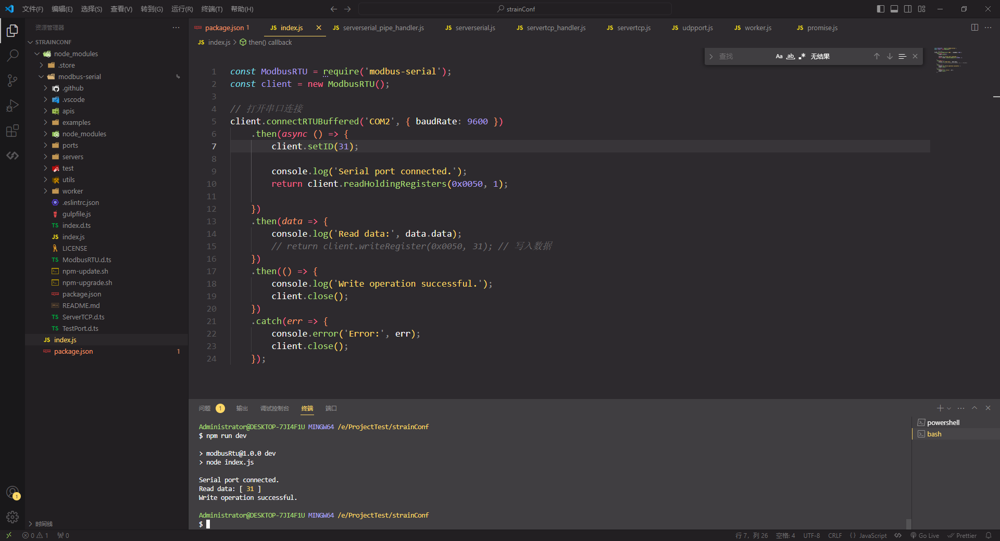
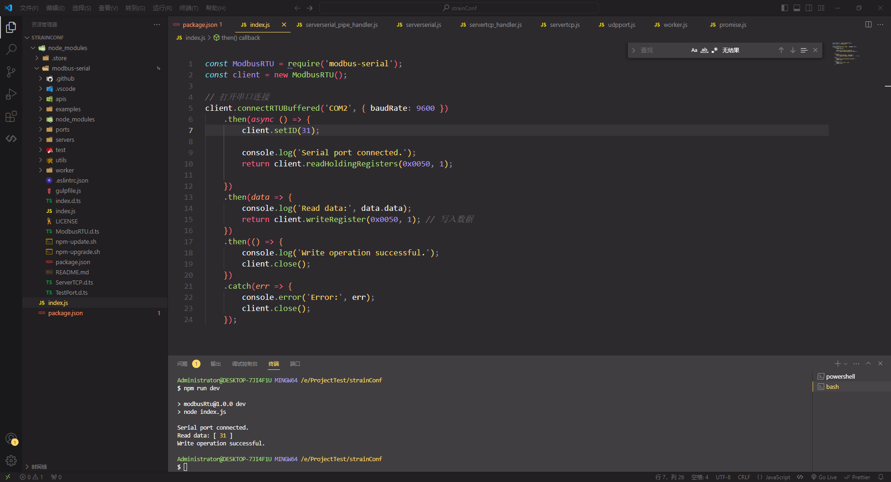

# 电阻测量模块

## modbus-Rtu 测试

插件：modbus-serial

npm：<https://www.npmjs.com/package/modbus-serial>

地址：E:\ProjectTest\strainConf

```js
const ModbusRTU = require("modbus-serial");
const client = new ModbusRTU();

// 打开串口连接
client
  .connectRTUBuffered("COM2", { baudRate: 9600 })
  .then(async () => {
    // client.setID(31);

    console.log("Serial port connected.");
    return client.readHoldingRegisters(0x0050, 1);
  })
  .then((data) => {
    console.log("Read data:", data.data);
    // return client.writeRegister(0x0050, 31);
  })
  .then(() => {
    console.log("Write operation successful.");
    client.close();
  })
  .catch((err) => {
    console.error("Error:", err);
    client.close();
  });
```

### 读取寄存器



### 写入寄存器


