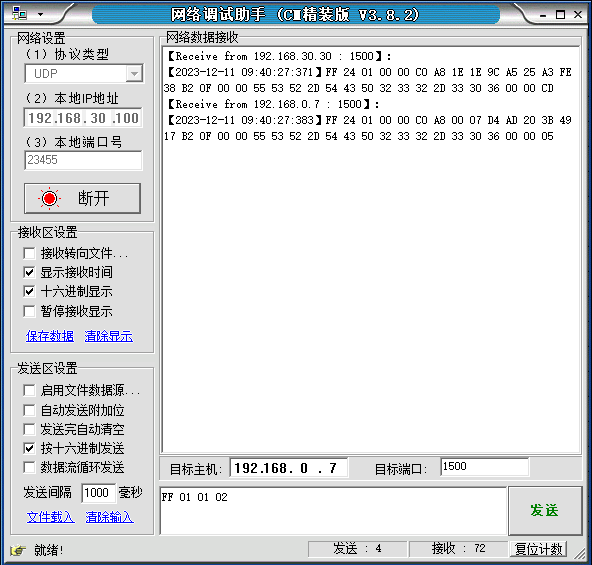

# RS485 网页配置

## 一、项目规划

此项目用于网页配置 USR-TCP232-306 单串口服务器

### 1.1 需求分析


USR-TCP232-306 是一款工业单串口服务器，小体积，成本可控，实现 RS232/485/422 转以太网双向透传功能；具备 1 路以太网口，10/100Mbps 速率；支持超时重启、DHCP 自动获取 IP、DNS 域名解析、远程升级、虚拟串口功能；支持自定义心跳包，杜绝死链接；自定义注册包，检测连接状态。

产品官网：<https://www.usr.cn/Product/177.html>

### 1.2 设计流程

有人 485 设置了专门的配置协议，为了方便跨网段进行配置，所有通讯协议的操作均采用 UDP 广播方式完成，排列方式均为低位在前。

网络配置时，UDP 通信必须保证目标 IP 为 255.255.255.255，目标端口：1500，排列方式均为低位在前，本地端口号随机，所有通信协议均为 UDP 广播。

具体流程为：

1. 建立 web 服务器

用于访问配置页面。

2. 建立 udp 服务器:

建立一个 UDP Socket，发送/接收广播数据。

3. 搜索设备：

- 网络端发送搜索命令

- 306 返回 IP 地址和 MAC，设备名称，版本号

4. 读取参数：

- 网络端读取 306 返回参数

5. 保存参数

- 根据 MAC 地址和已知的用户名和密码以及要设置的参数（不需要修改的保持原样）组成设置指令

- 发送设置指令，306 返回设置正确

- 发送重启指令，306 返回设置正确（或错误）

## 二、WEB 服务

采用 express 搭建 web 服务器

项目文件使用 express-generator 生成

```
express --view=pug rs485
```

### 2.1 修改启动

全局安装 nodemon

```
npm install -g nodemon
```

package.json

```js
  "scripts": {
    "start": "node ./bin/www",
    "dev": "nodemon ./bin/www"  // 新增
  },
```

启动项目

```
npm run dev
```

### 2.2 修改 HTTP 端口

/bin/www

```js
var port = normalizePort(process.env.PORT || "64485"); // 默认端口3000
app.set("port", port);
```

添加提示信息：onListening()

```js
function onListening() {
  var addr = server.address();
  var bind = typeof addr === "string" ? "pipe " + addr : "port " + addr.port;
  debug("Listening on " + bind);

  // 打印http服务器信息
  var addr = server.address();
  console.log("HTTP服务器启动：", addr);
}
```

```
HTTP服务器启动： { address: '::', family: 'IPv6', port: 64485 }
```

### 2.3 修改路由

/routes/index.js

```js
var path = require("path");

router.get("/", function (req, res, next) {
  // res.render('index', { title: 'Express' });
  res.sendFile("index.html", { root: path.join(__dirname, "../views") });
});
```

访问: <http://localhost:64485/>


## 三、UDP 服务

### 3.1 创建服务

/bin/udp-server.js

```js
const dgram = require("dgram");
const server = dgram.createSocket("udp4");

server.on("listening", () => {
  const address = server.address();

  console.log(`udp-Server running ${address.address}:${address.port}`);

  server.setBroadcast(true); // 开启广播模式

  // const message = Buffer.from('ff010102', 'hex');
  // server.send(message, 1500, '255.255.255.255')
});

server.on("message", (msg, remoteInfo) => {
  console.log(
    `server got msg from ${remoteInfo.address}:${
      remoteInfo.port
    }: ${msg.toString("hex")}`
  );
  server.send("world", remoteInfo.port, remoteInfo.address);
});

server.on("error", (err) => {
  console.log("server error", err);
});

server.bind(0, "192.168.30.100");
```

### 3.2 UDP 测试

```js
const message = Buffer.from("ff010102", "hex");
server.send(message, 1500, "255.255.255.255");
```

```
udp-Server running 192.168.30.100:59846
HTTP服务器启动： { address: '::', family: 'IPv6', port: 64485 }
server got msg from 192.168.30.30:1500: ff24010000c0a81e1e9ca525a3fe38b20f00005553522d5443503233322d3330360000cd
server got msg from 192.168.0.7:1500: ff24010000c0a80007d4ad203b4917b20f00005553522d5443503233322d333036000005
```

## 四、搜索设备

流程

1 点击页面"搜索设备"按钮，发送请求 ： GET /equipmentArray

2 后端发送搜索指令，将返回结果存储在 equipmentArray 数组中, 并返回给前端

3 前端获取到 equipmentArray 数组，将参数添加到 table 中，显示在页面上

接口

```json
Client_IP_address: item.address   // IP
msg: item.msg                     // 返回报文
```

查询表


### 4.1 搜索指令

#### 指令测试

搜索命令固定为：FF 01 01 02，和校验 02 = 01 + 01。




#### 搜索返回

搜索指令的返回结果（36 字节)：FF 24 01 00 00 C0 A8 00 07 D8 B0 4C 46 35 80 AF 0F 00 00 55 53 52 2D 54 43
50 32 33 32 2D 33 31 30 00 00 F4

校验方法为减和校验，校验位初始值为 0x00，依次减去每个字节，算法如下：F4 = 00 - FF - 24 - 01 - 00 – A8 - ... - 30 – 00-…-00。


实例可以参考上一栏：udp 测试

#### 截取字段

搜索指令的返回结果（36 字节)：FF 24 01 00 00 C0 A8 00 07 D8 B0 4C 46 35 80 AF 0F 00 00 55 53 52 2D 54 43
50 32 33 32 2D 33 31 30 00 00 F4

| 名称              | 字节  | 例子                                            | 说明                 |
| ----------------- | ----- | ----------------------------------------------- | -------------------- |
| TAG_STATUS        | 0     | FF                                              | 固定数字             |
| Client_IP_address | 5~8   | C0 A8 00 07                                     | 设备 IP（高位在前）  |
| MAC_address       | 9~14  | AC CF 23 20 FE 3D                               | 设备 MAC（高位在前） |
| Firemware_version | 15~18 | 01 00 00                                        | 固件版本号           |
| Application_title | 19~34 | 55 53 52 2D 4B 32 00 00 00 00 00 00 00 00 00 00 | 设备名称             |

一个字节两位

```js
td1.innerText = equipment.Client_IP_address; // IP 地址
td2.innerText = hexToAscii(equipment.msg.substring(38, 66)); // 设备名称
td3.innerText = equipment.msg
  .substring(18, 30)
  .toUpperCase()
  .replace(/(.{2})/g, "$1 "); // MAC 地址
td4.innerText = equipment.msg.substring(30, 36); // 设备序列号
```

### 4.2 前端代码

#### 请求事件

绑定点击事件（搜索设备），向服务器请求设备数据，并在获取到数据后更新表格；

同时输出信息(功能函数)和绑定点击事件（获取参数）。

/public/javascripts/index.js

```js
function getData() {
  var httpRequest = new XMLHttpRequest();
  httpRequest.onreadystatechange = function () {
    if (httpRequest.readyState === 4) {
      // 删除table里的旧数据（根据类名来找到那些元素）
      var tableItems = document.getElementsByClassName("equipment-table-item");
      Array.from(tableItems).forEach(function (item) {
        item.remove();
      });

      var responseData = JSON.parse(httpRequest.responseText);
      console.log(responseData);
      responseData.forEach((equipment, index) => {
        // 给table 添加新数据
        addTableData(equipment, index);
        // out(equipment.msg)
      });

      // 添加获取参数事件
      bindClickEvent();
    }
  };
  httpRequest.open("GET", "/equipmentArray");
  httpRequest.send();
  out("指令发送成功 -> FF010102");
  out("点击搜到的设备可读取参数");
}

// 绑定点击事件
document.getElementById("searchBtn").addEventListener("click", getData);
```

#### 显示设备

```js
function addTableData(equipment, index) {
  console.log(equipment);
  // 给table添加数据
  var tbody = document.createElement("tbody");
  tbody.className = "equipment-table-item equipment-table-item" + index;

  var tr = document.createElement("tr");
  var td1 = document.createElement("td");
  var td2 = document.createElement("td");
  var td3 = document.createElement("td");
  var td4 = document.createElement("td");
  td1.innerText = equipment.Client_IP_address;
  td2.innerText = hexToAscii(equipment.msg.substring(38, 66));
  td3.innerText = equipment.msg
    .substring(18, 30)
    .toUpperCase()
    .replace(/(.{2})/g, "$1 ");
  td4.innerText = equipment.msg.substring(30, 36);

  tr.append(td1);
  tr.append(td2);
  tr.append(td3);
  tr.append(td4);
  tbody.append(tr);
  tbody.id = equipment.msg.substring(18, 30);

  var devTable = document.getElementById("dev-table");
  devTable.append(tbody);
}
```

### 4.3 后端处理

#### 路由

/routes/index.js

```js
/* 获取设备 */
router.get("/equipmentArray", async function (req, res, next) {
  try {
    await udpServer.getEquipment();
    const result = [];

    udpServer.equipmentArray.forEach(function (item) {
      result.push({
        Client_IP_address: item.address,
        msg: item.msg,
      });
    });
    res.json(result);
  } catch (error) {
    console.error(error);
    res.status(500).json({ error: "Failed to get equipment information" });
  }
});
```

#### 广播搜索

/bin/udp-server.js

```js
var udpServer = require("../bin/udp-server");

// 广播搜索设备
function getEquipment() {
  return new Promise((resolve, reject) => {
    const message = Buffer.from("ff010102", "hex");
    server.send(message, 1500, "255.255.255.255");

    server.on("message", (msg, remoteInfo) => {
      remoteInfo.msg = msg.toString("hex");
      addEquipment(remoteInfo);
      // console.log(equipmentArray);
      resolve(equipmentArray);
    });
  });
}
```

## 五、获取参数

### 5.1 读取指令

#### 指令测试

发送(22 字节)：

```
FF 13 03 00 72 77 7B 63 0D 61 64 6D 69 6E 00 61 64 6D 69 6E 00 FC
```

和校验：（5）FC = 13 + 03 + 00 + ... + 6E + 00

第 4 位到第 9 位是 306 的 MAC 地址，校验位前的最后的 12 个字节为 306 的用户名与密码，均为 6 字节，不足，补 0。

FF 24 01 00 00 C0 A8 00 07 D4 AD 20 3B 49 17 B2 0F 00 00 55 53 52 2D 54 43 50 32 33 32 2D 33 30 36 00 00 05

测试


和校验：（6）64= 1303D4AD203B491761646D696E0061646D696E00

#### 指令返回

返回的是 306 的所有参数，一共是 567 字节，不带校验，没有协议，直接返回参数。

读取方式参考“基础参数表”和“串口参数表”以及透传云功能，心跳注册包功能和 Httpd Client 包头设置。

分为四个包返回，分别为 130 字节和 50 字节，85 字节（心跳包），302 字节。

密码错误回应：FF 01 03 50，返回的数据是不带校验的。

实例

[ 192.168.30.100 : 58621 ] → [ 255.255.255.255 : 1500 ]
[ Length : 22 ]
FF 13 03 9C A5 25 A3 FE 38 61 64 6D 69 6E 00 61 64 6D 69 6E 00 67

[ 192.168.30.100 : 58621 ] ← [ 192.168.30.30 : 1500 ]
[ Length : 130 ]
95 63 03 C0 00 00 50 00 00 1E 1E A8 C0 01 1E A8 C0 00 FF FF FF 55 53 52 2D 54 43 50 32 33 32 2D 33 30 36 00 00 61 64 6D 69 6E 00 61 64 6D 69 6E 00 00 01 00 A0 9C A5 25 A3 FE 38 DE DE 43 D0 03 00 00 00 80 25 00 00 08 01 01 01 00 00 00 00 B4 14 EF D0 31 39 32 2E 31 36 38 2E 33 30 2E 31 30 30 00 00 00 00 00 00 00 00 00 00 00 00 00 00 00 00 64 1E A8 C0 20 01 00 04 10 0E 00 00 00 00 00 00 00

[ 192.168.30.100 : 58621 ] ← [ 192.168.30.30 : 1500 ]
[ Length : 50 ]
00 00 00 00 00 00 00 00 00 00 00 00 00 00 00 00 00 00 00 00 00 00 00 00 00 00 00 00 00 00 00 00 00 00 00 00 00 00 00 00 00 00 00 00 00 00 00 00 00 00

[ 192.168.30.100 : 58621 ] ← [ 192.168.30.30 : 1500 ]
[ Length : 85 ]
04 1E 00 0A 0A 77 77 77 2E 75 73 72 2E 63 6E 00 00 00 00 00 00 00 00 00 00 00 00 00 00 00 00 00 00 00 00 00 00 00 00 00 00 00 00 00 00 77 77 77 2E 75 73 72 2E 63 6E 00 00 00 00 00 00 00 00 00 00 00 00 00 00 00 00 00 00 00 00 00 00 00 00 00 00 00 00 00 00

[ 192.168.30.100 : 58621 ] ← [ 192.168.30.30 : 1500 ]
[ Length : 302 ]
07 2F 31 2E 70 68 70 3F 00 00 00 00 00 00 00 00 00 00 00 00 00 00 00 00 00 00 00 00 00 00 00 00 00 00 00 00 00 00 00 00 00 00 00 00 00 00 00 00 00 00 00 00 00 00 00 00 00 00 00 00 00 00 00 00 00 00 00 00 00 00 00 00 00 00 00 00 00 00 00 00 00 00 00 00 00 00 00 00 00 00 00 00 00 00 00 00 00 00 00 00 00 2E 55 73 65 72 5F 41 67 65 6E 74 3A 20 4D 6F 7A 69 6C 6C 61 2F 34 2E 30 0D 0A 43 6F 6E 6E 65 63 74 69 6F 6E 3A 20 6B 65 65 70 61 6C 69 76 65 00 00 00 00 00 00 00 00 00 00 00 00 00 00 00 00 00 00 00 00 00 00 00 00 00 00 00 00 00 00 00 00 00 00 00 00 00 00 00 00 00 00 00 00 00 00 00 00 00 00 00 00 00 00 00 00 00 00 00 00 00 00 00 00 00 00 00 00 00 00 00 00 00 00 00 00 00 00 00 00 00 00 00 00 00 00 00 00 00 00 00 00 00 00 00 00 00 00 00 00 00 00 00 00 00 00 00 00 00 00 00 00 00 00 00 00 00 00 00 00 00 00 00 00 00 00 00 00 00 00 00 00 00 00 00 00 00 00 00 00 00 00 00 00 00 00 00 00 00 00 00 00 00 00

#### 截取字段

### 5.2 前端代码

在鼠标指针移动到 tr 元素上方时显示光标，可以使用 CSS 中的 cursor 属性来实现。

```css
tr:hover {
  cursor: pointer;
  /* 设置光标样式为手型 */
}
```

#### 请求事件

```js
// 绑定点击事件到设备项
function bindClickEvent() {
  var equipments = document.getElementsByClassName("equipment-table-item");
  console.log(equipments);
  Array.from(equipments).forEach(function (item, index) {
    item.addEventListener("click", getArgument);
  });
}

// 获取参数请求
function getArgument() {
  var httpRequest = new XMLHttpRequest();
  httpRequest.open("GET", "/argument");
  httpRequest.send();
}
```

## 六、修改参数

实例

（1）基础设置

[ 192.168.30.100 : 56951 ] → [ 255.255.255.255 : 1500 ]
[ Length : 89 ]
FF 56 05 D4 AD 20 3B 49 17 61 64 6D 69 6E 00 61 64 6D 69 6E 00 95 63 03 C0 00 00 50 00 00 07 00 A8 C0 01 00 A8 C0 00 FF FF FF 55 53 52 2D 54 43 50 32 33 32 2D 33 30 36 00 00 61 64 6D 69 6E 00 61 64 6D 69 6E 00 00 01 00 A0 D4 AD 20 3B 49 17 DE DE 43 D0 03 00 00 00 B5

（2）串口设置

[ 192.168.30.100 : 56951 ] → [ 255.255.255.255 : 1500 ]
[ Length : 85 ]
FF 52 06 D4 AD 20 3B 49 17 61 64 6D 69 6E 00 61 64 6D 69 6E 00 00 C2 01 00 08 01 01 01 00 00 00 00 00 00 2A 20 31 39 32 2E 31 36 38 2E 30 2E 32 30 31 00 00 00 00 00 00 00 00 00 00 00 00 00 00 00 00 00 C9 00 A8 C0 20 01 00 04 10 0E 00 00 00 00 00 00 00 BA

（3）心跳设置

[ 192.168.30.100 : 56951 ] → [ 255.255.255.255 : 1500 ]
[ Length : 107 ]
FF 68 21 D4 AD 20 3B 49 17 61 64 6D 69 6E 00 61 64 6D 69 6E 00 04 1E 00 0A 0A 77 77 77 2E 75 73 72 2E 63 6E 00 00 00 00 00 00 00 00 00 00 00 00 00 00 00 00 00 00 00 00 00 00 00 00 00 00 00 00 00 00 77 77 77 2E 75 73 72 2E 63 6E 00 00 00 00 00 00 00 00 00 00 00 00 00 00 00 00 00 00 00 00 00 00 00 00 00 00 00 00 00 00 E5

（4）重启

[ 192.168.30.100 : 56951 ] → [ 255.255.255.255 : 1500 ]
[ Length : 22 ]
FF 13 02 D4 AD 20 3B 49 17 61 64 6D 69 6E 00 61 64 6D 69 6E 00 63

（5）返回

[ 192.168.30.100 : 56951 ] ← [ 192.168.0.7 : 1500 ]
[ Length : 4 ]
FF 01 05 4B

[ 192.168.30.100 : 56951 ] ← [ 192.168.0.7 : 1500 ]
[ Length : 4 ]
FF 01 06 4B

[ 192.168.30.100 : 56951 ] ← [ 192.168.0.7 : 1500 ]
[ Length : 4 ]
FF 01 21 4B

[ 192.168.30.100 : 56951 ] ← [ 192.168.0.7 : 1500 ]
[ Length : 4 ]
FF 01 02 4B

## 七、功能函数

### 输出信息

```js
function err(str) {
  // 红色显示错误信息
  var dom = document.getElementById("dat");
  var time = getCurrentTime();
  if (dom) {
    dom.innerHTML += "<p style='color:red'>" + time + str + "</p>";
    dom.scrollTop = dom.scrollHeight;
  } else console.error(str);
}
function log(str) {
  // 蓝色显示消息
  var dom = document.getElementById("dat");
  var time = getCurrentTime();
  if (dom) {
    dom.innerHTML += "<p style='color:blue'>" + str + "</p>";
    dom.scrollTop = dom.scrollHeight;
  } else console.log(str);
}
function out(str) {
  // 简单输出消息
  var dom = document.getElementById("dat");
  var time = getCurrentTime();
  if (dom) {
    dom.innerHTML += "<p>" + time + "：" + str + "</p>";
    dom.scrollTop = dom.scrollHeight;
  } else console.log(str);
}
```

### 和校验

```js
function computeCrcSum(hexString) {
  // 去除字符串中的空格
  const hexStringWithoutSpace = hexString.replace(/\s/g, "");
  // 将字符串转换为十六进制数组
  const hexArray = hexStringWithoutSpace
    .match(/.{2}/g)
    .map((str) => parseInt(str, 16));
  // 计算所有值的和
  const sum = hexArray.reduce((acc, cur) => acc + cur);
  // 转换为十六进制形式并输出后两位
  // console.log(sum.toString(16).toUpperCase().slice(-2));
  return sum.toString(16).toUpperCase().slice(-2);
}

// 调用函数并传入不同的字符串进行计算
computeCrcSum("13 03 D4 AD203B491761646D696E0061646D696E00");
computeCrcSum("13 03 00 72 77 7B 63 0D 61 64 6D 69 6E 00 61 64 6D 69 6E 00");
computeCrcSum("1234567890ABCDEF");
```

### string-hex

```js
function hexToString(hex) {
  const buffer = Buffer.from(hex, "hex");
  return buffer.toString("utf8");
}
hexToString("");

function stringToHex(str) {
  const buffer = Buffer.from(str, "utf8");
  return buffer.toString("hex");
}

const inputString = "192.168.30.100"; // 输入的字符串
const result = stringToHex(inputString);
console.log(result); //
```

FF 56 05 D4 AD 20 3B 49 17 61 64 6D 69 6E 00 61 64 6D 69 6E 00 95 63 03 C0 00 00 50 00 00 07 1E A8 C0 01 00 A8 C0 00 FF FF FF 55 53 52 2D 54 43 50 32 33 32 2D 33 30 36 00 00 61 64 6D 69 6E 00 61 64 6D 69 6E 00 00 01 00 A0 D4 AD 20 3B 49 17 DE DE 43 D0 03 00 00 00 D3

### 减和校验

### 连接状态

Ubuntu 下执行 netstat 命令可以查看端口使用情况（但是无法查看进程 ID，需要使用 lsof 命令）

```sh
netstat -anp | grep 12000
```

需求：

思路：在 Node.js 中，可以使用 child_process 模块来执行系统命令并获取其输出结果，然后将结果封装进一个 json 对象。

```js
const { exec } = require("child_process");

function getCommandOutput(command) {
  return new Promise((resolve, reject) => {
    exec(command, (error, stdout, stderr) => {
      if (error) {
        reject(error);
        return;
      }
      resolve(stdout);
    });
  });
}

// 将命令输出结果转换为JSON对象的函数
function parseNetstatOutput(output) {
  const lines = output.trim().split("\n");
  const result = [];

  for (let i = 0; i < lines.length; i++) {
    const parts = lines[i].split(/\s+/).filter(Boolean);
    if (parts.length >= 7) {
      const entry = {
        Proto: parts[0],
        "Recv-Q": parts[1],
        "Send-Q": parts[2],
        "Local Address": parts[3],
        "Foreign Address": parts[4],
        State: parts[5],
        "PID/Program name": parts[6],
      };
      result.push(entry);
    }
  }

  return result;
}

// 定义要查看的端口号
const port = 12000;

// 构建命令
const command = `netstat -anp | grep ${port}`;

// 调用getCommandOutput函数执行命令并获取输出结果
getCommandOutput(command)
  .then((output) => {
    const result = parseNetstatOutput(output);
    console.log(result); // 打印输出结果
  })
  .catch((error) => {
    console.error(`Command execution failed: ${error}`);
  });
```

输出

```json
[
  {
    "Proto": "tcp6",
    "Recv-Q": "0",
    "Send-Q": "0",
    "Local Address": ":::12000",
    "Foreign Address": ":::*",
    "State": "LISTEN",
    "PID/Program name": "28532/java"
  },
  {
    "Proto": "tcp6",
    "Recv-Q": "0",
    "Send-Q": "0",
    "Local Address": "192.168.30.100:12000",
    "Foreign Address": "192.168.30.115:12115",
    "State": "ESTABLISHED",
    "PID/Program name": "28532/java"
  },
  {
    "Proto": "tcp6",
    "Recv-Q": "0",
    "Send-Q": "0",
    "Local Address": "192.168.30.100:12000",
    "Foreign Address": "192.168.30.125:12125",
    "State": "ESTABLISHED",
    "PID/Program name": "28532/java"
  }
]
```
