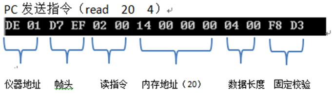
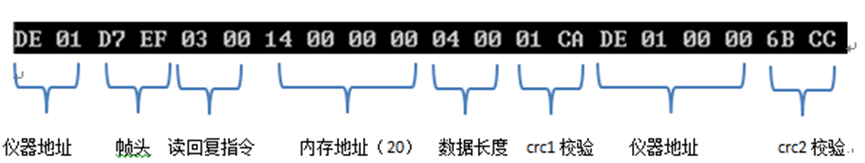
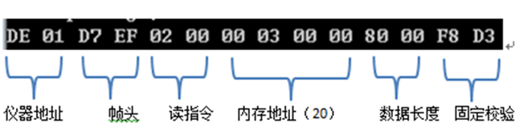
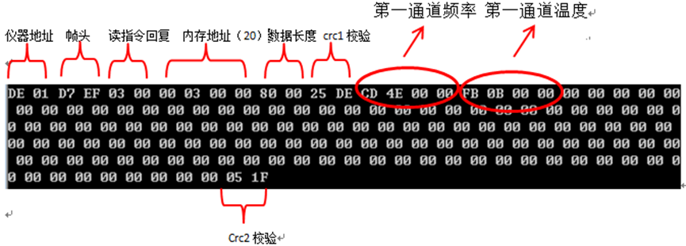

# 振弦

## 通讯地址

### 定义

485 通信的基本命令是读/写 + 地址 + 数据，其中地址为 32 位（4 字节）。

为了编程方便，地址划分为 5 个区，功能如下：

### S1 存储配置参数地址 4 – 36

#define ADDR_BOOST_VOLTAGE 4 振弦 PWM 波电压，默认为 5, （新板子只支持 5v）

#define ADDR_MEASURE_CHANNEL 4 + 4 手动模式下测量的通道号，0-15 可选 (暂时不用)

#define ADDR_WROK_MODE 4 + 8 为 0 为自动模式（自动检测通道是否有传感器）

#define ADDR_SAMPLE_RATE 4 + 12 采样率，默认可设置为 5，表示 5 秒采样一次

#define ADDR_SLAVE_ADDR 4 + 16 从机地址，其中 0 地址为公共地址，所有板子均可通信，1-65535 可选

#define ADDR_RESET_CONFIG 4 + 20 写 1 时复位配置参数

#define ADDR_FRAM_PAGE_INDEX 4 + 24 当前铁电存储器（32KB）的页码（当前正在写入的页，0-7 ，每页 4KB）

#define ADDR_FRAM_ITEM_INDEX 4 + 28 当前铁电存储器页内组号码（0-31），每页 32 个

#define ADDR_FLASH_PAGE_INDEX 4 + 32 当前 flash 存储的页码（0-511）（新板子不再用 flash）

#define ADDR_START_STOP 4 + 40 启动/停止测量开关（0 = 停止，1=开始）

#define ADDR_CHAN_FREQ_SEL1 4 + 44 通道 1 激励频率选择:0-3

[0 : 400-1200]
[1 : 1200-3500]
[2 : 1800-3500]
[3 : 2500-4000]

#define ADDR_CHAN_FREQ_SEL2 4 + 48 通道 2 激励频率选择

#define ADDR_CHAN_FREQ_SEL3 4 + 52 通道 3 激励频率选择

#define ADDR_CHAN_FREQ_SEL4 4 + 56 通道 4 激励频率选择

#define ADDR_CHAN_FREQ_SEL5 4 + 60 通道 5 激励频率选择

#define ADDR_CHAN_FREQ_SEL6 4 + 64 通道 6 激励频率选择

#define ADDR_CHAN_FREQ_SEL7 4 + 68 通道 7 激励频率选择

#define ADDR_CHAN_FREQ_SEL8 4 + 72 通道 8 激励频率选择

#define ADDR_CHAN_FREQ_SEL9 4 + 76 通道 9 激励频率选择

#define ADDR_CHAN_FREQ_SEL10 4 + 80 通道 10 激励频率选择

#define ADDR_CHAN_FREQ_SEL11 4 + 84 通道 11 激励频率选择

#define ADDR_CHAN_FREQ_SEL12 4 + 88 通道 12 激励频率选择

#define ADDR_CHAN_FREQ_SEL13 4 + 92 通道 13 激励频率选择

#define ADDR_CHAN_FREQ_SEL14 4 + 96 通道 14 激励频率选择

#define ADDR_CHAN_FREQ_SEL15 4 + 100 通道 15 激励频率选择

#define ADDR_CHAN_FREQ_SEL16 4 + 104 通道 16 激励频率选择

**(下面为新增地址)**

#define ADDR_KEY_START 4 + 108 签名存储起始地址

#define ADDR_KEY_END 4 + 360 签名存储结束地址

#define ADDR_RSV_1 4 + 364 预留不用地址

#define ADDR_HOST_IP_1 4 + 368 主机 ip 第 1 个数字, 默认为 192.168.30.100

#define ADDR_HOST_IP_2 4 + 372 主机 ip 第 2 个数字

#define ADDR_HOST_IP_3 4 + 376 主机 ip 第 3 个数字

#define ADDR_HOST_IP_4 4 + 380 主机 ip 第 4 个数字

#define ADDR_HOST_PORT 4 + 384 主机端口号，默认为 13010

### S2 数值存储区地址 512-600

#define ADDR_SW_VERSION 512 软件版本号，用来区分单片机的不同软件版本

#define ADDR_TIME_SEC 512 + 4 秒（读取时返回当前时间，写入时设置时间）

#define ADDR_TIME_MIN 512 + 8 分

#define ADDR_TIME_HOUR 512 + 12 时

#define ADDR_TIME_DAY 512 + 16 日

#define ADDR_TIME_MON 512 + 20 月

#define ADDR_TIME_WEEK 512 + 24 星期

#define ADDR_TIME_YEAR 512 + 28 年

#define ADDR_VOLT_VAL 512 + 32 当前通道的电压值（电阻值\*0.21mA）

#define ADDR_RES_VAL 512 + 36 当前通道的电阻值

#define ADDR_FREQ_VAL_C1 512 + 40 当前通道的频率值（2 次采样中的最优值）

#define ADDR_FREQ_VAL 512 + 44

#define ADDR_FREQ_VAL2 512 + 48

#define ADDR_FREQ_EVAL_S1 512 + 52 第 1 次采样的频率值

#define ADDR_FREQ_EVAL_S2 512 + 56 第 2 次采样的频率值

#define ADDR_SQURE_SUM_S1 512 + 60 第 1 次频率值的方差

#define ADDR_SQURE_SUM_S2 512 + 64 第 2 次频率值的方差

#define ADDR_CONTROL 512 + 68

#define ADDR_CHANNEL_MASK 512 + 72 通道传感器状态，0-15 位每位为 1 表示有传感器

#define ADDR_ERR_STATUS_1 512 + 76 错误状态

#define ADDR_SAMPLE_TICKS 512 + 80

#define ADDR_CURR_FRAM_ADDR 512 + 84 Fram 存储器最后一次写入的地址（128 字节值的起始地址，从起始地址开始往前计算是之前写入的地址）

#define ADDR_CURR_FLASH_ADDR 512 + 88 Flash 存储器最后一次写入的地址（4KB 页的开始地址），Flash 的地址从 1MB 到 3MB,对应页码 0-511 页

**（以下蓝色为新增地址）**
#define ADDR_BOARDID_1 512 + 92 板子的 ID，每个芯片唯一

#define ADDR_BOARDID_2 512 + 96

#define ADDR_BOARDID_3 512 + 100

#define ADDR_BOARDID_4 512 + 104

#define ADDR_BOARDID_5 512 + 108

#define ADDR_KEY_STATUS 512 + 112 为 1 时表示签名正确

#define ADDR_BIN_STATUS 512 + 116 为 1 时表示程序是完整的

#define ADDR_REBOOT_FLAG 512 + 120 写 1 后板子重启

#define ADDR_ACTIVE_CHANNELS 512 + 124 读取该地址可获取当前连接传感器的通道状态 (第 1 位为 1 表示通道 1 传感器已连接，第 2 位为 1 表示通道 2 传感器已连接)

### S3 16 通道的频率和电阻数据，地址 768-896

按照通道 1 频率，通道 1 电阻，。。。通道 15 频率，通道 15 电阻的顺序排列，每个值为 4 个字节

补充下，128 字节存储的格式如下：

```c
//data is saved at 128byte aligenment
typedefstruct
{
    uint32_t magic_word1; 标志位，固定为0xc869fc43
    uint16_t data_format_type; 格式类型为1
    uint16_t header_length;    头长度为20
char     time[8];          存储时间，顺序为 秒分时日月星期年
    uint16_t channel_mask;     从0-15位，为1表示该通道有值
    uint16_t sample_rate;      采样率
    uint16_t header_crc;       头的crc16校验值
    uint16_t freq_res_data[32]; 频率和电阻数据，顺序为freq1,res1,freq2,res2,...
    uint16_t data_crc;         数据的crc16校验值
}SavedDataFormat;
```

### S4 Fram 铁电存储器空间，地址 4096-32768 （对应 32KB）

读取每个 128 字节存储单元获得存储的数据，当前地址 ADDR_CURR_FRAM_ADDR 表示最后一次写入的地址，往前读取旧的数据。

### S5 Flash 存储器空间，地址 1024*1024 – 3*1024\*1024 (对应 1MB-3MB) （新板子不再使用 flash）

读取每个 128 字节获得存储的数据，当前地址 ADDR_CURR_FLASH_ADDR 表示最后一次写入的地址，往前读取旧的数据。（0-511 页是循环写入，即 0 到 511 写入，然后重新从 0 开始写入，第 0 页对应地址 1024*1024，第 511 页对应地址 1024*1024+511\*4096）

### TCP 连接说明：

TCP 连接默认端口为 13010, ip 地址为 192.168.30.100，通信协议和 485 的相同；PC 侧为 tcp server, 板子为 tcp client.

## 通讯协议

可以 485 通讯，也可以网口通讯。上位机指令包括写指令以及读指令。

### 读指令

#### 功能

上位机读取指令用于读取仪器的信息，包括功能：

1、 读取仪器地址 read 20 4

2、 读取仪器测量到的传感器的频率以及温敏电阻值 read 768 128

#### 解析

PC 读指令（read）： 02 ，仪器相应的回复指令：03

读取指令格式（长度 14 个字节，先发低位再发高位）：

仪器地址（2 个字节）+帧头(0XEFD7)+读/写指令（2 个字节）+内存地址（4 个字节）+数据长度（2 个字节）+CRC1 校验/固定校验（0xD3F8）

数据发送接收都是先发低位再发高位

内存分配表：

内存地址 存储内容

20 仪器地址

768~（768+128） 传感器频率、温敏电阻值

#### 实例

一、读取仪器地址



仪器返回



仪器地址是 478

CRC1 校验从第 4 位（回复指令）开始，校验长度为 8。

CRC2 校验从 14 位开始校验（仪器地址），校验长度 4。

二、读取数据

PC 发送指令（read 768 128）



仪器返回



仪器共有 16 个通道，每个通道占用 8 个字节存储数据，前 4 个字节存储频率数据，后 4 个字节存储温度数据。CRC1 校验从第 4 位（回复指令）开始，校验长度为 8，CRC2 校验从 14 位开始校验（第一通道频率值），校验长度 128。

注：频率放大了 10 倍，单位为 HZ，温度电阻单位为 Ω。

### 写指令
