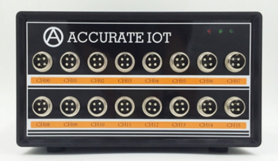

# 二、采集仪



## 2.1 产品功能

定义采集仪的功能和性能需求，包括采集信号类型、采集速度、精度要求等。

确定采集仪的适用场景和用户群体，以便设计合适的功能。

## 2.2 硬件电路

选择合适的传感器或接口进行数据采集。

设计模拟前端电路，包括放大、滤波、采样等电路。

选择合适的模数转换器（ADC）进行数字化转换。

设计数据存储模块，可以选择内置存储器或外部存储设备。

## 2.3 软件开发

编写嵌入式软件，包括采集控制、数据处理、存储和通信等功能。

设计用户界面，可以是 LCD 显示屏、按键操作或者基于 Web 的远程控制界面。

实现数据校准、校正和实时监控功能。

## 2.4 通信协议

### 通信地址

485 通信的基本命令是读/写 + 地址 + 数据，其中地址为 32 位（4 字节）。

为了编程方便，地址划分为 5 个区，功能如下：

- S1 存储配置参数地址 4 – 36

- S2 数值存储区地址 512-600

- S3 16 通道的频率和电阻数据，地址 768-896

- S4 Fram 铁电存储器空间，地址 4096-32768 （对应 32KB）

- S5 Flash 存储器空间，地址 1024*1024 – 3*1024\*1024 (对应 1MB-3MB)

#### S1 配置参数地址

```
#define ADDR_BOOST_VOLTAGE      4 振弦PWM波电压，默认为5, （新板子只支持5v）
#define ADDR_MEASURE_CHANNEL    4 + 4手动模式下测量的通道号，0-15可选 (暂时不用)
#define ADDR_WROK_MODE          4 + 8为0为自动模式（自动检测通道是否有传感器）
#define ADDR_SAMPLE_RATE        4 + 12采样率，默认可设置为5，表示5秒采样一次
#define ADDR_SLAVE_ADDR         4 + 16从机地址，其中0地址为公共地址，所有板子均可通信，1-65535可选
#define ADDR_RESET_CONFIG       4 + 20写1时复位配置参数
#define ADDR_FRAM_PAGE_INDEX    4 + 24当前铁电存储器（32KB）的页码（当前正在写入的页，0-7 ，每页4KB）
#define ADDR_FRAM_ITEM_INDEX    4 + 28当前铁电存储器页内组号码（0-31），每页32个
#define ADDR_FLASH_PAGE_INDEX   4 + 32当前flash存储的页码（0-511）（新板子不再用flash）
#define ADDR_FREQ_SECT    4+36
#define ADDR_START_STOP    4 + 40 启动/停止测量开关（0 = 停止，1=开始）
#define ADDR_CHAN_FREQ_SEL1      4 + 44 通道1激励频率选择:0-3
                                                        [0 : 400-1200]
                                                        [1 : 1200-3500]
                                                        [2 : 1800-3500]
                                                        [3 : 2500-4000]
#define ADDR_CHAN_FREQ_SEL2      4 + 48 通道2激励频率选择
#define ADDR_CHAN_FREQ_SEL3      4 + 52 通道3激励频率选择
#define ADDR_CHAN_FREQ_SEL4      4 + 56 通道4激励频率选择
#define ADDR_CHAN_FREQ_SEL5      4 + 60 通道5激励频率选择
#define ADDR_CHAN_FREQ_SEL6      4 + 64 通道6激励频率选择
#define ADDR_CHAN_FREQ_SEL7      4 + 68 通道7激励频率选择
#define ADDR_CHAN_FREQ_SEL8      4 + 72 通道8激励频率选择
#define ADDR_CHAN_FREQ_SEL9      4 + 76 通道9激励频率选择
#define ADDR_CHAN_FREQ_SEL10      4 + 80 通道10激励频率选择
#define ADDR_CHAN_FREQ_SEL11      4 + 84 通道11激励频率选择
#define ADDR_CHAN_FREQ_SEL12      4 + 88 通道12激励频率选择
#define ADDR_CHAN_FREQ_SEL13      4 + 92 通道13激励频率选择
#define ADDR_CHAN_FREQ_SEL14      4 + 96 通道14激励频率选择
#define ADDR_CHAN_FREQ_SEL15      4 + 100 通道15激励频率选择
#define ADDR_CHAN_FREQ_SEL16      4 + 104 通道16激励频率选择
(下面蓝色为新增地址)
#define ADDR_KEY_START             4 + 108 签名存储起始地址
#define ADDR_KEY_END              4 + 360 签名存储结束地址
#define ADDR_RSV_1                4 + 364  预留不用地址
#define ADDR_HOST_IP_1            4 + 368  主机ip第1个数字, 默认为192.168.30.100
#define ADDR_HOST_IP_2            4 + 372  主机ip第2个数字
#define ADDR_HOST_IP_3            4 + 376 主机ip第3个数字
#define ADDR_HOST_IP_4            4 + 380 主机ip第4个数字
#define ADDR_HOST_PORT           4 + 384 主机端口号，默认为13010
```

#### S2 数值存储地址

```
#define ADDR_SW_VERSION       512 软件版本号，用来区分单片机的不同软件版本
#define ADDR_TIME_SEC         512 + 4秒（读取时返回当前时间，写入时设置时间）
#define ADDR_TIME_MIN         512 + 8分
#define ADDR_TIME_HOUR        512 + 12时
#define ADDR_TIME_DAY         512 + 16日
#define ADDR_TIME_MON         512 + 20月
#define ADDR_TIME_WEEK        512 + 24星期
#define ADDR_TIME_YEAR        512 + 28年

#define ADDR_VOLT_VAL         512 + 32当前通道的电压值（电阻值*0.21mA）
#define ADDR_RES_VAL          512 + 36当前通道的电阻值
#define ADDR_FREQ_VAL_C1      512 + 40当前通道的频率值（2次采样中的最优值）
#define ADDR_FREQ_VAL         512 + 44
#define ADDR_FREQ_VAL2        512 + 48
#define ADDR_FREQ_EVAL_S1     512 + 52 第1次采样的频率值
#define ADDR_FREQ_EVAL_S2     512 + 56第2次采样的频率值
#define ADDR_SQURE_SUM_S1     512 + 60第1次频率值的方差
#define ADDR_SQURE_SUM_S2     512 + 64第2次频率值的方差
#define ADDR_CONTROL          512 + 68
#define ADDR_CHANNEL_MASK     512 + 72通道传感器状态，0-15位每位为1表示有传感器
#define ADDR_ERR_STATUS_1     512 + 76    错误状态
#define ADDR_SAMPLE_TICKS     512 + 80
#define ADDR_CURR_FRAM_ADDR   512 + 84   Fram存储器最后一次写入的地址（128字节值的起始地址，从起始地址开始往前计算是之前写入的地址）
#define ADDR_CURR_FLASH_ADDR  512 + 88    Flash存储器最后一次写入的地址（4KB页的开始地址），Flash的地址从1MB到3MB,对应页码0-511页
（以下蓝色为新增地址）
#define ADDR_BOARDID_1        512 + 92 板子的ID，每个芯片唯一
#define ADDR_BOARDID_2        512 + 96
#define ADDR_BOARDID_3        512 + 100
#define ADDR_BOARDID_4        512 + 104
#define ADDR_BOARDID_5        512 + 108
#define ADDR_KEY_STATUS        512 + 112  为1时表示签名正确
#define ADDR_BIN_STATUS        512 + 116  为1时表示程序是完整的
#define ADDR_REBOOT_FLAG      512 + 120  写1后板子重启
#define ADDR_ACTIVE_CHANNELS  512 + 124  读取该地址可获取当前连接传感器的通道状态
(第1位为1 表示通道1传感器已连接，第2位为1表示通道2传感器已连接)
```

#### S3 数据存储地址

按照通道 1 频率，通道 1 电阻，。。。通道 15 频率，通道 15 电阻的顺序排列，每个值为 4 个字节

补充下，128 字节存储的格式如下：

```c
//data is saved at 128byte aligenment
typedefstruct
{
    uint32_t magic_word1; 标志位，固定为0xc869fc43
    uint16_t data_format_type; 格式类型为1
    uint16_t header_length;    头长度为20
char     time[8];          存储时间，顺序为 秒分时日月星期年
    uint16_t channel_mask;     从0-15位，为1表示该通道有值
    uint16_t sample_rate;      采样率
    uint16_t header_crc;       头的crc16校验值
    uint16_t freq_res_data[32]; 频率和电阻数据，顺序为freq1,res1,freq2,res2,...
    uint16_t data_crc;         数据的crc16校验值
}SavedDataFormat;
```

#### S4 fram 铁地址

读取每个 128 字节存储单元获得存储的数据，当前地址 ADDR_CURR_FRAM_ADDR 表示最后一次写入的地址，往前读取旧的数据。

#### S5 flash 地址

（新板子不再使用 flash）

读取每个 128 字节获得存储的数据，当前地址 ADDR_CURR_FLASH_ADDR 表示最后一次写入的地址，往前读取旧的数据。（0-511 页是循环写入，即 0 到 511 写入，然后重新从 0 开始写入，第 0 页对应地址 1024*1024，第 511 页对应地址 1024*1024+511\*4096）

#### TCP 连接说明：

TCP 连接默认端口为 13010, ip 地址为 192.168.30.100，通信协议和 485 的相同；PC 侧为 tcp server, 板子为 tcp client.

### 通信协议

可以 485 通讯，也可以网口通讯。上位机指令包括写指令以及读指令。

#### 读指令

上位机读取指令用于读取仪器的信息，包括功能：

1、 读取仪器地址 read 20 4

2、 读取仪器测量到的传感器的频率以及温敏电阻值 read 768 128

### 上位机指令

一共有 3 个命令

- Addr

- Read

- Write

打开 485 上位机软件后，先回车，在设置地址

addr 1

read 516 32 //读当前时间

read 4 12 表示从地址 4 读取 12 个字节，最大 128

write 4 {24} 表示写入 24 到地址 4

下面举例说明几个常用命令

write 516 {01,50,22,7,7,1,14} 为写入 14 年,星期 1 ,7 月 7 号 22:50:01 到时钟里面， 516 为秒的地址

write 20 {2} 为设置板子地址为 2

addr 2 表示设置主机和地址为 2 的板子通信

write 8 {0} 表示设置手动测量通道为通道 0

write 12 {1} 表示使用手动测量模式（测量地址 8 的通道号）
